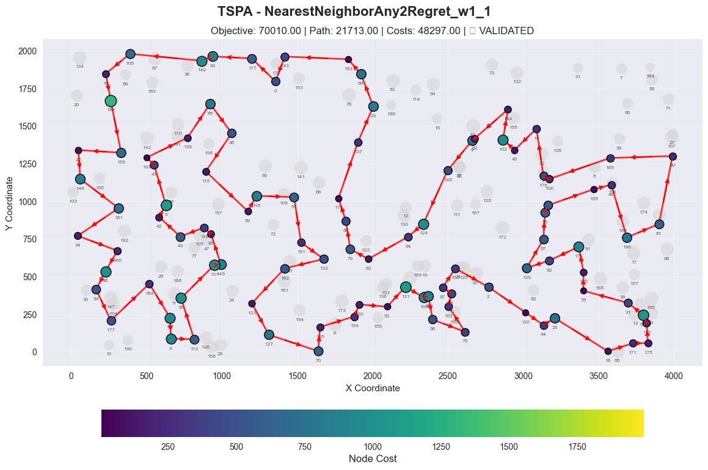
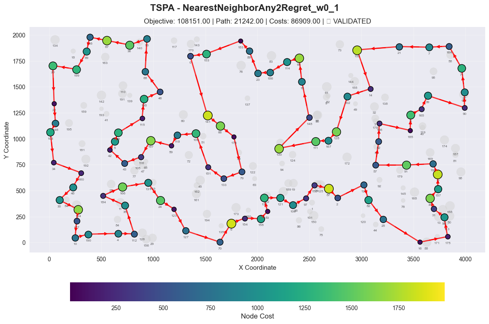
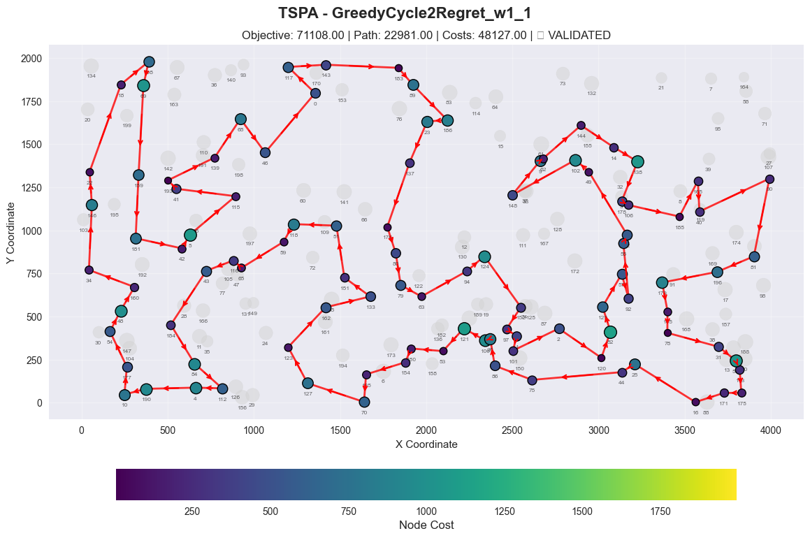
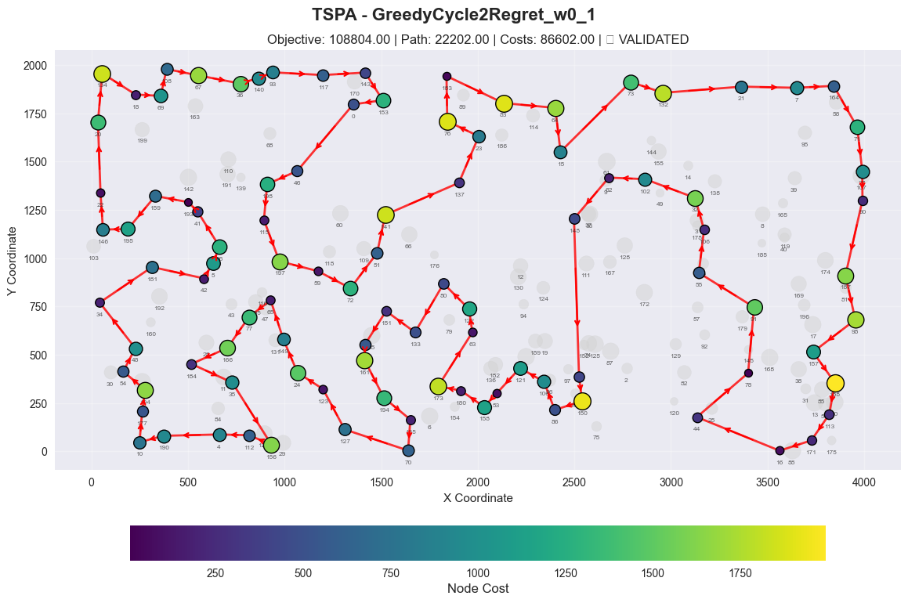
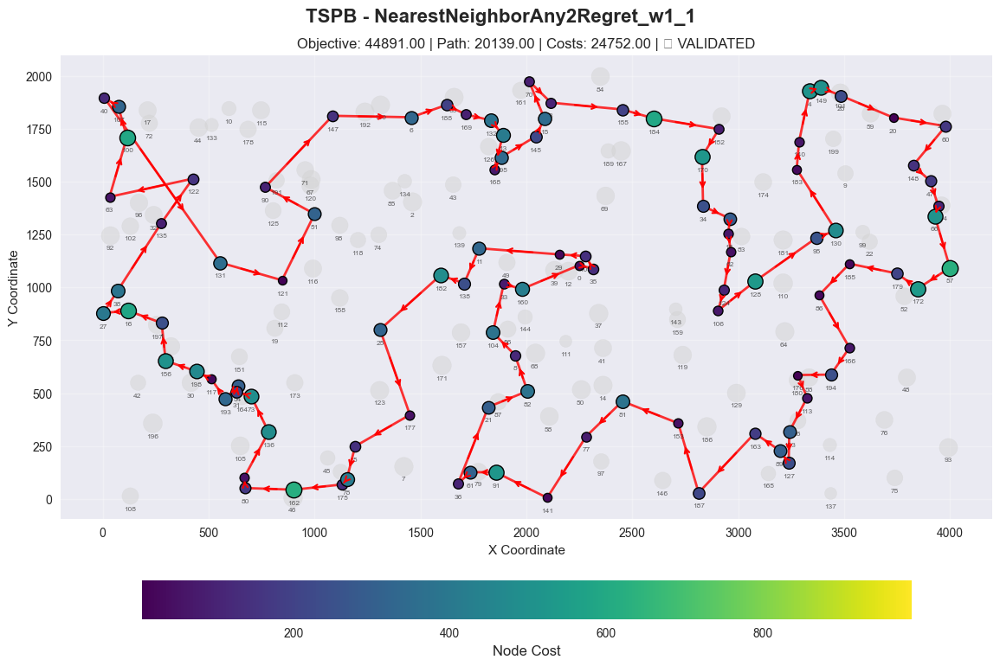
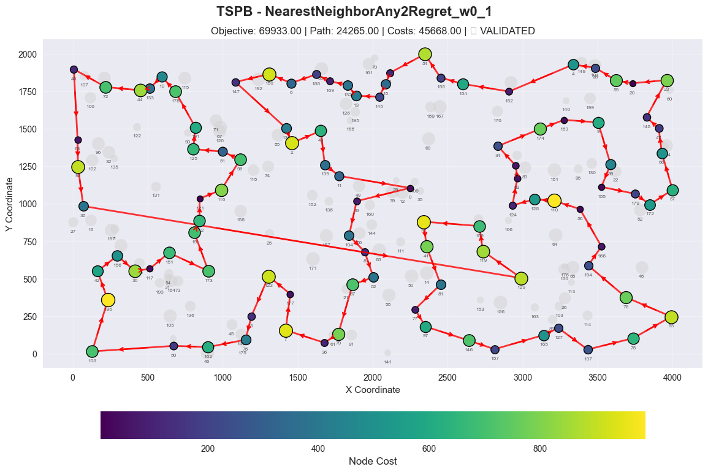
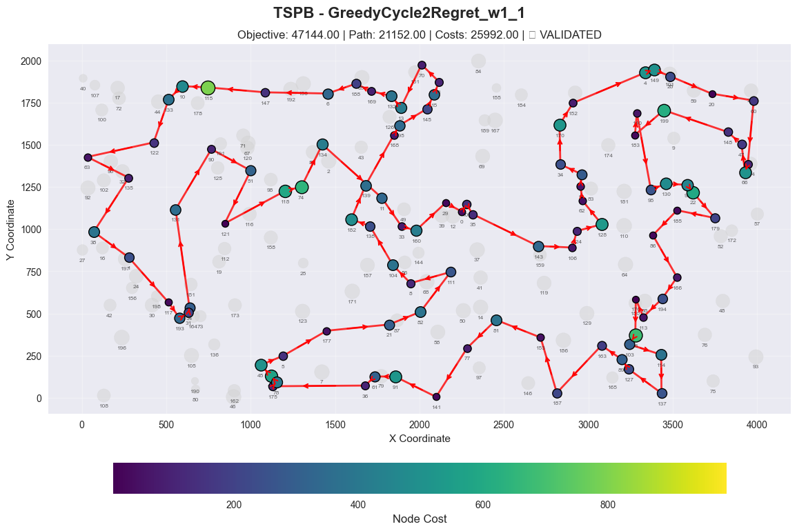
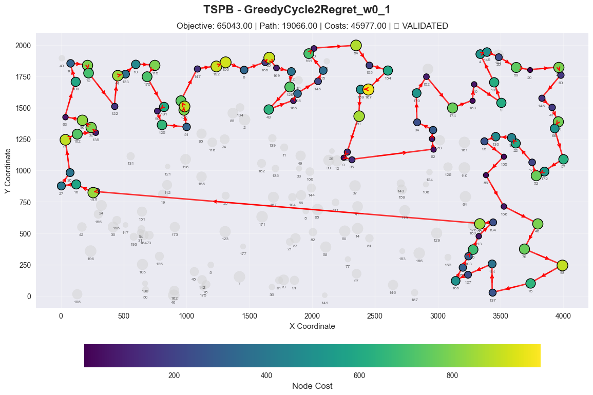
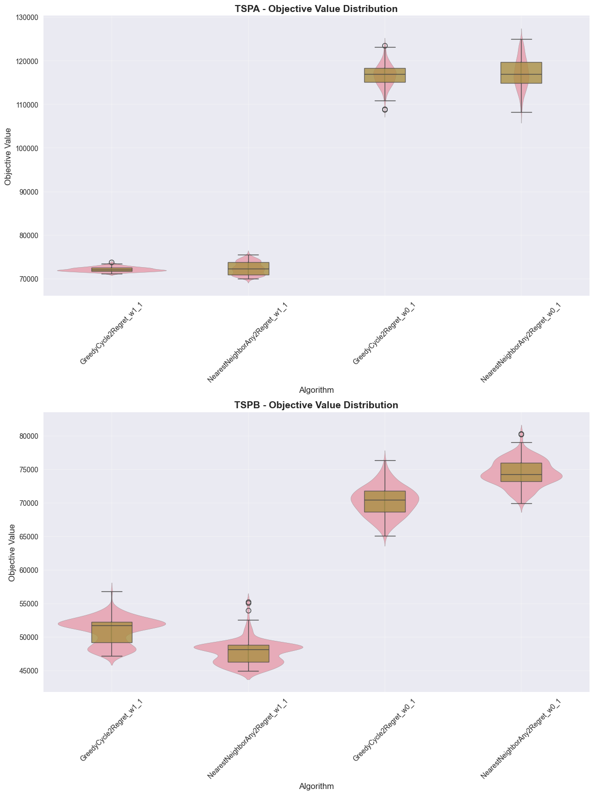

# Regret algorithm for TSP Problem

## Authors
- Adam Tomys 156057
- Marcin Kapiszewski 156048

## Implemented Algorithms

### 1. GreedyCycleTwoRegretAlgorithm
**Pseudocode:**
```
1. Select the starting vertex
2. Choose the nearest vertex and create an incomplete cycle from these two vertices
3. Repeat:
   a. For each unselected node:
      - Find best insertion position (minimum cycle increase)
      - Find second-best insertion position
      - Calculate regret = secondBestCost - bestCost
      - Calculate score = weightInsertion * bestCost - weightRegret * regret
   b. Select node with minimum score
   c. Insert selected node at its best position in the cycle until all vertices have been added
```

### 2. NearestNeighborAnyPositionTwoRegretAlgorithm
**Pseudocode:**
```
1. Start with startNode in the route
2. While route size < required nodes:
    a. For each unselected node:
       - Find best insertion position (minimum cost)
       - Find second-best insertion position
       - Calculate regret = secondBestCost - bestCost
       - Calculate score = weightInsertion * bestCost - weightRegret * regret
    b. Select node with minimum score
    c. Insert selected node at its best position
3. Return solution
```

## Computational Experiment Results

## Experimental Results

### Instance: TSPA

| Algorithm            | Runs | Min        | Max        | Average    | Validated |
|----------------------|------|------------|------------|------------|-----------|
| Random Solution      | 200  | 238,849.00 | 288,140.00 | 265,165.54 | YES       |
| Greedy Cycle         | 200  | 71,488.00  | 74,410.00  | 72,635.98  | YES       |
| Nearest Neighbor Any | 200  | 71,179.00  | 75,450.00  | 73,178.55  | YES       |
| Nearest Neighbor End | 200  | 83,182.00  | 89,433.00  | 85,108.51  | YES       |
| NearestNeighborAny2Regret_w1_1 | 200  | 70,010.00  | 75,452.00   | 72,401.24   | YES  |
| NearestNeighborAny2Regret_w0_1 | 200  | 108,151.00 | 124,921.00  | 117,138.49  | YES  |
| GreedyCycle2Regret_w1_1 | 200         | 71,108.00  | 73,718.00   | 72,148.23   | YES  |
| GreedyCycle2Regret_w0_1 | 200         | 108,804.00 | 123,447.00  | 116,681.18  | YES  |

---

### Instance: TSPB

| Algorithm            | Runs | Min        | Max        | Average    | Validated |
|----------------------|------|------------|------------|------------|-----------|
| Random Solution      | 200  | 194,376.00 | 245,960.00 | 212,968.97 | YES       |
| Greedy Cycle         | 200  | 49,001.00  | 57,324.00  | 51,400.60  | YES       |
| Nearest Neighbor Any | 200  | 44,417.00  | 53,438.00  | 45,870.25  | YES       |
| Nearest Neighbor End | 200  | 52,319.00  | 59,030.00  | 54,390.43  | YES       |
| NearestNeighborAny2Regret_w1_1 | 200  | 44,891.00  | 55,247.00  | 47,664.46  | YES  |
| NearestNeighborAny2Regret_w0_1 | 200  | 69,933.00  | 80,278.00  | 74,444.46  | YES  |
| GreedyCycle2Regret_w1_1 | 200         | 47,144.00  | 56,747.00  | 50,997.35  | YES  |
| GreedyCycle2Regret_w0_1 | 200         | 65,043.00  | 76,325.00  | 70,264.65  | YES  |

## 2D Visualization of Best Solution

### Instance: TSPA

#### NearestNeighborAny2Regret_w1_1



Node Order (Route):
108, 18, 199, 159, 22, 146, 181, 34, 160, 48, 54, 177, 184, 84, 4, 112, 35, 131, 149, 65, 116, 43, 42, 5, 41, 193, 139, 68, 46, 115, 59, 118, 51, 151, 133, 162, 123, 127, 70, 135, 154, 180, 53, 121, 100, 26, 86, 75, 101, 1, 97, 152, 2, 120, 44, 25, 16, 171, 175, 113, 56, 31, 78, 145, 179, 92, 129, 57, 55, 52, 185, 40, 196, 81, 90, 165, 106, 178, 14, 49, 102, 144, 62, 9, 148, 124, 94, 63, 79, 80, 176, 137, 23, 89, 183, 143, 0, 117, 93, 140

#### NearestNeighborAny2Regret_w0_1



Node Order (Route):
16, 175, 56, 31, 38, 157, 17, 196, 91, 57, 52, 106, 185, 8, 165, 39, 90, 27, 71, 164, 7, 21, 132, 14, 102, 128, 167, 111, 130, 148, 15, 64, 114, 186, 23, 89, 183, 153, 0, 141, 66, 176, 79, 133, 151, 109, 118, 59, 197, 116, 43, 42, 5, 96, 115, 198, 46, 68, 93, 36, 67, 108, 69, 199, 20, 22, 146, 103, 34, 160, 48, 30, 104, 177, 10, 190, 4, 112, 35, 184, 166, 131, 24, 123, 127, 70, 6, 154, 158, 53, 136, 121, 100, 97, 152, 87, 2, 129, 82, 25

#### GreedyCycle2Regret_w1_1



Node Order (Route):
23, 137, 176, 80, 79, 63, 94, 124, 152, 97, 1, 101, 2, 120, 82, 129, 57, 92, 55, 52, 49, 102, 148, 9, 62, 144, 14, 138, 178, 106, 185, 165, 40, 90, 81, 196, 179, 145, 78, 31, 56, 113, 175, 171, 16, 25, 44, 75, 86, 26, 100, 121, 53, 180, 154, 135, 70, 127, 123, 162, 133, 151, 51, 118, 59, 65, 116, 43, 184, 84, 112, 4, 190, 10, 177, 54, 48, 160, 34, 146, 22, 18, 108, 69, 159, 181, 42, 5, 115, 41, 193, 139, 68, 46, 0, 117, 143, 183, 89, 186

#### GreedyCycle2Regret_w0_1



Node Order (Route):
148, 1, 150, 86, 100, 121, 53, 158, 180, 173, 63, 122, 80, 133, 151, 162, 161, 194, 135, 70, 127, 123, 24, 149, 65, 77, 166, 184, 35, 156, 112, 4, 190, 10, 177, 104, 54, 48, 34, 181, 42, 5, 96, 41, 193, 159, 195, 146, 22, 20, 134, 18, 69, 108, 67, 36, 140, 93, 117, 143, 153, 0, 46, 198, 115, 197, 59, 72, 51, 141, 137, 23, 76, 183, 83, 64, 15, 73, 132, 21, 7, 164, 71, 27, 90, 187, 98, 157, 188, 113, 171, 16, 44, 78, 91, 55, 106, 32, 102, 62

### TSPB

#### NearestNeighborAny2Regret_w1_1



Node Order (Route):
131, 121, 51, 90, 147, 6, 188, 169, 132, 13, 168, 195, 145, 15, 70, 3, 155, 184, 152, 170, 34, 55, 18, 62, 124, 106, 128, 95, 130, 183, 140, 4, 149, 28, 20, 60, 148, 47, 94, 66, 57, 172, 179, 185, 86, 166, 194, 176, 113, 103, 127, 89, 163, 187, 153, 81, 77, 141, 91, 61, 36, 21, 82, 8, 104, 33, 160, 0, 35, 109, 29, 11, 138, 182, 25, 177, 5, 78, 175, 162, 80, 190, 136, 73, 31, 54, 193, 117, 198, 156, 1, 16, 27, 38, 135, 122, 63, 100, 107, 40

#### NearestNeighborAny2Regret_w0_1



Node Order (Route):
129, 119, 159, 37, 41, 81, 77, 97, 146, 187, 165, 127, 137, 75, 93, 76, 194, 166, 86, 110, 128, 124, 62, 18, 34, 174, 183, 9, 99, 185, 179, 172, 57, 66, 47, 148, 23, 20, 59, 28, 4, 152, 184, 155, 84, 3, 15, 145, 13, 132, 169, 188, 6, 150, 147, 134, 2, 43, 139, 11, 0, 33, 104, 8, 82, 87, 79, 36, 7, 177, 123, 5, 78, 162, 80, 108, 196, 42, 156, 30, 117, 151, 173, 19, 112, 121, 116, 98, 51, 125, 191, 178, 10, 133, 44, 72, 40, 63, 92, 38

#### GreedyCycle2Regret_w1_1



Node Order (Route):
199, 183, 140, 95, 130, 99, 22, 179, 185, 86, 166, 194, 113, 176, 26, 103, 114, 137, 127, 89, 163, 187, 153, 81, 77, 141, 91, 61, 36, 175, 78, 142, 45, 5, 177, 21, 82, 111, 8, 104, 138, 182, 139, 168, 195, 145, 15, 3, 70, 13, 132, 169, 188, 6, 147, 115, 10, 133, 122, 63, 135, 38, 1, 117, 193, 31, 54, 131, 90, 51, 121, 118, 74, 134, 11, 33, 160, 29, 0, 109, 35, 143, 106, 124, 128, 62, 18, 55, 34, 170, 152, 4, 149, 28, 20, 60, 94, 66, 47, 148

#### GreedyCycle2Regret_w0_1



Node Order (Route):
88, 1, 197, 16, 27, 38, 92, 102, 135, 32, 96, 63, 100, 107, 17, 72, 122, 44, 133, 10, 115, 178, 191, 90, 125, 51, 120, 67, 71, 147, 192, 150, 6, 188, 65, 169, 132, 126, 43, 168, 195, 145, 15, 161, 70, 84, 155, 184, 167, 189, 69, 109, 0, 35, 62, 18, 55, 34, 170, 152, 174, 183, 140, 9, 199, 4, 149, 28, 59, 20, 23, 60, 148, 47, 154, 66, 57, 172, 52, 179, 22, 99, 130, 95, 185, 86, 166, 48, 76, 93, 75, 137, 114, 127, 165, 89, 103, 26, 113, 194

# Best solution validation
In additional to the validator created by us, all of the 4 best solutions were checked manually by copying the nodes numbers to the solution checker excel.


## Algorithm Performance Comparison
