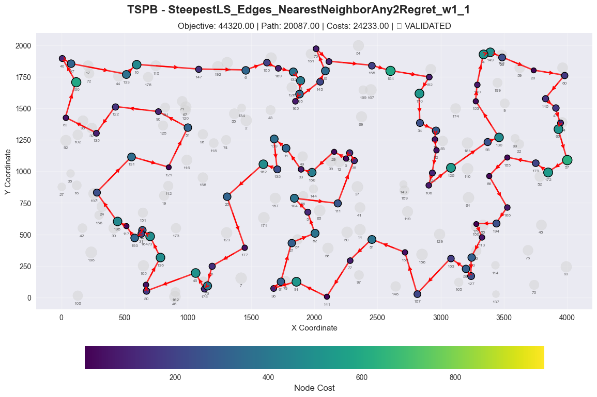
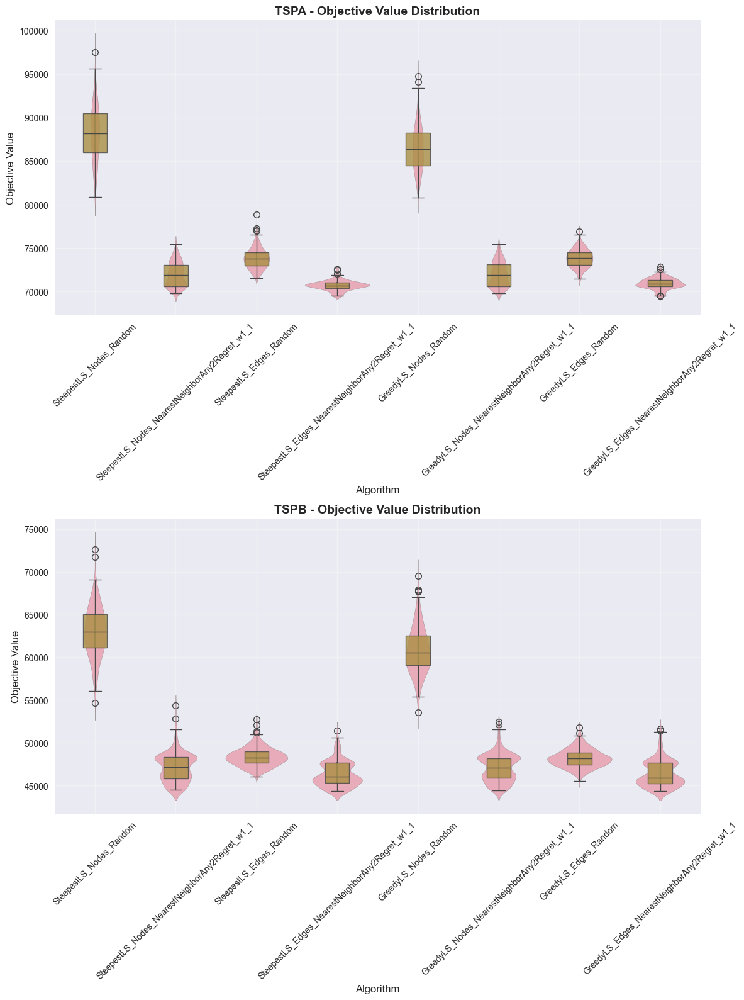

# Local Search algorithm for TSP Problem

## Authors
- Adam Tomys 156057
- Marcin Kapiszewski 156048

## Implemented Algorithms

### 1. Local Search (Greedy implementation)
**Pseudocode**
```
In each iteration:
1. Generate all possible moves and randomize their order
2. Evaluate moves in the randomized order
3. Apply the first move that improves the solution
4. Repeat until no improving move is found (local optimum)
 
The randomization ensures different search trajectories in different runs, which is important for avoiding bias towards particular move types or positions.
Neighborhood includes:
 - Node position swaps (intra-route)
 - 2-opt edge exchanges (inter-route)
```


## Experiment Results

### Objective function

### Instance: TSPA

| Algorithm            | Runs | Min        | Max        | Average    | Validated |
|----------------------|------|------------|------------|------------|-----------|
| Random Solution      | 200  | 238,849.00 | 288,140.00 | 265,165.54 | YES       |
| Greedy Cycle         | 200  | 71,488.00  | 74,410.00  | 72,635.98  | YES       |
| Nearest Neighbor Any | 200  | 71,179.00  | 75,450.00  | 73,178.55  | YES       |
| Nearest Neighbor End | 200  | 83,182.00  | 89,433.00  | 85,108.51  | YES       |
| NearestNeighborAny2Regret_w1_1 | 200  | 70,010.00  | 75,452.00   | 72,401.24   | YES  |
| NearestNeighborAny2Regret_w0_1 | 200  | 108,151.00 | 124,921.00  | 117,138.49  | YES  |
| GreedyCycle2Regret_w1_1 | 200         | 71,108.00  | 73,718.00   | 72,148.23   | YES  |
| GreedyCycle2Regret_w0_1 | 200         | 108,804.00 | 123,447.00  | 116,681.18  | YES  |
| SteepestLS_Edges_Random | 200      | 71576.00   | 78846.00   | 73842.79   | YES       |
| SteepestLS_Nodes_NearestNeighborAny2Regret_w1_1 | 200      | 69801.00   | 75440.00   | 72010.01   | YES       |
| GreedyLS_Nodes_NearestNeighborAny2Regret_w1_1 | 200      | 69801.00   | 75440.00   | 72001.06   | YES       |
| SteepestLS_Nodes_Random | 200      | 80895.00   | 97487.00   | 88217.17   | YES       |
| GreedyLS_Edges_Random | 200      | 71444.00   | 76883.00   | 73856.40   | YES       |
| GreedyLS_Edges_NearestNeighborAny2Regret_w1_1 | 200      | 69497.00   | 72850.00   | 70936.85   | YES       |
| GreedyLS_Nodes_Random | 200      | 80812.00   | 94777.00   | 86465.01   | YES       |
| SteepestLS_Edges_NearestNeighborAny2Regret_w1_1 | 200      | 69540.00   | 72546.00   | 70722.29   | YES       |

---

### Instance: TSPB

| Algorithm            | Runs | Min        | Max        | Average    | Validated |
|----------------------|------|------------|------------|------------|-----------|
| Random Solution      | 200  | 194,376.00 | 245,960.00 | 212,968.97 | YES       |
| Greedy Cycle         | 200  | 49,001.00  | 57,324.00  | 51,400.60  | YES       |
| Nearest Neighbor Any | 200  | 44,417.00  | 53,438.00  | 45,870.25  | YES       |
| Nearest Neighbor End | 200  | 52,319.00  | 59,030.00  | 54,390.43  | YES       |
| NearestNeighborAny2Regret_w1_1 | 200  | 44,891.00  | 55,247.00  | 47,664.46  | YES  |
| NearestNeighborAny2Regret_w0_1 | 200  | 69,933.00  | 80,278.00  | 74,444.46  | YES  |
| GreedyCycle2Regret_w1_1 | 200         | 47,144.00  | 56,747.00  | 50,997.35  | YES  |
| GreedyCycle2Regret_w0_1 | 200         | 65,043.00  | 76,325.00  | 70,264.65  | YES  |
| SteepestLS_Edges_Random | 200      | 46064.00   | 52759.00   | 48374.04   | YES       |
| SteepestLS_Nodes_NearestNeighborAny2Regret_w1_1 | 200      | 44488.00   | 54391.00   | 47137.03   | YES       |
| GreedyLS_Nodes_NearestNeighborAny2Regret_w1_1 | 200      | 44456.00   | 52416.00   | 47103.65   | YES       |
| SteepestLS_Nodes_Random | 200      | 54687.00   | 72635.00   | 63017.43   | YES       |
| GreedyLS_Edges_Random | 200      | 45536.00   | 51754.00   | 48202.11   | YES       |
| GreedyLS_Edges_NearestNeighborAny2Regret_w1_1 | 200      | 44320.00   | 51672.00   | 46397.24   | YES       |
| GreedyLS_Nodes_Random | 200      | 53522.00   | 69566.00   | 60805.92   | YES       |
| SteepestLS_Edges_NearestNeighborAny2Regret_w1_1 | 200      | 44320.00   | 51431.00   | 46342.04   | YES       |

### Computation Times (ms)

### Instance: TSPA

| Algorithm                      | Mean   | Std    | Min | Max  |
|--------------------------------|--------|--------|-----|------|
| NearestNeighborAny2Regret_w0_1 | 2.83   | 0.60   | 2   | 6    |
| NearestNeighborAny2Regret_w1_1 | 3.08   | 2.33   | 2   | 18   |
| GreedyCycle2Regret_w0_1        | 3.82   | 0.50   | 3   | 5    |
| GreedyCycle2Regret_w1_1        | 4.22   | 1.99   | 3   | 21   |
| RandomSolution                 | 0.18   | 0.58   | 0   | 6    |
| NearestNeighborEnd             | 0.36   | 0.52   | 0   | 2    |
| NearestNeighborAny             | 2.81   | 4.38   | 1   | 57   |
| GreedyCycle                    | 2.58   | 2.03   | 1   | 17   |
| SteepestLS_Nodes_NearestNeighborAny2Regret_w1_1 | 5.07    | 2.92   | 3   | 26   |
| SteepestLS_Edges_NearestNeighborAny2Regret_w1_1 | 6.30    | 2.09   | 3   | 12   |
| GreedyLS_Nodes_NearestNeighborAny2Regret_w1_1   | 6.32    | 2.25   | 4  | 14   |
| GreedyLS_Edges_NearestNeighborAny2Regret_w1_1   | 10.86   | 4.85   | 3   | 26   |
| SteepestLS_Edges_Random                         | 59.24   | 3.70   | 51  | 80   |
| SteepestLS_Nodes_Random                         | 69.33   | 8.85   | 54  | 134  |
| GreedyLS_Edges_Random                           | 206.46  | 12.50  | 180 | 254  |
| GreedyLS_Nodes_Random                           | 210.28  | 16.05  | 173 | 261  |

### Instance: TSPB

| Algorithm                      | Mean   | Std    | Min | Max  |
|--------------------------------|--------|--------|-----|------|
| NearestNeighborAny2Regret_w1_1 | 2.71   | 0.49   | 2   | 5    |
| NearestNeighborAny2Regret_w0_1 | 2.76   | 0.50   | 2   | 6    |
| GreedyCycle2Regret_w1_1        | 4.02   | 0.28   | 3   | 5    |
| GreedyCycle2Regret_w0_1        | 4.08   | 0.39   | 3   | 5    |
| RandomSolution                 | 0.04   | 0.18   | 0   | 1    |
| NearestNeighborEnd             | 0.15   | 0.36   | 0   | 1    |
| NearestNeighborAny             | 2.04   | 0.34   | 1   | 3    |
| GreedyCycle                    | 2.62   | 4.54   | 1   | 54   |
| SteepestLS_Nodes_NearestNeighborAny2Regret_w1_1 | 6.48 | 1.16 | 4 | 11 |
| SteepestLS_Edges_NearestNeighborAny2Regret_w1_1 | 8.11 | 1.94 | 5 | 15 |
| GreedyLS_Nodes_NearestNeighborAny2Regret_w1_1 | 10.07 | 2.79 | 5 | 26 |
| GreedyLS_Edges_NearestNeighborAny2Regret_w1_1 | 12.92 | 4.23 | 6 | 27 |
| SteepestLS_Edges_Random | 56.47 | 3.04 | 42 | 65 |
| SteepestLS_Nodes_Random | 68.87 | 6.37 | 55 | 86 |
| GreedyLS_Edges_Random | 205.24 | 10.63 | 172 | 231 |
| GreedyLS_Nodes_Random | 212.09 | 16.49 | 167 | 257 |

## 2D Visualization of Best Solution

### Instance: TSPA

#### SteepestLS_Edges_Random


Node Order (Route):
10, 190, 184, 112, 123, 127, 135, 162, 133, 151, 51, 176, 80, 79, 63, 180, 154, 53, 121, 94, 124, 26, 100, 86, 75, 101, 1, 97, 152, 2, 120, 44, 25, 82, 129, 92, 57, 179, 145, 78, 16, 171, 175, 113, 56, 31, 196, 81, 90, 165, 119, 40, 185, 55, 52, 106, 178, 3, 14, 144, 49, 102, 62, 9, 148, 137, 89, 183, 143, 0, 117, 93, 140, 108, 69, 18, 22, 146, 159, 193, 41, 139, 198, 68, 46, 115, 118, 59, 149, 131, 47, 65, 116, 43, 42, 181, 34, 160, 54, 177

#### SteepestLS_Nodes_NearestNeighborAny2Regret_w1_1


Node Order (Route):
108, 69, 18, 159, 22, 146, 181, 34, 160, 48, 54, 177, 184, 84, 4, 112, 35, 131, 149, 65, 116, 43, 42, 5, 41, 193, 139, 68, 46, 115, 59, 118, 51, 151, 133, 162, 123, 127, 70, 135, 154, 180, 53, 121, 100, 26, 86, 75, 101, 1, 97, 152, 2, 120, 44, 25, 16, 171, 175, 113, 56, 31, 78, 145, 179, 92, 129, 57, 55, 52, 185, 40, 196, 81, 90, 165, 106, 178, 14, 49, 102, 144, 62, 9, 148, 124, 94, 63, 79, 80, 176, 137, 23, 89, 183, 143, 0, 117, 93, 140

#### GreedyLS_Nodes_NearestNeighborAny2Regret_w1_1


Node Order (Route):
108, 69, 18, 159, 22, 146, 181, 34, 160, 48, 54, 177, 184, 84, 4, 112, 35, 131, 149, 65, 116, 43, 42, 5, 41, 193, 139, 68, 46, 115, 59, 118, 51, 151, 133, 162, 123, 127, 70, 135, 154, 180, 53, 121, 100, 26, 86, 75, 101, 1, 97, 152, 2, 120, 44, 25, 16, 171, 175, 113, 56, 31, 78, 145, 179, 92, 129, 57, 55, 52, 185, 40, 196, 81, 90, 165, 106, 178, 14, 49, 102, 144, 62, 9, 148, 124, 94, 63, 79, 80, 176, 137, 23, 89, 183, 143, 0, 117, 93, 140

#### SteepestLS_Nodes_Random


Node Order (Route):
16, 25, 44, 75, 86, 53, 180, 154, 135, 70, 35, 184, 160, 34, 48, 54, 177, 112, 127, 123, 162, 72, 59, 115, 5, 116, 65, 47, 149, 131, 43, 42, 41, 193, 159, 22, 146, 181, 151, 133, 79, 122, 63, 97, 1, 101, 120, 92, 179, 57, 94, 176, 51, 46, 68, 117, 0, 143, 183, 89, 23, 186, 62, 49, 3, 178, 106, 52, 55, 129, 2, 152, 137, 108, 18, 69, 139, 118, 80, 121, 100, 26, 124, 148, 9, 144, 14, 165, 39, 27, 90, 40, 185, 145, 78, 31, 56, 113, 175, 171

#### GreedyLS_Edges_Random


Node Order (Route):
2, 152, 97, 1, 101, 75, 86, 26, 100, 121, 53, 158, 180, 154, 135, 70, 127, 112, 84, 184, 190, 10, 177, 54, 48, 160, 34, 181, 146, 22, 18, 159, 193, 41, 42, 43, 105, 116, 65, 47, 131, 149, 123, 162, 151, 51, 118, 59, 115, 139, 46, 0, 143, 183, 89, 186, 23, 137, 176, 80, 133, 79, 63, 94, 124, 148, 15, 9, 62, 144, 102, 49, 14, 3, 178, 106, 52, 55, 185, 40, 119, 165, 27, 90, 81, 196, 179, 145, 31, 113, 175, 171, 16, 78, 92, 57, 129, 25, 44, 120

#### GreedyLS_Edges_NearestNeighborAny2Regret_w1_1


Node Order (Route):
31, 56, 113, 175, 171, 16, 25, 44, 120, 2, 75, 101, 1, 152, 97, 26, 100, 86, 53, 180, 154, 135, 70, 127, 123, 162, 151, 133, 79, 63, 94, 80, 176, 51, 118, 59, 65, 116, 43, 42, 184, 35, 84, 112, 4, 190, 10, 177, 54, 48, 160, 34, 181, 146, 22, 18, 108, 69, 159, 193, 41, 139, 115, 46, 68, 140, 93, 117, 0, 143, 183, 89, 23, 137, 186, 114, 15, 148, 9, 62, 102, 144, 14, 49, 178, 106, 52, 55, 185, 40, 165, 90, 81, 196, 179, 57, 129, 92, 145, 78

#### GreedyLS_Nodes_Random


Node Order (Route):
43, 184, 35, 123, 80, 9, 62, 186, 89, 183, 23, 137, 176, 94, 124, 148, 165, 90, 81, 196, 179, 92, 2, 101, 86, 26, 100, 53, 158, 154, 180, 133, 65, 42, 5, 41, 193, 159, 139, 68, 46, 0, 143, 117, 93, 108, 18, 22, 115, 118, 51, 151, 162, 149, 131, 181, 34, 160, 54, 177, 10, 4, 112, 127, 70, 135, 121, 167, 106, 185, 40, 14, 144, 102, 49, 3, 178, 52, 55, 57, 145, 78, 25, 44, 120, 1, 97, 152, 129, 31, 56, 113, 175, 171, 16, 75, 63, 79, 59, 116

#### SteepestLS_Edges_NearestNeighborAny2Regret_w1_1


Node Order (Route):
31, 56, 113, 175, 171, 16, 25, 44, 120, 92, 57, 129, 2, 75, 101, 1, 152, 97, 26, 100, 86, 53, 180, 154, 135, 70, 127, 123, 162, 151, 133, 79, 63, 94, 80, 176, 51, 118, 59, 65, 116, 43, 42, 184, 35, 84, 112, 4, 190, 10, 177, 54, 48, 160, 34, 181, 146, 22, 18, 108, 69, 159, 193, 41, 139, 115, 46, 68, 140, 93, 117, 0, 143, 183, 89, 23, 137, 186, 114, 15, 148, 9, 62, 102, 144, 14, 49, 178, 106, 52, 55, 185, 40, 165, 90, 81, 196, 179, 145, 78

### TSPB

#### SteepestLS_Edges_Random


Node Order (Route):
20, 28, 149, 140, 183, 34, 55, 18, 62, 124, 106, 143, 35, 109, 0, 29, 49, 11, 139, 168, 195, 126, 132, 13, 145, 15, 155, 3, 70, 169, 188, 6, 147, 10, 133, 122, 90, 191, 51, 121, 131, 135, 63, 38, 27, 1, 156, 198, 117, 193, 31, 54, 73, 136, 190, 80, 45, 175, 78, 5, 177, 25, 118, 74, 134, 182, 138, 33, 160, 144, 104, 8, 82, 21, 61, 36, 91, 141, 77, 81, 153, 187, 163, 103, 89, 127, 114, 113, 180, 176, 194, 166, 86, 95, 130, 185, 179, 94, 47, 148

#### SteepestLS_Nodes_NearestNeighborAny2Regret_w1_1


Node Order (Route):
131, 121, 51, 90, 147, 6, 188, 169, 132, 13, 195, 168, 145, 15, 70, 3, 155, 184, 152, 170, 34, 55, 18, 62, 124, 106, 128, 95, 130, 183, 140, 4, 149, 28, 20, 60, 148, 47, 94, 66, 57, 172, 179, 185, 86, 166, 194, 176, 113, 103, 127, 89, 163, 187, 153, 81, 77, 141, 91, 36, 61, 21, 82, 8, 104, 33, 160, 0, 35, 109, 29, 11, 138, 182, 25, 177, 5, 78, 175, 45, 80, 190, 136, 73, 54, 31, 193, 117, 198, 156, 1, 16, 27, 38, 135, 63, 100, 40, 107, 122

#### GreedyLS_Nodes_NearestNeighborAny2Regret_w1_1


Node Order (Route):
122, 133, 107, 40, 63, 135, 38, 27, 16, 1, 156, 198, 117, 193, 31, 54, 73, 136, 190, 80, 45, 175, 78, 5, 177, 25, 182, 138, 11, 29, 109, 35, 0, 160, 33, 104, 8, 82, 21, 61, 36, 91, 141, 77, 81, 153, 187, 163, 89, 127, 103, 113, 176, 194, 166, 86, 185, 179, 172, 57, 66, 94, 47, 148, 60, 20, 28, 149, 4, 140, 183, 130, 95, 128, 106, 124, 62, 18, 55, 34, 170, 152, 184, 155, 3, 70, 15, 145, 168, 195, 13, 132, 169, 188, 6, 147, 90, 51, 121, 131

#### SteepestLS_Nodes_Random


Node Order (Route):
176, 128, 62, 18, 55, 95, 130, 86, 113, 103, 114, 179, 66, 94, 47, 148, 60, 20, 28, 140, 34, 109, 160, 33, 144, 8, 177, 5, 142, 78, 175, 190, 63, 40, 107, 133, 10, 178, 122, 135, 1, 198, 54, 73, 31, 193, 117, 131, 121, 51, 134, 188, 169, 132, 195, 168, 29, 12, 0, 35, 143, 159, 124, 106, 119, 146, 187, 165, 127, 89, 163, 153, 81, 77, 111, 82, 141, 36, 61, 21, 104, 138, 182, 90, 191, 71, 147, 6, 70, 3, 155, 184, 170, 152, 183, 99, 185, 166, 194, 180

#### GreedyLS_Edges_Random


Node Order (Route):
33, 138, 11, 139, 168, 195, 126, 13, 145, 15, 3, 70, 132, 169, 188, 6, 147, 71, 51, 191, 90, 125, 121, 131, 122, 133, 10, 107, 40, 100, 63, 135, 38, 27, 1, 156, 198, 117, 193, 31, 54, 164, 73, 136, 190, 80, 175, 78, 142, 45, 5, 177, 21, 87, 82, 61, 36, 91, 141, 77, 153, 187, 163, 165, 127, 89, 103, 113, 180, 176, 194, 166, 86, 95, 130, 185, 179, 66, 94, 47, 148, 20, 28, 140, 183, 152, 34, 55, 18, 62, 124, 106, 35, 109, 0, 29, 160, 144, 8, 104

#### GreedyLS_Edges_NearestNeighborAny2Regret_w1_1


Node Order (Route):
40, 107, 133, 10, 147, 6, 188, 169, 132, 13, 195, 168, 145, 15, 70, 3, 155, 184, 152, 170, 34, 55, 18, 62, 124, 106, 128, 95, 130, 183, 140, 4, 149, 28, 20, 60, 148, 47, 94, 66, 57, 172, 179, 185, 86, 166, 194, 176, 113, 103, 127, 89, 163, 187, 153, 81, 77, 141, 91, 36, 61, 21, 82, 8, 104, 111, 35, 109, 0, 29, 160, 33, 11, 139, 138, 182, 25, 177, 5, 78, 175, 45, 80, 190, 136, 73, 54, 31, 193, 117, 198, 1, 131, 121, 51, 90, 122, 135, 63, 100

#### GreedyLS_Nodes_Random


Node Order (Route):
63, 1, 198, 117, 54, 73, 164, 31, 193, 190, 80, 175, 78, 5, 177, 33, 160, 189, 15, 145, 13, 126, 132, 169, 6, 188, 70, 3, 155, 184, 152, 183, 95, 185, 99, 130, 140, 20, 60, 148, 47, 94, 66, 179, 166, 86, 55, 34, 18, 62, 124, 106, 176, 180, 194, 113, 103, 163, 138, 182, 25, 118, 51, 98, 74, 134, 43, 168, 195, 111, 81, 153, 77, 141, 36, 61, 21, 87, 82, 8, 104, 144, 159, 143, 35, 109, 0, 29, 49, 11, 139, 147, 10, 133, 122, 90, 125, 121, 131, 135

#### SteepestLS_Edges_NearestNeighborAny2Regret_w1_1



Node Order (Route):
135, 63, 100, 40, 107, 133, 10, 147, 6, 188, 169, 132, 13, 195, 168, 145, 15, 70, 3, 155, 184, 152, 170, 34, 55, 18, 62, 124, 106, 128, 95, 130, 183, 140, 4, 149, 28, 20, 60, 148, 47, 94, 66, 57, 172, 179, 185, 86, 166, 194, 176, 113, 103, 127, 89, 163, 187, 153, 81, 77, 141, 91, 36, 61, 21, 82, 8, 104, 111, 35, 109, 0, 29, 160, 33, 11, 139, 138, 182, 25, 177, 5, 78, 175, 45, 80, 190, 136, 73, 54, 31, 193, 117, 198, 1, 131, 121, 51, 90, 122

## Algorithm Performance Comparison
