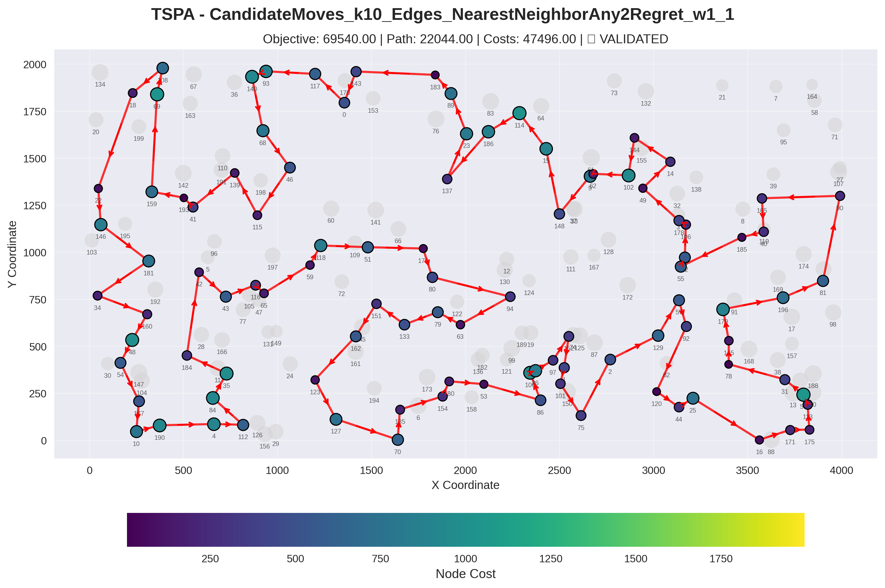
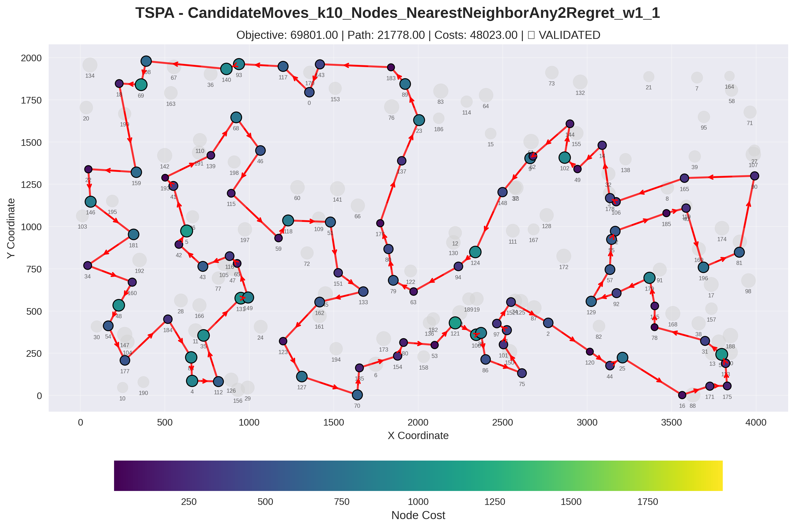
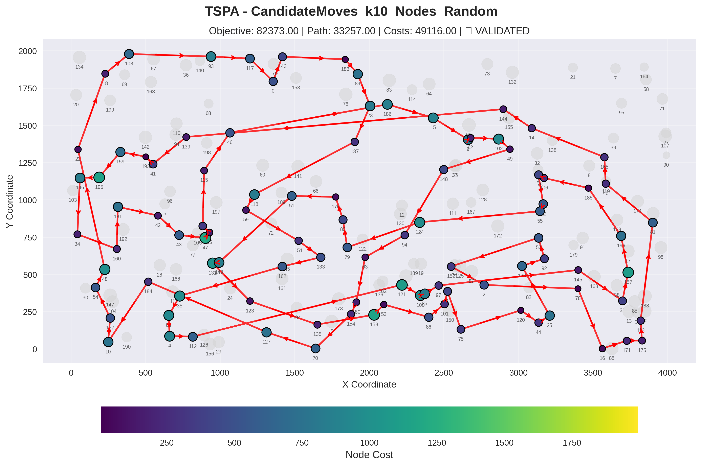
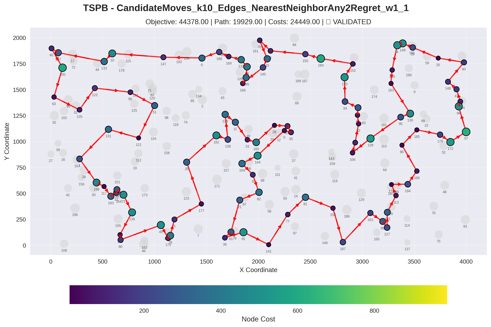
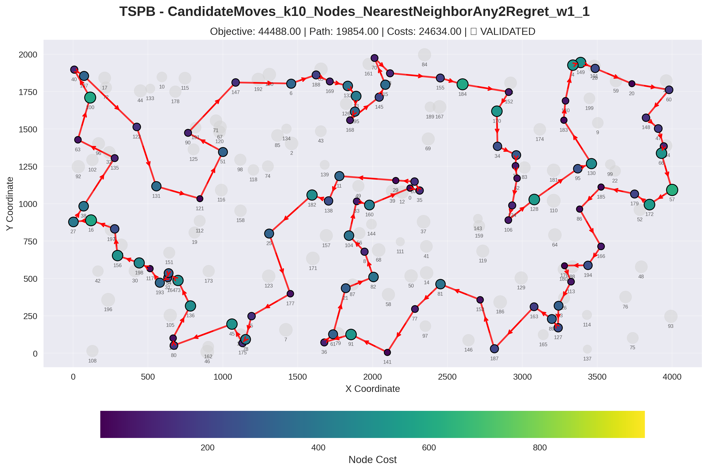
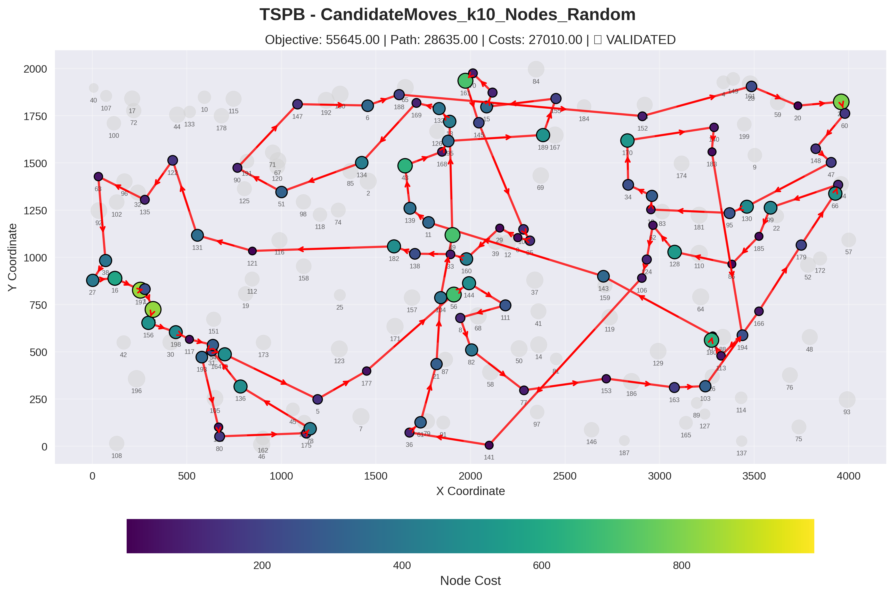
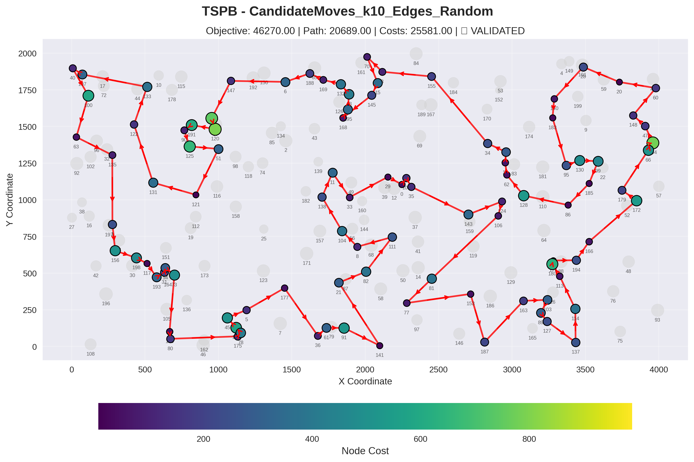

# Candidate Moves Algorithm for TSP Problem

## Authors
- Adam Tomys 156057
- Marcin Kapiszewski 156048

## Implemented Algorithms

### Pseudocode

```
#### Initialization
BuildCandidateLists():
    candidateLists ← empty map
    distMatrix ← instance.getDistanceMatrix()
    totalNodes ← instance.getTotalNodes()
    
    for each node in 0 to totalNodes-1:
        neighbors ← empty list
        
        // Collect all other nodes with their distances
        for each other in 0 to totalNodes-1:
            if node ≠ other:
                add (other, dist(node, other)) to neighbors
        
        // Sort by distance and take k nearest
        sort neighbors by distance (ascending)
        candidates ← empty list
        limit ← min(candidateListSize, neighbors.size())
        
        for i ← 0 to limit-1:
            add neighbors[i].nodeId to candidates
        
        candidateLists[node] ← candidates
    
    return candidateLists

---

#### Main Algorithm

Solve():
    // Build candidate lists once at the beginning
    buildCandidateLists()
    
    // Get initial solution
    currentSolution ← initialSolutionAlgorithm.solve()
    iterationCount ← 0
    improved ← true
    
    while improved:
        improved ← performIteration()
        iterationCount ← iterationCount + 1
    
    return currentSolution

---

#### Iteration Logic

PerformIteration():
    // Generate only candidate moves (not all possible moves)
    candidateMoves ← generateCandidateMoves()
    
    // Find best improving move (steepest descent)
    bestMove ← null
    bestDelta ← 0  // Only accept negative deltas (improvements)
    
    for each move in candidateMoves:
        delta ← calculateMoveDelta(move)
        
        if delta < bestDelta:
            bestDelta ← delta
            bestMove ← move
    
    // Apply best move if found
    if bestMove ≠ null:
        currentSolution ← applyMove(bestMove)
        return true
    
    // No improvement found - local optimum reached
    return false

---

#### Generate Candidate Moves

GenerateCandidateMoves():
    moves ← empty list
    route ← currentSolution.getRoute()
    selectedNodes ← currentSolution.getSelectedNodes()
    n ← route.size()
    
    // Build position map for O(1) lookup
    nodeToPosition ← empty map
    for i ← 0 to n-1:
        nodeToPosition[route[i]] ← i
    
    // For each node in the route
    for i ← 0 to n-1:
        currentNode ← route[i]
        nextPos ← (i + 1) mod n
        nextNode ← route[nextPos]
        prevPos ← (i - 1 + n) mod n
        prevNode ← route[prevPos]
        
        candidates ← candidateLists[currentNode]
        
        // For each candidate of current node
        for each candidate in candidates:
            
            if candidate in selectedNodes:
                // Candidate is in route - generate intra-route moves
                j ← nodeToPosition[candidate]
                
                if neighborhoodChoice == NODE_SWAP:
                    // Swap neighbors with candidate
                    if candidate ≠ nextNode:
                        // _ i _ _ j -> _ i j _ _
                        add NodeSwapMove(nextPos, j) to moves
                        // _ i _ _ j -> j i _ _ _
                        add NodeSwapMove(prevPos, j) to moves
                
                else:  // TWO_OPT
                    // Create edge between currentNode and candidate
                    if candidate ≠ nextNode and candidate ≠ prevNode:
                        pos1 ← min(i, j)
                        pos2 ← max(i, j)
                        
                        if pos2 - pos1 > 1:
                            // _ i _ _ j _ -> // _ i j _ _ _
                            add TwoOptMove(pos1, pos2) to moves
                            // _ i _ _ j _ -> // _ _ _ i j _
                            add TwoOptMove(pos1 - 1, pos2 - 1) to moves
            
            else:
                // Candidate not in route - generate replacement moves
                add ReplaceNodeMove(nextPos, candidate) to moves
                add ReplaceNodeMove(prevPos, candidate) to moves
    
    return moves
```
---

## Experiment Results

### Objective function

| Algorithm | TSPA | TSPB |
|---|---|---|
| Random Solution      | 265,165.54 (238,849.00 - 288,140.00) | 212,968.97 (194,376.00 - 245,960.00)|
| Greedy Cycle         | 72,635.98 (71,488.00 - 74,410.00)  | 51,400.60 (49,001.00 - 57,324.00)|
| Nearest Neighbor Any | 73,178.55 (71,179.00 - 75,450.00)  | 45,870.25 (44,417.00 - 53,438.00)|
| Nearest Neighbor End | 85,108.51 (83,182.00 - 89,433.00)  | 54,390.43 (52,319.00 - 59,030.00)|
| NearestNeighborAny2Regret_w1_1 | 72,401.24 (70,010.00 - 75,452.00) | 47,664.46 (44,891.00 - 55,247.00)|
| NearestNeighborAny2Regret_w0_1 | 117,138.49 (108,151.00 - 124,921.00) | 74,444.46 (69,933.00 - 80,278.00)|
| GreedyCycle2Regret_w1_1 | 72,148.23 (71,108.00 - 73,718.00) | 50,997.35 (47,144.00 - 56,747.00)|
| GreedyCycle2Regret_w0_1 | 116,681.18 (108,804.00 - 123,447.00) | 70,264.65 (65,043.00 - 76,325.00)|
| SteepestLS_Edges_Random | 73842.79 (71576.00 - 78846.00)    | 48374.04 (46064.00 - 52759.00) |
| SteepestLS_Nodes_NearestNeighborAny2Regret_w1_1 | 72010.01 (69801.00 - 75440.00)    | 47137.03 (44488.00 - 54391.00) |
| GreedyLS_Nodes_NearestNeighborAny2Regret_w1_1 | 72001.06 (69801.00 - 75440.00)    | 47103.65 (44456.00 - 52416.00) |
| SteepestLS_Nodes_Random | 88217.17 (80895.00 - 97487.00)    | 63017.43 (54687.00 - 72635.00) |
| GreedyLS_Edges_Random | 73856.40 (71444.00 - 76883.00)    | 48202.11 (45536.00 - 51754.00) |
| GreedyLS_Edges_NearestNeighborAny2Regret_w1_1 | 70936.85 (69497.00 - 72850.00)    | 46397.24 (44320.00 - 51672.00) |
| GreedyLS_Nodes_Random | 86465.01 (80812.00 - 94777.00)    | 60805.92 (53522.00 - 69566.00) |
| SteepestLS_Edges_NearestNeighborAny2Regret_w1_1 | 70722.29 (69540.00 - 72546.00)    | 46342.04 (44320.00 - 51431.00) |
| **CandidateMoves_k10_Edges_NearestNeighborAny2Regret_w1_1** | 70950.55 (69540.00 - 73830.00) | 46363.69 (44378.00 - 51710.00) |
| **CandidateMoves_k10_Edges_Random** | 74166.95 (71665.00 - 80727.00) | 48393.12 (46270.00 - 50834.00) |
| **CandidateMoves_k10_Nodes_NearestNeighborAny2Regret_w1_1** | 72038.13 (69801.00 - 75440.00) | 47192.71 (44488.00 - 54627.00) |
| **CandidateMoves_k10_Nodes_Random** | 90248.02 (82373.00 - 98681.00) | 64866.99 (55645.00 - 75417.00) |

---

### Computation Times (ms)

| Algorithm | TSPA | TSPB |
|---|---|---|
| NearestNeighborAny2Regret_w0_1 | 2.83 (2 - 6) | 2.71 (2 - 5) |
| NearestNeighborAny2Regret_w1_1 | 3.08 (2 - 18) | 2.76 (2 - 6) |
| GreedyCycle2Regret_w0_1        | 3.82 (3 - 5) | 4.02 (3 - 5) |
| GreedyCycle2Regret_w1_1        | 4.22 (3 - 21) | 4.08 (3 - 5) |
| RandomSolution                 | 0.18 (0 - 6) | 0.04 (0 - 1) |
| NearestNeighborEnd             | 0.36 (0 - 2) | 0.15 (0 - 1) |
| NearestNeighborAny             | 2.81 (1 - 57) | 2.04 (1 - 3) |
| GreedyCycle                    | 2.58 (1 - 17) | 2.62 (1 - 54) |
| SteepestLS_Nodes_NearestNeighborAny2Regret_w1_1 | 5.07 (3 - 26) | 6.48 (4 - 11) |
| SteepestLS_Edges_NearestNeighborAny2Regret_w1_1 | 6.30 (3 - 12) | 8.11 (5 - 15) |
| GreedyLS_Nodes_NearestNeighborAny2Regret_w1_1   | 6.32 (4 - 14) | 10.07 (5 - 26) |
| GreedyLS_Edges_NearestNeighborAny2Regret_w1_1   | 10.86 (3 - 26) | 12.92 (6 - 27) |
| SteepestLS_Edges_Random                         | 59.24 (51 - 80) | 56.47 (42 - 65) |
| SteepestLS_Nodes_Random                         | 69.33 (54 - 134) | 68.87 (55 - 86) |
| GreedyLS_Edges_Random                           | 206.46 (180 - 254) | 205.24 (172 - 231) |
| GreedyLS_Nodes_Random                           | 210.28 (173 - 261) | 212.09 (167 - 257) |
| **CandidateMoves_k10_Edges_NearestNeighborAny2Regret_w1_1** | 4.01 (3 - 5) | 4.17 (3 - 5) |
| **CandidateMoves_k10_Edges_Random** | 7.31 (6 - 12) | 7.10 (6 - 10) |
| **CandidateMoves_k10_Nodes_NearestNeighborAny2Regret_w1_1** | 4.14 (3 - 14) | 4.12 (3 - 5) |
| **CandidateMoves_k10_Nodes_Random** | 8.62 (6 - 46) | 8.41 (7 - 11) |

## 2D Visualization of Best Solution

### Instance: TSPA

#### CandidateMoves_k10_Edges_NearestNeighborAny2Regret_w1_1



**Node Order (Route):**
2, 129, 57, 92, 120, 44, 25, 16, 171, 175, 113, 56, 31, 78, 145, 179, 196, 81, 90, 165, 40, 185, 55, 52, 106, 178, 49, 14, 144, 102, 62, 9, 148, 15, 114, 186, 137, 23, 89, 183, 143, 0, 117, 93, 140, 68, 46, 115, 139, 41, 193, 159, 69, 108, 18, 22, 146, 181, 34, 160, 48, 54, 177, 10, 190, 4, 112, 84, 35, 184, 42, 43, 116, 65, 59, 118, 51, 176, 80, 94, 63, 79, 133, 151, 162, 123, 127, 70, 135, 154, 180, 53, 86, 100, 26, 97, 152, 1, 101, 75

#### CandidateMoves_k10_Nodes_NearestNeighborAny2Regret_w1_1



**Node Order (Route):**
108, 69, 18, 159, 22, 146, 181, 34, 160, 48, 54, 177, 184, 84, 4, 112, 35, 131, 149, 65, 116, 43, 42, 5, 41, 193, 139, 68, 46, 115, 59, 118, 51, 151, 133, 162, 123, 127, 70, 135, 154, 180, 53, 121, 100, 26, 86, 75, 101, 1, 97, 152, 2, 120, 44, 25, 16, 171, 175, 113, 56, 31, 78, 145, 179, 92, 129, 57, 55, 52, 185, 40, 196, 81, 90, 165, 106, 178, 14, 49, 102, 144, 62, 9, 148, 124, 94, 63, 79, 80, 176, 137, 23, 89, 183, 143, 0, 117, 93, 140

#### CandidateMoves_k10_Nodes_Random



**Node Order (Route):**
117, 0, 143, 183, 89, 23, 137, 118, 59, 151, 133, 162, 35, 84, 4, 112, 121, 100, 26, 97, 145, 31, 157, 196, 185, 106, 178, 52, 55, 124, 79, 80, 176, 51, 149, 131, 123, 135, 158, 53, 86, 101, 1, 75, 120, 44, 25, 129, 92, 57, 152, 2, 78, 16, 171, 175, 113, 81, 40, 165, 14, 144, 139, 41, 193, 159, 195, 146, 34, 160, 181, 42, 43, 47, 65, 116, 115, 46, 186, 15, 9, 62, 102, 49, 148, 94, 63, 180, 154, 70, 127, 184, 10, 177, 54, 48, 22, 18, 108, 93

#### CandidateMoves_k10_Edges_Random


**Node Order (Route):**
78, 145, 179, 92, 57, 55, 52, 106, 178, 49, 102, 148, 9, 62, 144, 14, 165, 27, 90, 119, 40, 185, 196, 81, 31, 56, 113, 175, 171, 16, 25, 44, 120, 75, 101, 86, 26, 100, 121, 53, 180, 154, 135, 70, 127, 112, 4, 84, 190, 10, 177, 54, 34, 160, 184, 131, 65, 116, 43, 42, 181, 146, 22, 18, 108, 69, 159, 193, 41, 139, 115, 46, 68, 117, 0, 143, 183, 89, 186, 23, 137, 176, 51, 59, 149, 123, 162, 151, 133, 80, 79, 63, 94, 124, 189, 97, 1, 152, 2, 129

### Instance: TSPB

#### CandidateMoves_k10_Edges_NearestNeighborAny2Regret_w1_1



**Node Order (Route):**
10, 133, 107, 40, 100, 63, 135, 122, 90, 51, 121, 131, 1, 198, 117, 193, 31, 54, 73, 136, 190, 80, 45, 175, 78, 5, 177, 25, 182, 138, 139, 11, 33, 160, 29, 109, 35, 0, 144, 104, 8, 82, 21, 61, 36, 91, 141, 77, 81, 153, 187, 163, 89, 127, 103, 113, 176, 194, 166, 86, 185, 179, 172, 57, 66, 94, 47, 148, 60, 20, 28, 149, 4, 140, 183, 130, 95, 128, 106, 124, 62, 18, 55, 34, 170, 152, 184, 155, 3, 70, 15, 145, 168, 195, 13, 132, 169, 188, 6, 147

#### CandidateMoves_k10_Nodes_NearestNeighborAny2Regret_w1_1



**Node Order (Route):**
131, 121, 51, 90, 147, 6, 188, 169, 132, 13, 195, 168, 145, 15, 70, 3, 155, 184, 152, 170, 34, 55, 18, 62, 124, 106, 128, 95, 130, 183, 140, 4, 149, 28, 20, 60, 148, 47, 94, 66, 57, 172, 179, 185, 86, 166, 194, 176, 113, 103, 127, 89, 163, 187, 153, 81, 77, 141, 91, 36, 61, 21, 82, 8, 104, 33, 160, 0, 35, 109, 29, 11, 138, 182, 25, 177, 5, 78, 175, 45, 80, 190, 136, 73, 54, 31, 193, 117, 198, 156, 1, 16, 27, 38, 135, 63, 100, 40, 107, 122

#### CandidateMoves_k10_Nodes_Random



**Node Order (Route):**
24, 156, 198, 117, 54, 193, 190, 80, 175, 78, 136, 31, 73, 5, 177, 56, 144, 111, 8, 82, 77, 153, 163, 103, 166, 179, 66, 94, 99, 185, 86, 128, 62, 124, 106, 141, 36, 61, 21, 104, 49, 13, 132, 169, 134, 51, 90, 147, 6, 188, 152, 28, 20, 23, 60, 148, 47, 130, 95, 18, 55, 34, 170, 140, 183, 194, 113, 180, 176, 143, 11, 139, 43, 168, 195, 189, 155, 15, 3, 70, 161, 145, 109, 35, 0, 29, 160, 33, 138, 182, 121, 131, 122, 135, 63, 38, 27, 16, 197, 1

#### CandidateMoves_k10_Edges_Random



**Node Order (Route):**
185, 86, 128, 62, 18, 55, 34, 155, 3, 70, 15, 145, 168, 195, 13, 132, 169, 188, 6, 147, 71, 120, 191, 90, 125, 51, 121, 131, 122, 133, 107, 40, 100, 63, 135, 1, 156, 198, 117, 193, 31, 54, 73, 190, 80, 175, 78, 142, 45, 5, 177, 36, 61, 91, 141, 21, 82, 111, 8, 104, 138, 11, 33, 29, 0, 109, 35, 143, 124, 106, 81, 77, 153, 187, 163, 103, 89, 127, 137, 114, 113, 180, 176, 194, 166, 172, 179, 66, 94, 154, 47, 148, 60, 20, 28, 140, 183, 95, 130, 99

---

## Conclusions
- Swapping edges again outperforms swapping nodes
- The algorithms are much faster, especially when using the random starts (it is not as visible when starting with other algorithm)
- In general these results are worse than when considering the whole space, but only slightly. If we use the Best initial solution possible the difference is basically zero.