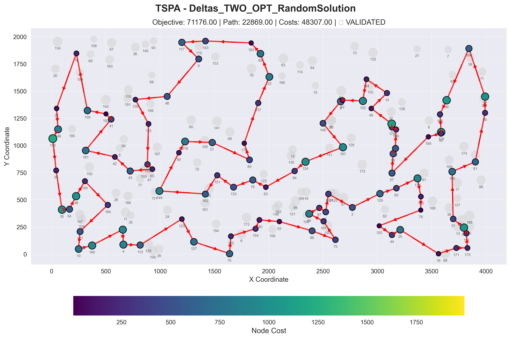
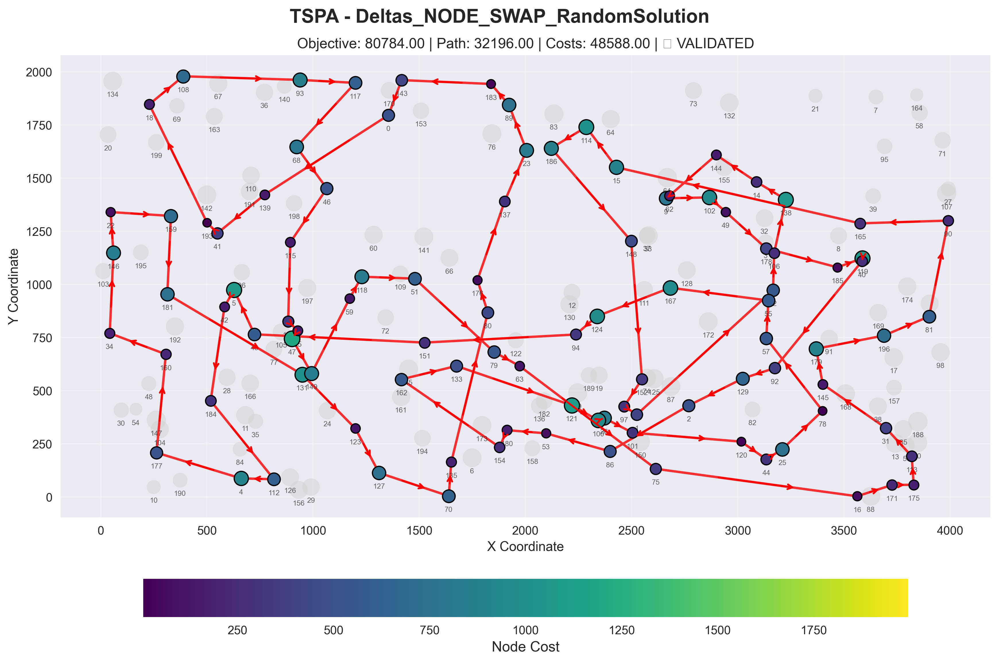
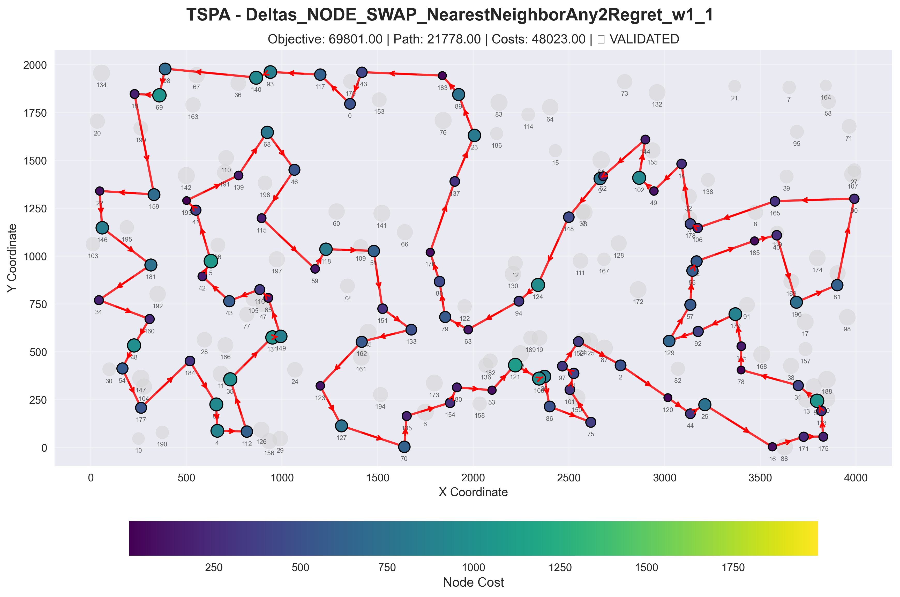
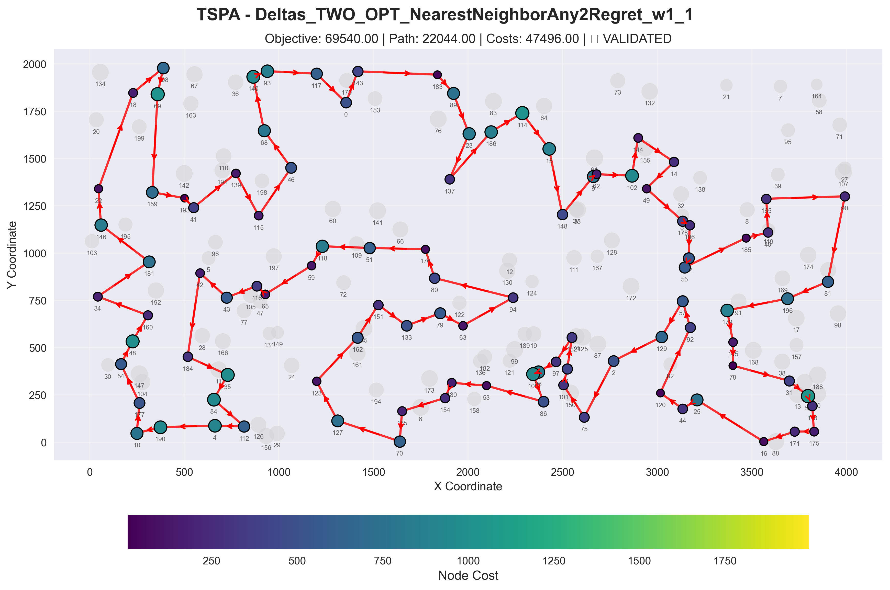
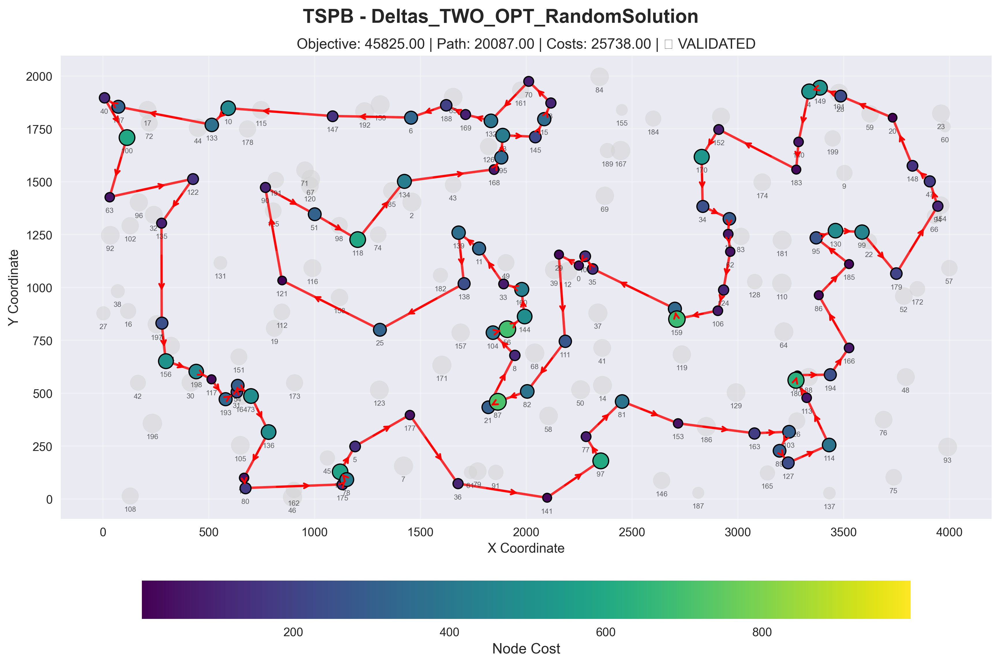
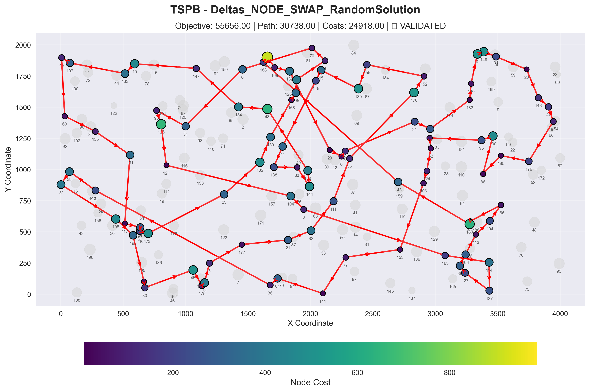
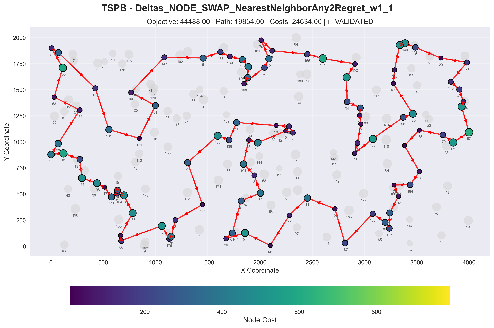
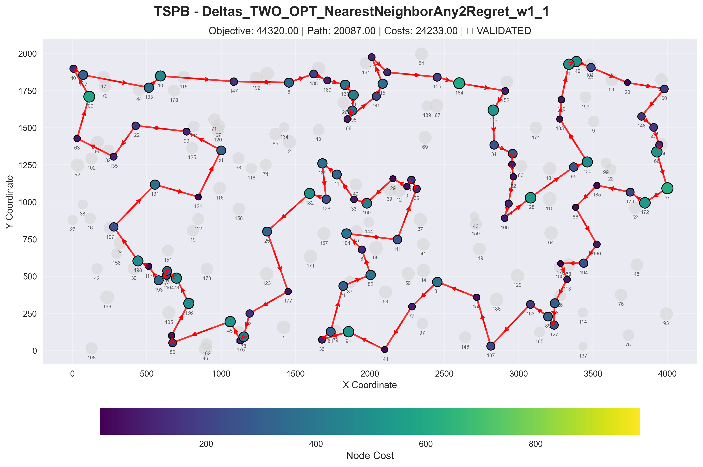

# Delta Caching Algorithm for TSP Problem

## Implemented Algorithms

### Pseudocode

```
# TODO: Add algorithm pseudocode here
```

---

## Experiment Results

### Objective function

| Algorithm | TSPA | TSPB |
|---|---|---|
| SteepestLS_Nodes_NearestNeighborAny2Regret_w1_1 | 72010.01 (69801.00 - 75440.00)    | 47137.03 (44488.00 - 54391.00) |
| Deltas_NODE_SWAP_NearestNeighborAny2Regret_w1_1 | 72010.01 (69801.00 - 75440.00) | 47137.03 (44488.00 - 54391.00) |
| SteepestLS_Nodes_Random | 88217.17 (80895.00 - 97487.00)    | 63017.43 (54687.00 - 72635.00) |
| Deltas_NODE_SWAP_RandomSolution | 88013.12 (80784.00 - 98964.00) | 63135.89 (55656.00 - 72227.00) |
| SteepestLS_Edges_NearestNeighborAny2Regret_w1_1 | 70722.29 (69540.00 - 72546.00)    | 46342.04 (44320.00 - 51431.00) |
| Deltas_TWO_OPT_NearestNeighborAny2Regret_w1_1 | 70722.29 (69540.00 - 72546.00) | 46342.04 (44320.00 - 51431.00) |
| SteepestLS_Edges_Random | 73842.79 (71576.00 - 78846.00)    | 48374.04 (46064.00 - 52759.00) |
| Deltas_TWO_OPT_RandomSolution | 73707.24 (71176.00 - 76844.00) | 48218.42 (45825.00 - 51103.00) |

---

### Computation Times (ms)

| Algorithm | TSPA | TSPB |
|---|---|---|
| SteepestLS_Nodes_NearestNeighborAny2Regret_w1_1 | 5.07 (3 - 26) | 6.48 (4 - 11) |
| Deltas_NODE_SWAP_NearestNeighborAny2Regret_w1_1 | 4.55 (3 - 24) | 4.80 (3 - 8) |
| SteepestLS_Nodes_Random                         | 69.33 (54 - 134) | 68.87 (55 - 86) |
| Deltas_NODE_SWAP_RandomSolution | 28.88 (22 - 117) | 28.16 (22 - 39) |
| SteepestLS_Edges_NearestNeighborAny2Regret_w1_1 | 6.30 (3 - 12) | 8.11 (5 - 15) |
| Deltas_TWO_OPT_NearestNeighborAny2Regret_w1_1 | 4.62 (3 - 8) | 5.83 (3 - 9) |
| SteepestLS_Edges_Random                         | 59.24 (51 - 80) | 56.47 (42 - 65) |
| Deltas_TWO_OPT_RandomSolution | 28.89 (-568 - 66) | 33.73 (29 - 42) |

## 2D Visualization of Best Solution

### Instance: TSPA

#### Deltas_TWO_OPT_RandomSolution



**Node Order (Route):**
190, 84, 4, 112, 123, 127, 70, 135, 154, 180, 53, 86, 75, 101, 26, 97, 1, 152, 2, 129, 92, 179, 145, 78, 120, 44, 25, 16, 171, 175, 113, 56, 31, 196, 81, 90, 27, 164, 39, 165, 119, 40, 185, 57, 55, 52, 106, 178, 3, 49, 14, 144, 102, 62, 9, 148, 167, 124, 94, 63, 79, 133, 151, 162, 149, 59, 118, 51, 80, 176, 137, 23, 89, 183, 143, 117, 0, 46, 139, 115, 116, 65, 43, 42, 181, 41, 193, 159, 18, 22, 146, 103, 34, 30, 54, 48, 160, 184, 177, 10

#### Deltas_NODE_SWAP_RandomSolution



**Node Order (Route):**
114, 186, 148, 152, 97, 1, 52, 106, 138, 14, 144, 62, 9, 102, 49, 178, 185, 119, 40, 92, 129, 2, 86, 53, 180, 154, 162, 133, 121, 100, 26, 101, 120, 44, 25, 78, 57, 55, 167, 124, 94, 151, 43, 5, 42, 184, 112, 4, 177, 160, 34, 146, 22, 159, 181, 131, 123, 127, 70, 135, 80, 176, 137, 23, 89, 183, 143, 0, 139, 41, 193, 18, 108, 93, 117, 68, 46, 115, 116, 65, 47, 149, 59, 118, 51, 79, 63, 75, 16, 171, 175, 113, 31, 145, 179, 196, 81, 90, 165, 15

#### Deltas_NODE_SWAP_NearestNeighborAny2Regret_w1_1



**Node Order (Route):**
108, 69, 18, 159, 22, 146, 181, 34, 160, 48, 54, 177, 184, 84, 4, 112, 35, 131, 149, 65, 116, 43, 42, 5, 41, 193, 139, 68, 46, 115, 59, 118, 51, 151, 133, 162, 123, 127, 70, 135, 154, 180, 53, 121, 100, 26, 86, 75, 101, 1, 97, 152, 2, 120, 44, 25, 16, 171, 175, 113, 56, 31, 78, 145, 179, 92, 129, 57, 55, 52, 185, 40, 196, 81, 90, 165, 106, 178, 14, 49, 102, 144, 62, 9, 148, 124, 94, 63, 79, 80, 176, 137, 23, 89, 183, 143, 0, 117, 93, 140

#### Deltas_TWO_OPT_NearestNeighborAny2Regret_w1_1



**Node Order (Route):**
31, 56, 113, 175, 171, 16, 25, 44, 120, 92, 57, 129, 2, 75, 101, 1, 152, 97, 26, 100, 86, 53, 180, 154, 135, 70, 127, 123, 162, 151, 133, 79, 63, 94, 80, 176, 51, 118, 59, 65, 116, 43, 42, 184, 35, 84, 112, 4, 190, 10, 177, 54, 48, 160, 34, 181, 146, 22, 18, 108, 69, 159, 193, 41, 139, 115, 46, 68, 140, 93, 117, 0, 143, 183, 89, 23, 137, 186, 114, 15, 148, 9, 62, 102, 144, 14, 49, 178, 106, 52, 55, 185, 40, 165, 90, 81, 196, 179, 145, 78

### Instance: TSPB

#### Deltas_TWO_OPT_RandomSolution



**Node Order (Route):**
6, 147, 10, 133, 107, 40, 100, 63, 122, 135, 1, 156, 198, 117, 193, 31, 54, 73, 136, 190, 80, 175, 78, 142, 5, 177, 36, 141, 97, 77, 81, 153, 163, 103, 89, 127, 114, 113, 180, 176, 194, 166, 86, 185, 95, 130, 99, 179, 94, 47, 148, 20, 28, 149, 4, 140, 183, 152, 170, 34, 55, 18, 62, 124, 106, 159, 143, 35, 109, 0, 29, 111, 82, 87, 21, 8, 104, 56, 144, 160, 33, 11, 139, 138, 25, 121, 90, 51, 118, 134, 168, 195, 13, 145, 15, 3, 70, 132, 169, 188

#### Deltas_NODE_SWAP_RandomSolution



**Node Order (Route):**
124, 106, 153, 77, 141, 61, 36, 1, 38, 27, 198, 193, 190, 80, 45, 175, 78, 5, 177, 21, 82, 111, 35, 170, 152, 155, 189, 15, 145, 11, 138, 33, 144, 160, 43, 134, 147, 10, 133, 107, 40, 63, 135, 131, 117, 54, 31, 73, 25, 182, 139, 168, 195, 13, 3, 70, 6, 51, 90, 125, 121, 104, 8, 163, 114, 137, 127, 89, 103, 113, 194, 166, 176, 180, 143, 188, 65, 169, 132, 29, 0, 109, 34, 55, 183, 140, 4, 149, 28, 20, 148, 47, 94, 179, 185, 86, 130, 95, 18, 62

#### Deltas_NODE_SWAP_NearestNeighborAny2Regret_w1_1



**Node Order (Route):**
131, 121, 51, 90, 147, 6, 188, 169, 132, 13, 195, 168, 145, 15, 70, 3, 155, 184, 152, 170, 34, 55, 18, 62, 124, 106, 128, 95, 130, 183, 140, 4, 149, 28, 20, 60, 148, 47, 94, 66, 57, 172, 179, 185, 86, 166, 194, 176, 113, 103, 127, 89, 163, 187, 153, 81, 77, 141, 91, 36, 61, 21, 82, 8, 104, 33, 160, 0, 35, 109, 29, 11, 138, 182, 25, 177, 5, 78, 175, 45, 80, 190, 136, 73, 54, 31, 193, 117, 198, 156, 1, 16, 27, 38, 135, 63, 100, 40, 107, 122

#### Deltas_TWO_OPT_NearestNeighborAny2Regret_w1_1



**Node Order (Route):**
135, 63, 100, 40, 107, 133, 10, 147, 6, 188, 169, 132, 13, 195, 168, 145, 15, 70, 3, 155, 184, 152, 170, 34, 55, 18, 62, 124, 106, 128, 95, 130, 183, 140, 4, 149, 28, 20, 60, 148, 47, 94, 66, 57, 172, 179, 185, 86, 166, 194, 176, 113, 103, 127, 89, 163, 187, 153, 81, 77, 141, 91, 36, 61, 21, 82, 8, 104, 111, 35, 109, 0, 29, 160, 33, 11, 139, 138, 182, 25, 177, 5, 78, 175, 45, 80, 190, 136, 73, 54, 31, 193, 117, 198, 1, 131, 121, 51, 90, 122

---

## Conclusions

### Key Findings

<!-- TODO: Add analysis of results -->


### Performance Comparison

<!-- TODO: Compare algorithms -->


### Observations

<!-- TODO: Add observations -->
