# Lns algorithm for TSP Problem

## Implemented Algorithms

### Pseudocode

```
# TODO: Add algorithm pseudocode here
```

---

## Experiment Results

### Objective function

| Algorithm | TSPA | TSPB |
|---|---|---|
| LNS_d-0.20_LONGEST_EDGE_REMOVAL_ls-Off_hood-TWO_OPT | 71980.50 (70331.00 - 73501.00) | 45864.65 (44572.00 - 47835.00) |
| LNS_d-0.20_LONGEST_EDGE_REMOVAL_ls-On_hood-TWO_OPT | 71175.40 (69965.00 - 72330.00) | 45526.65 (44392.00 - 47494.00) |
| LNS_d-0.20_RANDOM_REMOVAL_ls-Off_hood-TWO_OPT | 69874.00 (69374.00 - 70503.00) | 44412.50 (43602.00 - 45730.00) |
| LNS_d-0.20_RANDOM_REMOVAL_ls-On_hood-TWO_OPT | 69784.30 (69255.00 - 70547.00) | 44260.95 (43565.00 - 44932.00) |
| LNS_d-0.30_LONGEST_EDGE_REMOVAL_ls-Off_hood-TWO_OPT | 71398.60 (70042.00 - 72834.00) | 45190.15 (44316.00 - 46066.00) |
| LNS_d-0.30_LONGEST_EDGE_REMOVAL_ls-On_hood-TWO_OPT | 70757.35 (69792.00 - 71607.00) | 44810.40 (43899.00 - 45727.00) |
| LNS_d-0.30_RANDOM_REMOVAL_ls-Off_hood-TWO_OPT | 69850.40 (69537.00 - 70174.00) | 44270.90 (43671.00 - 45118.00) |
| LNS_d-0.30_RANDOM_REMOVAL_ls-On_hood-TWO_OPT | 69612.30 (69214.00 - 70184.00) | 44292.90 (43484.00 - 45362.00) |
| LNS_d-0.40_LONGEST_EDGE_REMOVAL_ls-Off_hood-TWO_OPT | 70684.15 (69983.00 - 72008.00) | 44945.05 (43997.00 - 45756.00) |
| LNS_d-0.40_LONGEST_EDGE_REMOVAL_ls-On_hood-TWO_OPT | 70319.40 (69405.00 - 71932.00) | 44682.00 (43894.00 - 45976.00) |
| LNS_d-0.40_RANDOM_REMOVAL_ls-Off_hood-TWO_OPT | 69737.15 (69255.00 - 70554.00) | 44199.95 (43602.00 - 44832.00) |
| LNS_d-0.40_RANDOM_REMOVAL_ls-On_hood-TWO_OPT | 69605.65 (69185.00 - 70200.00) | 44026.40 (43509.00 - 44623.00) |

---

### Computation Times (ms)

| Algorithm | TSPA | TSPB |
|---|---|---|
| LNS_d-0.20_LONGEST_EDGE_REMOVAL_ls-Off_hood-TWO_OPT | 11244.10 (11091 - 11448) | 11388.00 (10964 - 11644) |
| LNS_d-0.20_LONGEST_EDGE_REMOVAL_ls-On_hood-TWO_OPT | 7146.45 (4707 - 8003) | 6326.45 (4356 - 7704) |
| LNS_d-0.20_RANDOM_REMOVAL_ls-Off_hood-TWO_OPT | 11177.45 (10979 - 11347) | 11378.25 (11169 - 11565) |
| LNS_d-0.20_RANDOM_REMOVAL_ls-On_hood-TWO_OPT | 6740.95 (5891 - 7517) | 6586.00 (5215 - 7734) |
| LNS_d-0.30_LONGEST_EDGE_REMOVAL_ls-Off_hood-TWO_OPT | 7550.60 (7443 - 7665) | 7712.75 (7579 - 7830) |
| LNS_d-0.30_LONGEST_EDGE_REMOVAL_ls-On_hood-TWO_OPT | 4999.95 (4479 - 5808) | 4892.20 (3702 - 5755) |
| LNS_d-0.30_RANDOM_REMOVAL_ls-Off_hood-TWO_OPT | 7552.75 (7462 - 7631) | 7708.45 (7591 - 7838) |
| LNS_d-0.30_RANDOM_REMOVAL_ls-On_hood-TWO_OPT | 5108.50 (4188 - 5591) | 4550.55 (3687 - 4960) |
| LNS_d-0.40_LONGEST_EDGE_REMOVAL_ls-Off_hood-TWO_OPT | 5782.80 (5700 - 5843) | 5868.30 (5782 - 5957) |
| LNS_d-0.40_LONGEST_EDGE_REMOVAL_ls-On_hood-TWO_OPT | 3853.65 (2941 - 4502) | 3702.55 (3105 - 4580) |
| LNS_d-0.40_RANDOM_REMOVAL_ls-Off_hood-TWO_OPT | 5782.30 (5704 - 5876) | 5920.50 (5823 - 6006) |
| LNS_d-0.40_RANDOM_REMOVAL_ls-On_hood-TWO_OPT | 3993.10 (3522 - 4428) | 3530.70 (2935 - 3879) |

## 2D Visualization of Best Solution

### Instance: TSPA

#### LNS_d-0.30_RANDOM_REMOVAL_ls-Off_hood-TWO_OPT

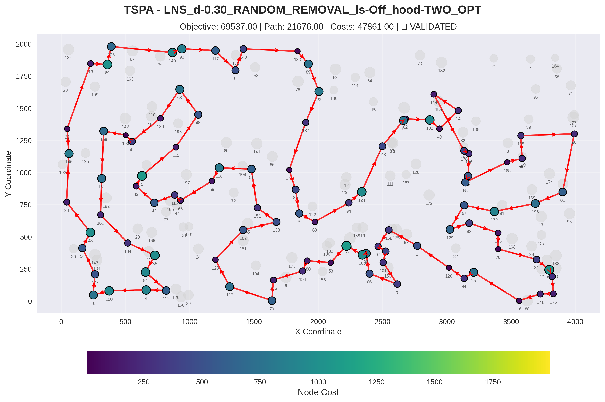

**Node Order (Route):**
178, 106, 52, 55, 185, 40, 165, 90, 81, 196, 179, 57, 129, 92, 145, 78, 31, 56, 113, 175, 171, 16, 25, 44, 120, 2, 152, 97, 1, 101, 75, 86, 26, 100, 121, 53, 180, 154, 135, 70, 127, 123, 162, 133, 151, 51, 118, 59, 65, 116, 43, 42, 5, 115, 46, 68, 139, 41, 193, 159, 181, 160, 184, 35, 84, 112, 4, 190, 10, 177, 54, 48, 34, 146, 22, 18, 69, 108, 140, 93, 117, 0, 143, 183, 89, 23, 137, 176, 80, 79, 63, 94, 124, 148, 9, 62, 102, 49, 14, 144

#### LNS_d-0.20_RANDOM_REMOVAL_ls-On_hood-TWO_OPT

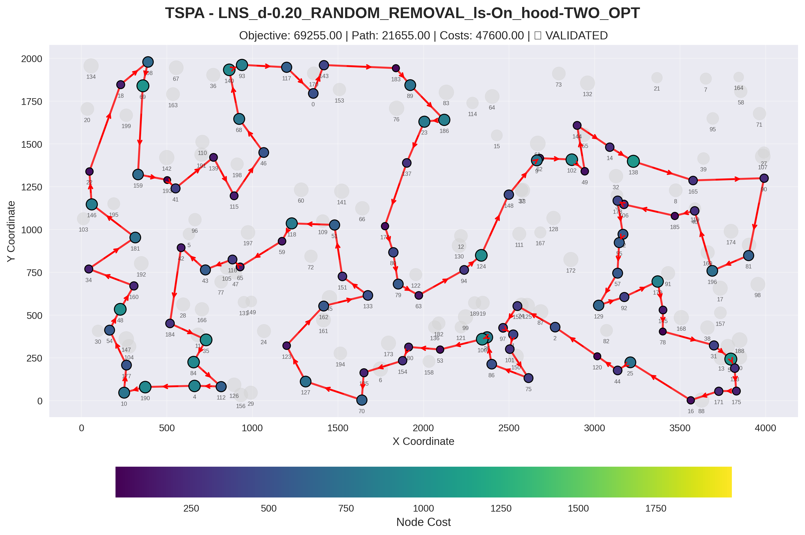

**Node Order (Route):**
2, 152, 97, 1, 101, 75, 86, 26, 100, 53, 180, 154, 135, 70, 127, 123, 162, 133, 151, 51, 118, 59, 65, 116, 43, 42, 184, 35, 84, 112, 4, 190, 10, 177, 54, 48, 160, 34, 181, 146, 22, 18, 108, 69, 159, 193, 41, 139, 115, 46, 68, 140, 93, 117, 0, 143, 183, 89, 186, 23, 137, 176, 80, 79, 63, 94, 124, 148, 9, 62, 102, 49, 144, 14, 138, 165, 90, 81, 196, 40, 185, 106, 178, 52, 55, 57, 129, 92, 179, 145, 78, 31, 56, 113, 175, 171, 16, 25, 44, 120

#### LNS_d-0.40_RANDOM_REMOVAL_ls-On_hood-TWO_OPT

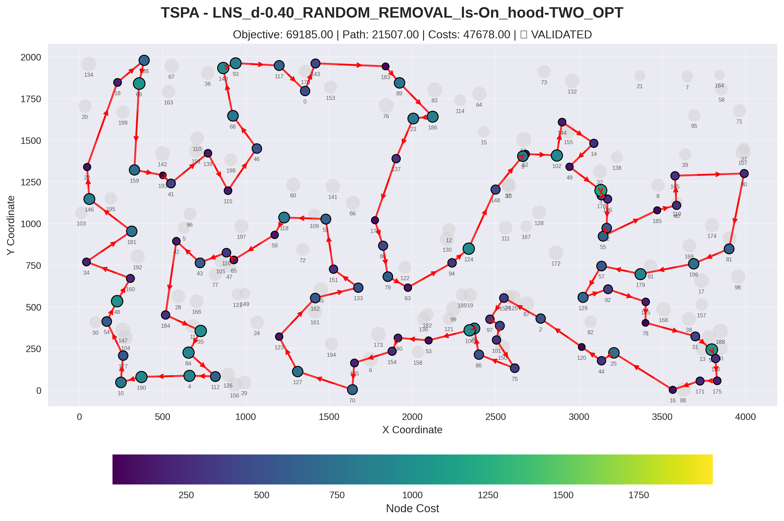

**Node Order (Route):**
51, 118, 59, 65, 116, 43, 42, 184, 35, 84, 112, 4, 190, 10, 177, 54, 48, 160, 34, 181, 146, 22, 18, 108, 69, 159, 193, 41, 139, 115, 46, 68, 140, 93, 117, 0, 143, 183, 89, 186, 23, 137, 176, 80, 79, 63, 94, 124, 148, 9, 62, 102, 144, 14, 49, 3, 178, 106, 52, 55, 185, 40, 165, 90, 81, 196, 179, 57, 129, 92, 145, 78, 31, 56, 113, 175, 171, 16, 25, 44, 120, 2, 152, 97, 1, 101, 75, 86, 26, 100, 53, 180, 154, 135, 70, 127, 123, 162, 133, 151

#### LNS_d-0.30_LONGEST_EDGE_REMOVAL_ls-On_hood-TWO_OPT

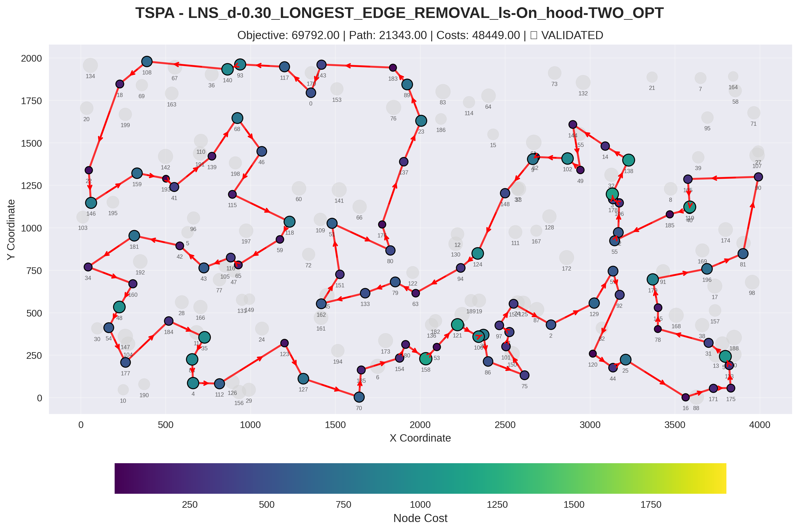

**Node Order (Route):**
178, 3, 138, 14, 144, 49, 102, 62, 9, 148, 124, 94, 63, 79, 133, 162, 151, 51, 80, 176, 137, 23, 89, 183, 143, 0, 117, 93, 140, 108, 18, 22, 146, 159, 193, 41, 139, 68, 46, 115, 118, 59, 65, 116, 43, 42, 181, 34, 160, 48, 54, 177, 184, 35, 84, 4, 112, 123, 127, 70, 135, 154, 180, 158, 53, 121, 100, 26, 86, 75, 101, 1, 97, 152, 2, 129, 57, 92, 120, 44, 25, 16, 171, 175, 113, 56, 31, 78, 145, 179, 196, 81, 90, 165, 119, 40, 185, 55, 52, 106

#### LNS_d-0.30_RANDOM_REMOVAL_ls-On_hood-TWO_OPT

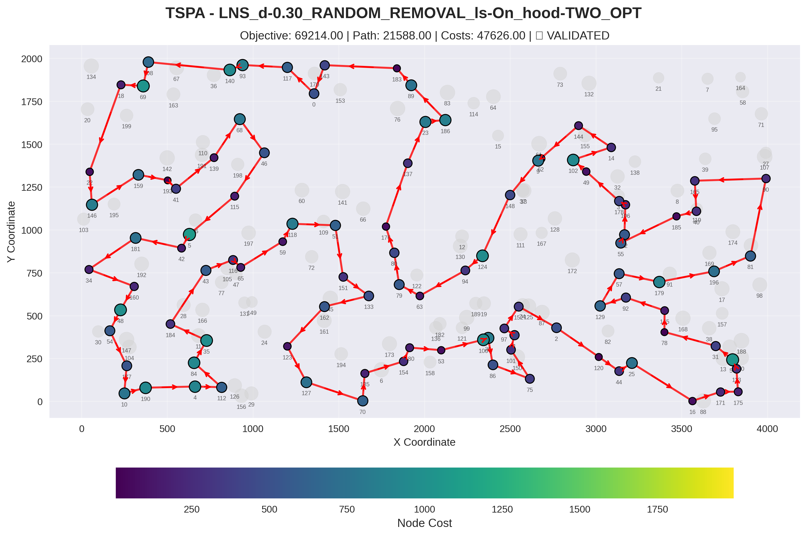

**Node Order (Route):**
78, 145, 92, 129, 57, 179, 196, 81, 90, 165, 40, 185, 55, 52, 106, 178, 49, 102, 14, 144, 62, 9, 148, 124, 94, 63, 79, 80, 176, 137, 23, 186, 89, 183, 143, 0, 117, 93, 140, 108, 69, 18, 22, 146, 159, 193, 41, 139, 68, 46, 115, 5, 42, 181, 34, 160, 48, 54, 177, 10, 190, 4, 112, 84, 35, 184, 43, 116, 65, 59, 118, 51, 151, 133, 162, 123, 127, 70, 135, 154, 180, 53, 100, 26, 86, 75, 101, 1, 97, 152, 2, 120, 44, 25, 16, 171, 175, 113, 56, 31

#### LNS_d-0.40_LONGEST_EDGE_REMOVAL_ls-Off_hood-TWO_OPT

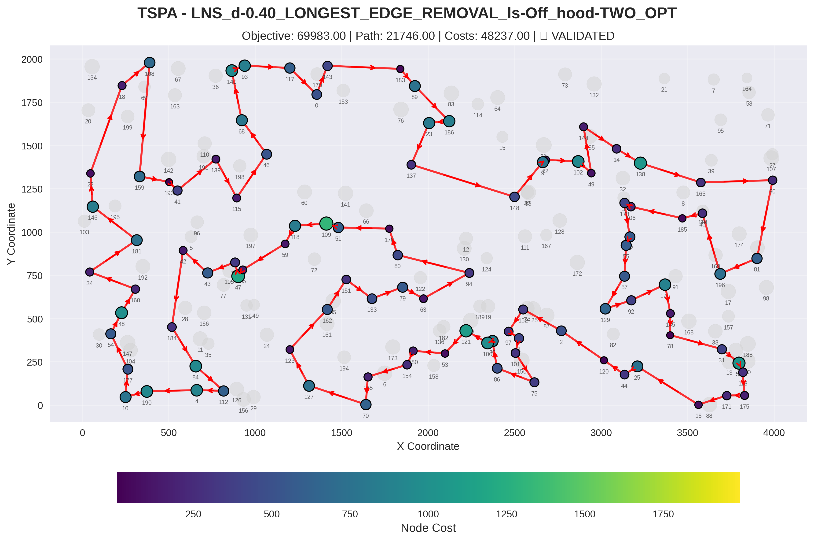

**Node Order (Route):**
31, 56, 113, 175, 171, 16, 25, 44, 120, 2, 152, 97, 1, 101, 75, 86, 26, 100, 121, 53, 180, 154, 135, 70, 127, 123, 162, 151, 133, 79, 63, 94, 80, 176, 51, 109, 118, 59, 65, 47, 116, 43, 42, 184, 84, 112, 4, 190, 10, 177, 54, 48, 160, 34, 181, 146, 22, 18, 108, 159, 193, 41, 139, 115, 46, 68, 140, 93, 117, 0, 143, 183, 89, 186, 23, 137, 148, 9, 62, 102, 49, 144, 14, 138, 165, 90, 81, 196, 40, 185, 106, 178, 52, 55, 57, 129, 92, 179, 145, 78

#### LNS_d-0.30_LONGEST_EDGE_REMOVAL_ls-Off_hood-TWO_OPT

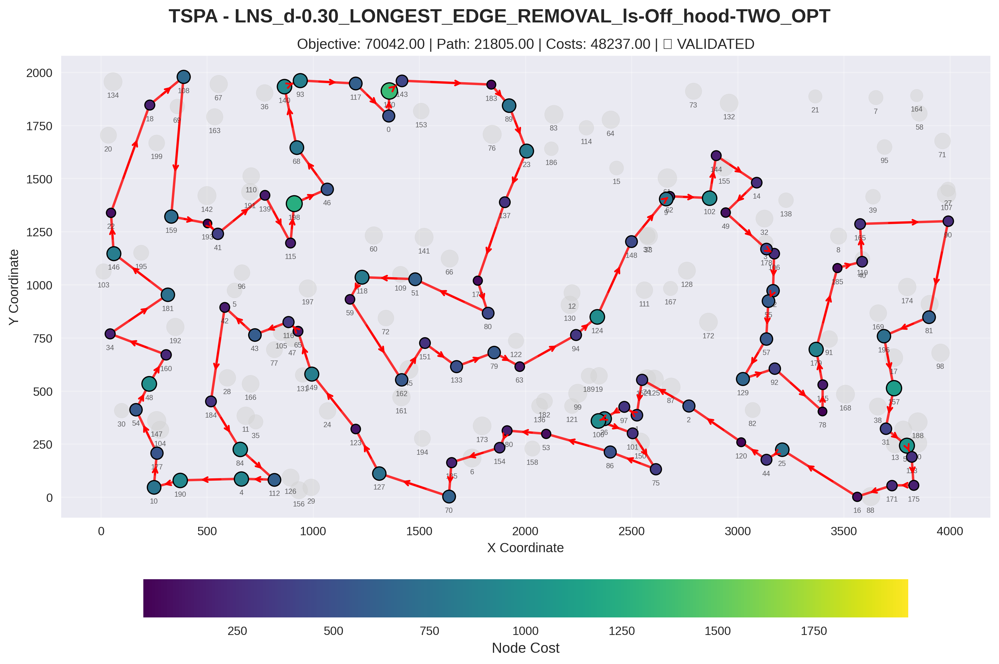

**Node Order (Route):**
2, 152, 1, 97, 26, 100, 101, 75, 86, 53, 180, 154, 135, 70, 127, 123, 149, 65, 116, 43, 42, 184, 84, 112, 4, 190, 10, 177, 54, 48, 160, 34, 181, 146, 22, 18, 108, 159, 193, 41, 139, 115, 198, 46, 68, 140, 93, 117, 0, 170, 143, 183, 89, 23, 137, 176, 80, 51, 118, 59, 162, 151, 133, 79, 63, 94, 124, 148, 9, 62, 102, 144, 14, 49, 178, 106, 52, 55, 57, 129, 92, 78, 145, 179, 185, 40, 165, 90, 81, 196, 157, 31, 56, 113, 175, 171, 16, 25, 44, 120

#### LNS_d-0.20_LONGEST_EDGE_REMOVAL_ls-On_hood-TWO_OPT

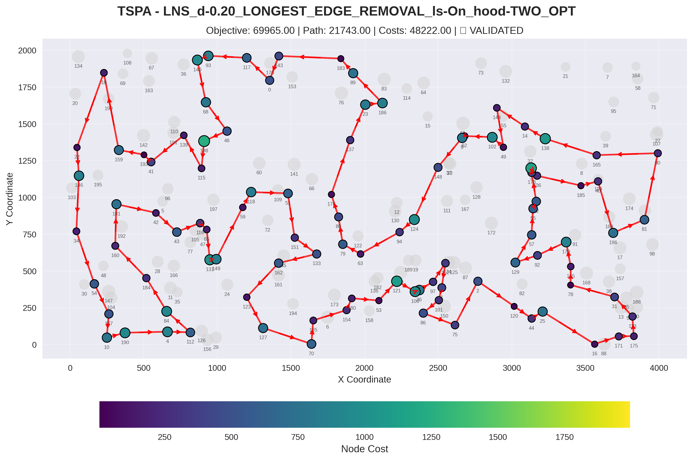

**Node Order (Route):**
175, 113, 31, 78, 145, 179, 92, 129, 57, 55, 52, 178, 3, 106, 185, 40, 196, 81, 90, 165, 138, 14, 144, 49, 102, 62, 9, 148, 124, 94, 63, 79, 80, 176, 137, 23, 186, 89, 183, 143, 0, 117, 93, 140, 68, 46, 198, 115, 139, 41, 193, 159, 18, 22, 146, 34, 54, 177, 10, 190, 4, 112, 84, 184, 160, 181, 42, 43, 116, 65, 131, 149, 59, 118, 51, 151, 133, 162, 123, 127, 70, 135, 154, 180, 53, 121, 100, 26, 97, 152, 1, 101, 86, 75, 2, 120, 44, 25, 16, 171

#### LNS_d-0.20_LONGEST_EDGE_REMOVAL_ls-Off_hood-TWO_OPT

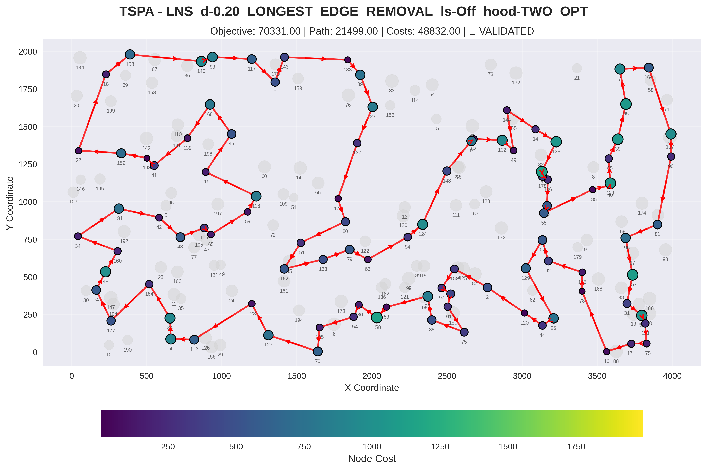

**Node Order (Route):**
138, 3, 178, 106, 52, 55, 185, 40, 119, 165, 39, 95, 7, 164, 27, 90, 81, 196, 157, 31, 56, 113, 175, 171, 16, 78, 145, 92, 57, 129, 25, 44, 120, 2, 152, 97, 1, 101, 75, 86, 26, 53, 158, 180, 154, 135, 70, 127, 123, 112, 4, 84, 184, 177, 54, 48, 160, 34, 181, 42, 43, 116, 65, 59, 118, 115, 46, 68, 139, 41, 193, 159, 22, 18, 108, 140, 93, 117, 0, 143, 183, 89, 23, 137, 176, 80, 151, 162, 133, 79, 63, 94, 124, 148, 9, 62, 102, 49, 144, 14

#### LNS_d-0.20_RANDOM_REMOVAL_ls-Off_hood-TWO_OPT

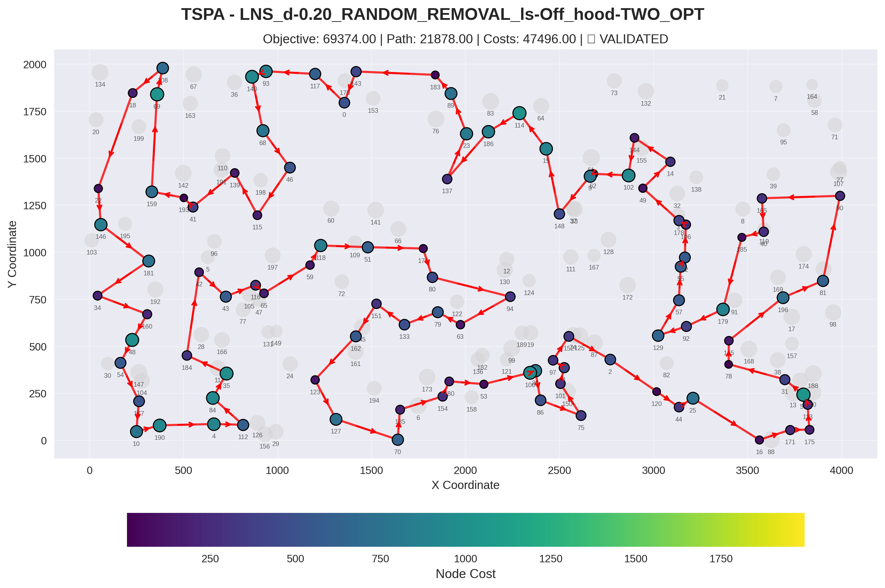

**Node Order (Route):**
179, 92, 129, 57, 55, 52, 106, 178, 49, 14, 144, 102, 62, 9, 148, 15, 114, 186, 137, 23, 89, 183, 143, 0, 117, 93, 140, 68, 46, 115, 139, 41, 193, 159, 69, 108, 18, 22, 146, 181, 34, 160, 48, 54, 177, 10, 190, 4, 112, 84, 35, 184, 42, 43, 116, 65, 59, 118, 51, 176, 80, 94, 63, 79, 133, 151, 162, 123, 127, 70, 135, 154, 180, 53, 100, 26, 86, 75, 101, 1, 97, 152, 2, 120, 44, 25, 16, 171, 175, 113, 56, 31, 78, 145, 196, 81, 90, 165, 40, 185

#### LNS_d-0.40_LONGEST_EDGE_REMOVAL_ls-On_hood-TWO_OPT

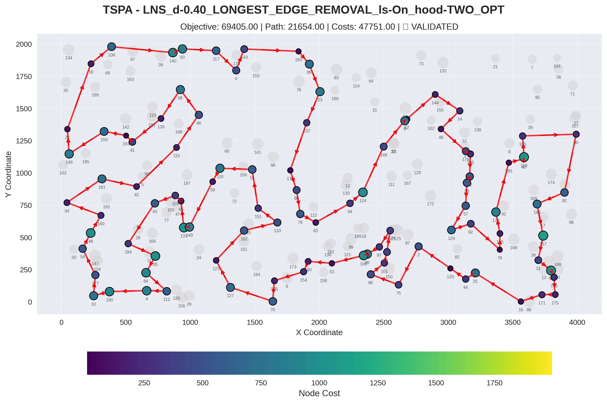

**Node Order (Route):**
25, 44, 120, 2, 75, 86, 101, 1, 152, 97, 26, 100, 53, 180, 154, 135, 70, 127, 123, 162, 133, 151, 51, 118, 59, 149, 131, 65, 116, 43, 184, 35, 84, 112, 4, 190, 10, 177, 54, 48, 160, 34, 181, 42, 115, 46, 68, 139, 41, 193, 159, 146, 22, 18, 108, 140, 93, 117, 0, 143, 183, 89, 23, 137, 176, 80, 79, 63, 94, 124, 148, 9, 62, 144, 14, 49, 178, 106, 52, 55, 57, 129, 92, 78, 145, 179, 185, 40, 119, 165, 90, 81, 196, 157, 31, 56, 113, 175, 171, 16

#### LNS_d-0.40_RANDOM_REMOVAL_ls-Off_hood-TWO_OPT


**Node Order (Route):**
70, 135, 154, 180, 53, 100, 26, 86, 75, 101, 1, 97, 152, 2, 120, 44, 25, 16, 171, 175, 113, 56, 31, 78, 145, 179, 92, 129, 57, 55, 52, 178, 106, 185, 40, 196, 81, 90, 165, 138, 14, 144, 49, 102, 62, 9, 148, 124, 94, 63, 79, 80, 176, 137, 23, 186, 89, 183, 143, 0, 117, 93, 140, 68, 46, 115, 139, 41, 193, 159, 69, 108, 18, 22, 146, 181, 34, 160, 48, 54, 177, 10, 190, 4, 112, 84, 35, 184, 42, 43, 116, 65, 59, 118, 51, 151, 133, 162, 123, 127

### Instance: TSPB

#### LNS_d-0.30_RANDOM_REMOVAL_ls-Off_hood-TWO_OPT

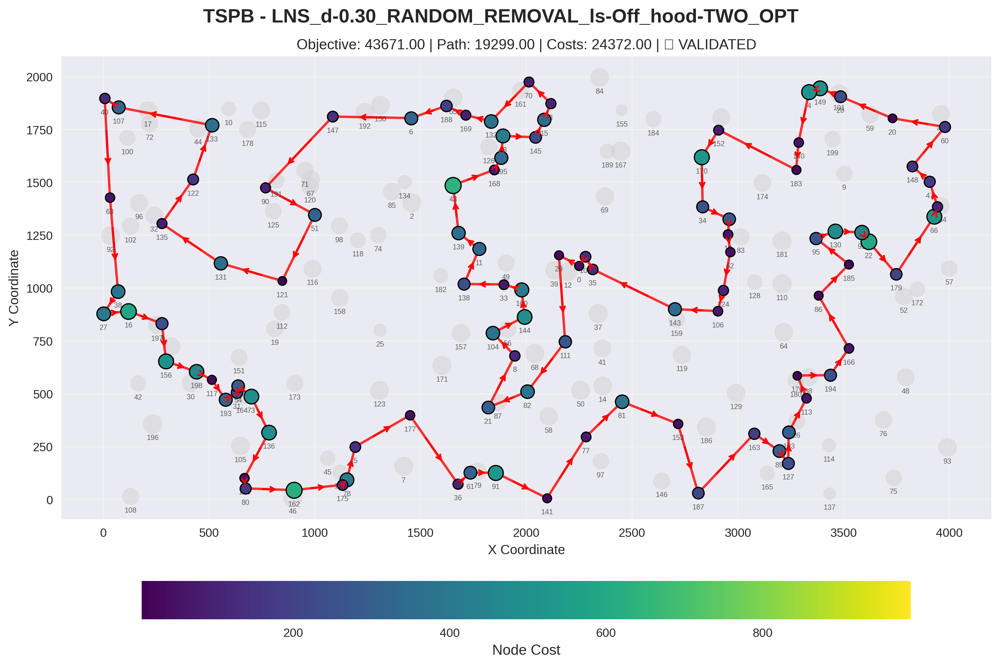

**Node Order (Route):**
90, 51, 121, 131, 135, 122, 133, 107, 40, 63, 38, 27, 16, 1, 156, 198, 117, 193, 31, 54, 73, 136, 190, 80, 162, 175, 78, 5, 177, 36, 61, 91, 141, 77, 81, 153, 187, 163, 89, 127, 103, 113, 176, 194, 166, 86, 185, 95, 130, 99, 22, 179, 66, 94, 47, 148, 60, 20, 28, 149, 4, 140, 183, 152, 170, 34, 55, 18, 62, 124, 106, 143, 35, 109, 0, 29, 111, 82, 21, 8, 104, 144, 160, 33, 138, 11, 139, 43, 168, 195, 13, 145, 15, 3, 70, 132, 169, 188, 6, 147

#### LNS_d-0.20_RANDOM_REMOVAL_ls-On_hood-TWO_OPT

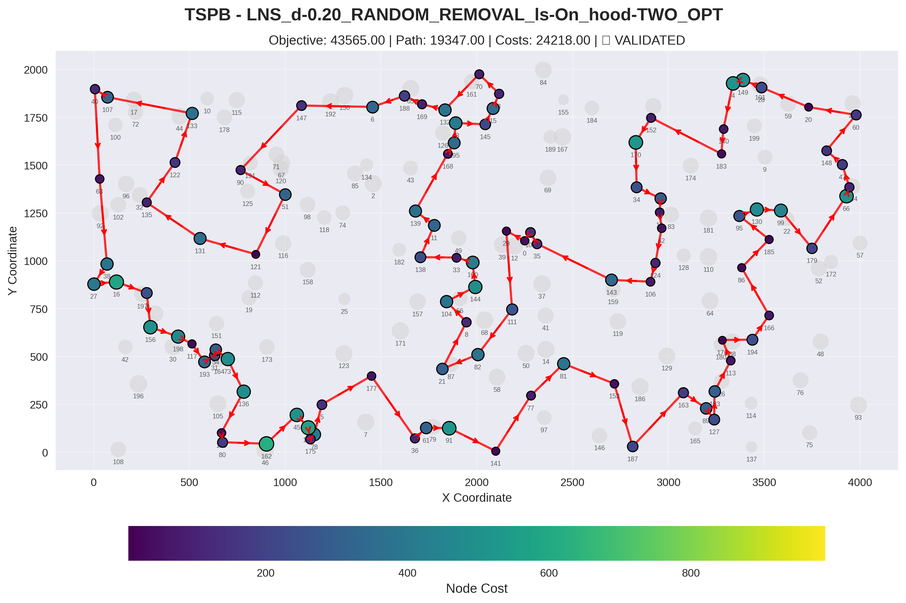

**Node Order (Route):**
121, 131, 135, 122, 133, 107, 40, 63, 38, 27, 16, 1, 156, 198, 117, 193, 31, 54, 73, 136, 190, 80, 162, 45, 142, 175, 78, 5, 177, 36, 61, 91, 141, 77, 81, 153, 187, 163, 89, 127, 103, 113, 176, 194, 166, 86, 185, 95, 130, 99, 179, 66, 94, 47, 148, 60, 20, 28, 149, 4, 140, 183, 152, 170, 34, 55, 18, 62, 124, 106, 143, 35, 109, 0, 29, 111, 82, 21, 8, 104, 144, 160, 33, 138, 11, 139, 168, 195, 13, 145, 15, 3, 70, 132, 169, 188, 6, 147, 90, 51

#### LNS_d-0.40_RANDOM_REMOVAL_ls-On_hood-TWO_OPT

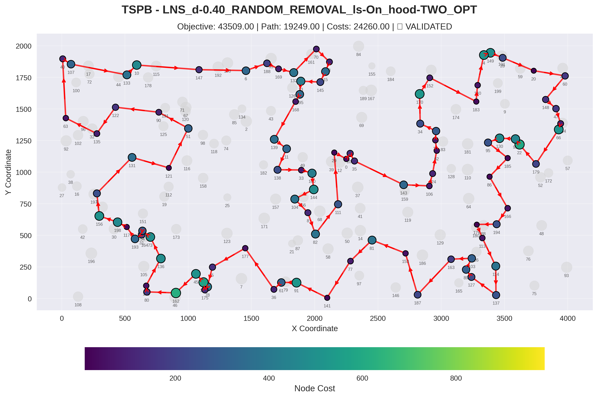

**Node Order (Route):**
187, 153, 81, 77, 141, 91, 61, 36, 177, 5, 78, 175, 142, 45, 162, 80, 190, 136, 73, 54, 31, 193, 117, 198, 156, 1, 131, 121, 51, 90, 122, 135, 63, 40, 107, 133, 10, 147, 6, 188, 169, 132, 70, 3, 15, 145, 13, 195, 168, 139, 11, 138, 33, 160, 144, 104, 8, 82, 111, 29, 0, 109, 35, 143, 106, 124, 62, 18, 55, 34, 170, 152, 183, 140, 4, 149, 28, 20, 60, 148, 47, 94, 66, 179, 22, 99, 130, 95, 185, 86, 166, 194, 176, 113, 114, 137, 127, 89, 103, 163

#### LNS_d-0.30_LONGEST_EDGE_REMOVAL_ls-On_hood-TWO_OPT

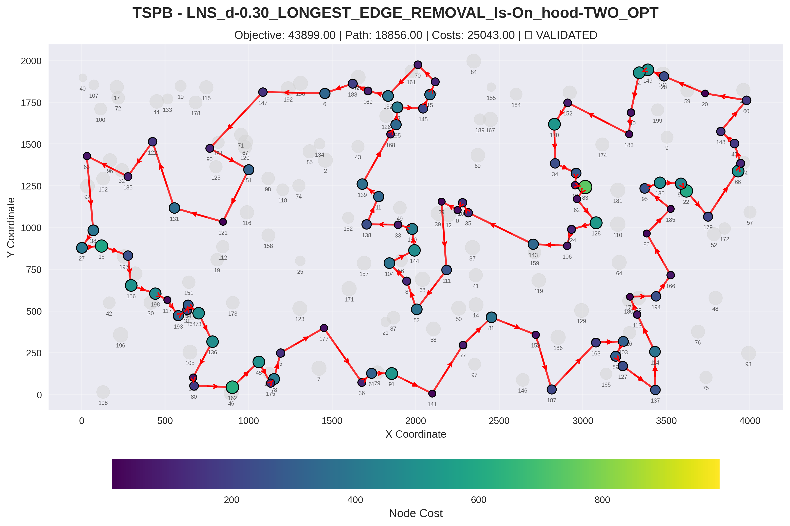

**Node Order (Route):**
86, 185, 95, 130, 99, 22, 179, 66, 94, 47, 148, 60, 20, 28, 149, 4, 140, 183, 152, 170, 34, 55, 18, 83, 62, 128, 124, 106, 143, 35, 109, 0, 29, 111, 82, 8, 104, 144, 160, 33, 138, 11, 139, 168, 195, 13, 145, 15, 3, 70, 132, 169, 188, 6, 147, 90, 51, 121, 131, 122, 135, 63, 38, 27, 16, 1, 156, 198, 117, 193, 31, 54, 73, 136, 190, 80, 162, 45, 175, 78, 5, 177, 36, 61, 91, 141, 77, 81, 153, 187, 163, 103, 89, 127, 137, 114, 113, 176, 194, 166

#### LNS_d-0.30_RANDOM_REMOVAL_ls-On_hood-TWO_OPT

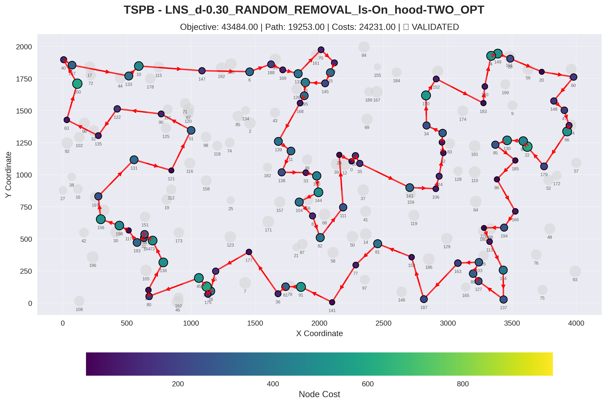

**Node Order (Route):**
133, 10, 147, 6, 188, 169, 132, 70, 3, 15, 145, 13, 195, 168, 139, 11, 138, 33, 160, 144, 104, 8, 82, 111, 29, 0, 109, 35, 143, 106, 124, 62, 18, 55, 34, 170, 152, 183, 140, 4, 149, 28, 20, 60, 148, 47, 94, 66, 179, 22, 99, 130, 95, 185, 86, 166, 194, 176, 113, 114, 137, 127, 89, 103, 163, 187, 153, 81, 77, 141, 91, 61, 36, 177, 5, 78, 175, 142, 45, 80, 190, 136, 73, 54, 31, 193, 117, 198, 156, 1, 131, 121, 51, 90, 122, 135, 63, 100, 40, 107

#### LNS_d-0.40_LONGEST_EDGE_REMOVAL_ls-Off_hood-TWO_OPT

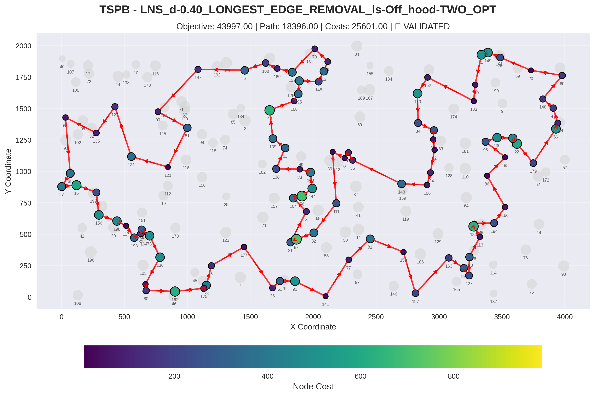

**Node Order (Route):**
3, 70, 132, 169, 188, 6, 147, 90, 51, 121, 131, 122, 135, 63, 38, 27, 16, 1, 156, 198, 117, 193, 31, 54, 73, 136, 190, 80, 162, 175, 78, 5, 177, 36, 61, 91, 141, 77, 81, 153, 187, 163, 89, 127, 103, 113, 180, 176, 194, 166, 86, 185, 95, 130, 99, 22, 179, 66, 94, 47, 148, 60, 20, 28, 149, 4, 140, 183, 152, 170, 34, 55, 18, 62, 124, 106, 143, 35, 109, 0, 29, 111, 82, 87, 21, 8, 104, 56, 144, 160, 33, 138, 11, 139, 43, 168, 195, 13, 145, 15

#### LNS_d-0.30_LONGEST_EDGE_REMOVAL_ls-Off_hood-TWO_OPT

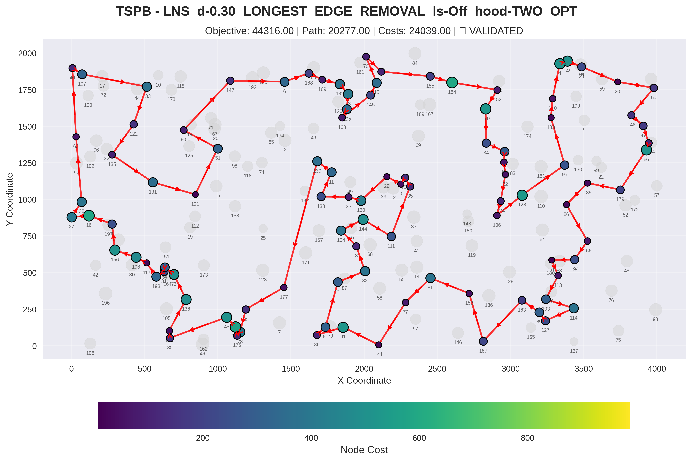

**Node Order (Route):**
177, 5, 78, 175, 142, 45, 80, 190, 136, 73, 54, 31, 193, 117, 198, 156, 1, 16, 27, 38, 63, 40, 107, 133, 122, 135, 131, 121, 51, 90, 147, 6, 188, 169, 132, 13, 195, 168, 145, 15, 70, 3, 155, 184, 152, 170, 34, 55, 18, 62, 124, 106, 128, 95, 183, 140, 4, 149, 28, 20, 60, 148, 47, 94, 66, 179, 185, 86, 166, 194, 176, 113, 103, 114, 127, 89, 163, 187, 153, 81, 77, 141, 91, 36, 61, 21, 82, 8, 104, 144, 111, 35, 109, 0, 29, 160, 33, 138, 11, 139

#### LNS_d-0.20_LONGEST_EDGE_REMOVAL_ls-On_hood-TWO_OPT

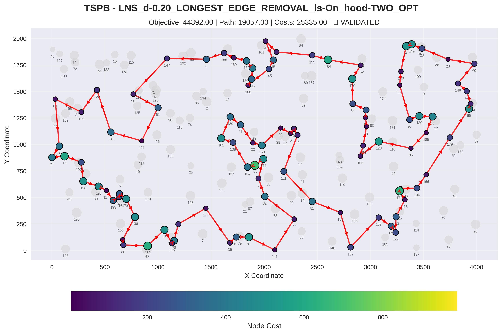

**Node Order (Route):**
138, 182, 139, 11, 33, 160, 29, 0, 109, 35, 111, 81, 153, 187, 163, 89, 127, 103, 113, 180, 176, 194, 166, 179, 66, 94, 47, 148, 60, 20, 28, 149, 4, 140, 183, 95, 130, 99, 185, 86, 128, 106, 124, 62, 18, 55, 34, 170, 152, 184, 155, 3, 70, 15, 145, 168, 195, 13, 132, 169, 188, 6, 147, 90, 51, 121, 131, 122, 135, 63, 38, 27, 16, 1, 156, 198, 117, 193, 31, 54, 73, 136, 190, 80, 162, 45, 175, 78, 5, 177, 36, 61, 91, 141, 77, 82, 8, 144, 56, 104

#### LNS_d-0.20_LONGEST_EDGE_REMOVAL_ls-Off_hood-TWO_OPT

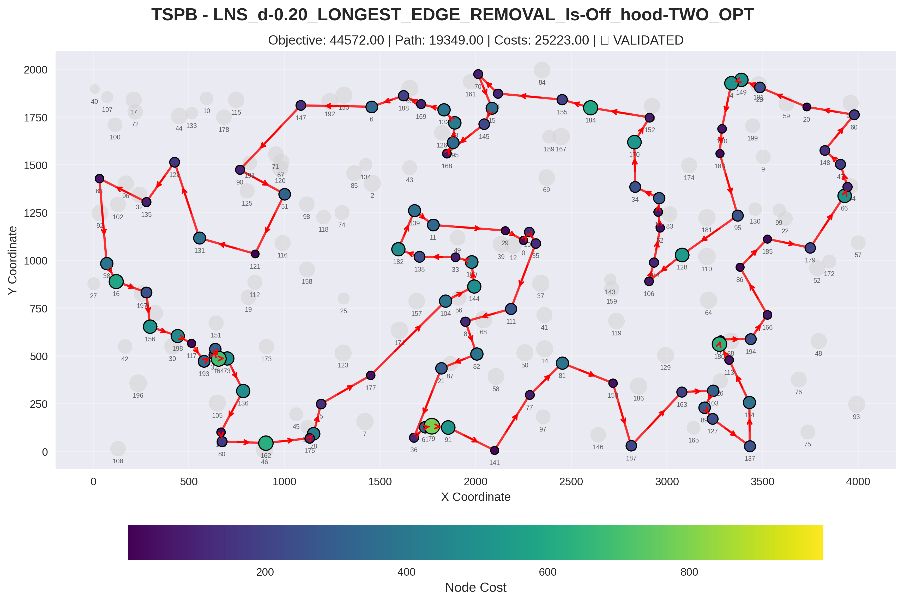

**Node Order (Route):**
86, 185, 179, 66, 94, 47, 148, 60, 20, 28, 149, 4, 140, 183, 95, 128, 106, 124, 62, 18, 55, 34, 170, 152, 184, 155, 3, 70, 15, 145, 168, 195, 13, 132, 169, 188, 6, 147, 90, 51, 121, 131, 122, 135, 63, 38, 16, 1, 156, 198, 117, 193, 31, 54, 164, 73, 136, 190, 80, 162, 175, 78, 5, 177, 104, 144, 160, 33, 138, 182, 139, 11, 29, 0, 109, 35, 111, 8, 82, 21, 36, 61, 79, 91, 141, 77, 81, 153, 187, 163, 103, 89, 127, 137, 114, 113, 180, 176, 194, 166

#### LNS_d-0.20_RANDOM_REMOVAL_ls-Off_hood-TWO_OPT

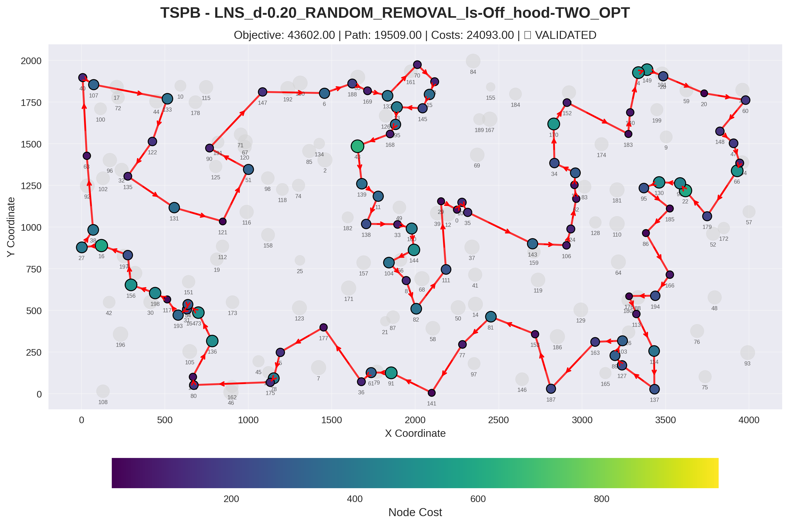

**Node Order (Route):**
80, 190, 136, 73, 54, 31, 193, 117, 198, 156, 1, 16, 27, 38, 63, 40, 107, 133, 122, 135, 131, 121, 51, 90, 147, 6, 188, 169, 132, 70, 3, 15, 145, 13, 195, 168, 43, 139, 11, 138, 33, 160, 144, 104, 8, 82, 111, 29, 0, 109, 35, 143, 106, 124, 62, 18, 55, 34, 170, 152, 183, 140, 4, 149, 28, 20, 60, 148, 47, 94, 66, 179, 22, 99, 130, 95, 185, 86, 166, 194, 176, 113, 114, 137, 127, 89, 103, 163, 187, 153, 81, 77, 141, 91, 61, 36, 177, 5, 78, 175

#### LNS_d-0.40_LONGEST_EDGE_REMOVAL_ls-On_hood-TWO_OPT

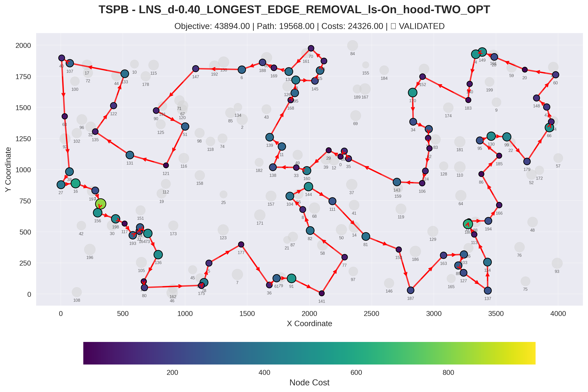

**Node Order (Route):**
175, 78, 5, 177, 36, 61, 91, 141, 77, 82, 8, 104, 144, 111, 81, 153, 187, 163, 103, 89, 127, 137, 114, 113, 180, 176, 194, 166, 86, 185, 95, 130, 99, 179, 66, 94, 47, 148, 60, 20, 28, 149, 4, 140, 183, 152, 170, 34, 55, 18, 62, 124, 106, 143, 35, 109, 0, 29, 160, 33, 138, 11, 139, 168, 195, 13, 145, 15, 3, 70, 132, 169, 188, 6, 147, 90, 51, 121, 131, 135, 122, 133, 107, 40, 63, 38, 27, 16, 1, 24, 156, 198, 117, 193, 31, 54, 73, 136, 190, 80

#### LNS_d-0.40_RANDOM_REMOVAL_ls-Off_hood-TWO_OPT


**Node Order (Route):**
80, 190, 136, 73, 54, 31, 193, 117, 198, 156, 1, 16, 27, 38, 63, 40, 107, 133, 122, 135, 131, 121, 51, 90, 147, 6, 188, 169, 132, 70, 3, 15, 145, 13, 195, 168, 43, 139, 11, 138, 33, 160, 144, 104, 8, 82, 111, 29, 0, 109, 35, 143, 106, 124, 62, 18, 55, 34, 170, 152, 183, 140, 4, 149, 28, 20, 60, 148, 47, 94, 66, 179, 22, 99, 130, 95, 185, 86, 166, 194, 176, 113, 114, 137, 127, 89, 103, 163, 187, 153, 81, 77, 141, 91, 61, 36, 177, 5, 78, 175

---

## Conclusions

### Key Findings

<!-- TODO: Add analysis of results -->


### Performance Comparison

<!-- TODO: Compare algorithms -->


### Observations

<!-- TODO: Add observations -->
