# Lns algorithm for TSP Problem

## Implemented Algorithms

### Pseudocode

```
# TODO: Add algorithm pseudocode here
```

---

## Experiment Results

### Objective function

| Algorithm | TSPA | TSPB |
|---|---|---|
| LNS_d-0.20_REGRET_INSERTION_LONGEST_EDGE_REMOVAL_ls-Off_hood-TWO_OPT | 73492.40 (71714.00 - 75243.00) | 47763.50 (46152.00 - 50433.00) |
| LNS_d-0.20_REGRET_INSERTION_LONGEST_EDGE_REMOVAL_ls-On_hood-TWO_OPT | 73311.80 (71458.00 - 76047.00) | 48166.80 (45521.00 - 50230.00) |
| LNS_d-0.20_REGRET_INSERTION_RANDOM_REMOVAL_ls-Off_hood-TWO_OPT | 72473.10 (71062.00 - 75165.00) | 47537.70 (45436.00 - 49298.00) |
| LNS_d-0.20_REGRET_INSERTION_RANDOM_REMOVAL_ls-On_hood-TWO_OPT | 72166.55 (71049.00 - 73780.00) | 46839.30 (45050.00 - 49571.00) |
| LNS_d-0.30_REGRET_INSERTION_LONGEST_EDGE_REMOVAL_ls-Off_hood-TWO_OPT | 72956.75 (71786.00 - 73776.00) | 47770.45 (46657.00 - 49137.00) |
| LNS_d-0.30_REGRET_INSERTION_LONGEST_EDGE_REMOVAL_ls-On_hood-TWO_OPT | 72488.40 (70558.00 - 73850.00) | 47617.00 (45600.00 - 49588.00) |
| LNS_d-0.30_REGRET_INSERTION_RANDOM_REMOVAL_ls-Off_hood-TWO_OPT | 73244.65 (71120.00 - 77941.00) | 47190.45 (46020.00 - 48550.00) |
| LNS_d-0.30_REGRET_INSERTION_RANDOM_REMOVAL_ls-On_hood-TWO_OPT | 72176.15 (71071.00 - 73842.00) | 46737.20 (44630.00 - 48560.00) |
| LNS_d-0.40_REGRET_INSERTION_LONGEST_EDGE_REMOVAL_ls-Off_hood-TWO_OPT | 73289.95 (71089.00 - 75943.00) | 48018.50 (46137.00 - 50250.00) |
| LNS_d-0.40_REGRET_INSERTION_LONGEST_EDGE_REMOVAL_ls-On_hood-TWO_OPT | 72699.95 (71027.00 - 74319.00) | 47004.60 (44819.00 - 50291.00) |
| LNS_d-0.40_REGRET_INSERTION_RANDOM_REMOVAL_ls-Off_hood-TWO_OPT | 72460.70 (70917.00 - 75292.00) | 47638.45 (46221.00 - 49945.00) |
| LNS_d-0.40_REGRET_INSERTION_RANDOM_REMOVAL_ls-On_hood-TWO_OPT | 71712.85 (70288.00 - 74823.00) | 46271.35 (44823.00 - 48331.00) |

---

### Computation Times (ms)

| Algorithm | TSPA | TSPB |
|---|---|---|
| LNS_d-0.20_REGRET_INSERTION_LONGEST_EDGE_REMOVAL_ls-Off_hood-TWO_OPT | 11436.60 (11005 - 11868) | 11004.50 (10660 - 11346) |
| LNS_d-0.20_REGRET_INSERTION_LONGEST_EDGE_REMOVAL_ls-On_hood-TWO_OPT | 7893.60 (7595 - 8161) | 7812.55 (7387 - 8066) |
| LNS_d-0.20_REGRET_INSERTION_RANDOM_REMOVAL_ls-Off_hood-TWO_OPT | 11459.50 (11001 - 11864) | 11461.80 (11103 - 11813) |
| LNS_d-0.20_REGRET_INSERTION_RANDOM_REMOVAL_ls-On_hood-TWO_OPT | 7960.25 (7685 - 8153) | 7872.15 (7770 - 8036) |
| LNS_d-0.30_REGRET_INSERTION_LONGEST_EDGE_REMOVAL_ls-Off_hood-TWO_OPT | 5702.50 (5486 - 5970) | 5623.00 (5472 - 5855) |
| LNS_d-0.30_REGRET_INSERTION_LONGEST_EDGE_REMOVAL_ls-On_hood-TWO_OPT | 4679.65 (4152 - 4866) | 4621.10 (4360 - 4801) |
| LNS_d-0.30_REGRET_INSERTION_RANDOM_REMOVAL_ls-Off_hood-TWO_OPT | 5698.20 (5511 - 5804) | 5669.75 (5547 - 5920) |
| LNS_d-0.30_REGRET_INSERTION_RANDOM_REMOVAL_ls-On_hood-TWO_OPT | 4687.15 (4491 - 4838) | 4547.45 (4366 - 4746) |
| LNS_d-0.40_REGRET_INSERTION_LONGEST_EDGE_REMOVAL_ls-Off_hood-TWO_OPT | 3493.65 (3360 - 3632) | 3692.55 (3505 - 3880) |
| LNS_d-0.40_REGRET_INSERTION_LONGEST_EDGE_REMOVAL_ls-On_hood-TWO_OPT | 3083.00 (2891 - 3245) | 3079.85 (2849 - 3211) |
| LNS_d-0.40_REGRET_INSERTION_RANDOM_REMOVAL_ls-Off_hood-TWO_OPT | 3590.55 (3508 - 3679) | 3607.15 (3513 - 3781) |
| LNS_d-0.40_REGRET_INSERTION_RANDOM_REMOVAL_ls-On_hood-TWO_OPT | 3135.85 (3045 - 3216) | 3103.40 (2979 - 3217) |

## 2D Visualization of Best Solution

### Instance: TSPA

#### LNS_d-0.20_REGRET_INSERTION_LONGEST_EDGE_REMOVAL_ls-On_hood-TWO_OPT

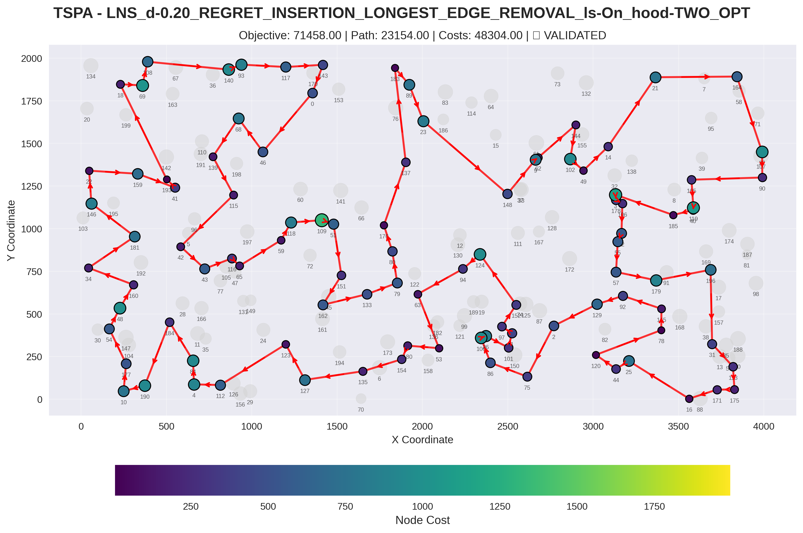

**Node Order (Route):**
53, 180, 154, 135, 127, 123, 112, 4, 84, 184, 190, 10, 177, 54, 48, 160, 34, 181, 146, 22, 159, 41, 193, 18, 69, 108, 140, 93, 117, 143, 0, 46, 68, 139, 115, 42, 43, 116, 65, 59, 118, 109, 51, 151, 162, 133, 79, 80, 176, 137, 183, 89, 23, 148, 9, 62, 144, 102, 49, 14, 21, 164, 27, 90, 165, 119, 40, 185, 3, 178, 106, 52, 55, 57, 179, 196, 31, 113, 175, 171, 16, 25, 44, 120, 78, 145, 92, 129, 2, 75, 86, 100, 26, 101, 1, 97, 152, 124, 94, 63

#### LNS_d-0.30_REGRET_INSERTION_LONGEST_EDGE_REMOVAL_ls-Off_hood-TWO_OPT

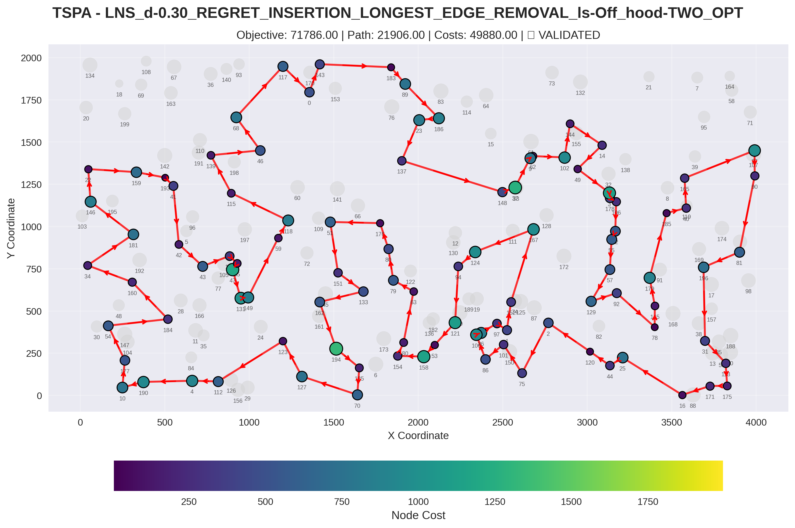

**Node Order (Route):**
143, 183, 89, 186, 23, 137, 148, 37, 9, 62, 102, 144, 14, 49, 3, 178, 106, 52, 55, 57, 129, 92, 78, 145, 179, 185, 40, 165, 27, 90, 81, 196, 31, 113, 175, 171, 16, 25, 44, 120, 2, 75, 101, 86, 100, 26, 97, 1, 152, 167, 124, 94, 121, 53, 158, 154, 180, 63, 79, 80, 176, 51, 151, 133, 162, 194, 135, 70, 127, 123, 112, 4, 190, 10, 177, 54, 184, 160, 34, 181, 146, 22, 159, 193, 41, 42, 43, 116, 65, 47, 131, 149, 59, 118, 115, 139, 46, 68, 117, 0

#### LNS_d-0.40_REGRET_INSERTION_RANDOM_REMOVAL_ls-Off_hood-TWO_OPT

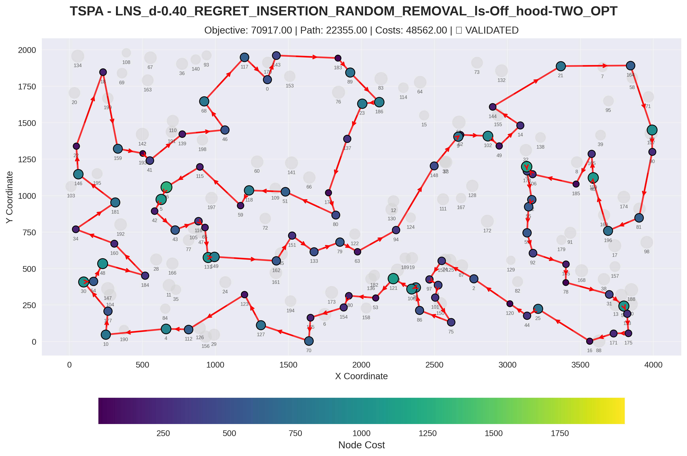

**Node Order (Route):**
79, 63, 94, 148, 9, 62, 102, 49, 14, 144, 21, 164, 27, 90, 81, 196, 40, 119, 165, 185, 106, 3, 178, 52, 55, 57, 92, 145, 78, 31, 56, 113, 175, 171, 16, 25, 44, 120, 2, 152, 97, 1, 101, 75, 86, 26, 100, 121, 53, 180, 154, 135, 70, 127, 123, 112, 4, 10, 177, 30, 54, 48, 184, 160, 34, 181, 146, 22, 18, 159, 193, 41, 139, 46, 68, 117, 0, 143, 183, 89, 186, 23, 137, 176, 80, 51, 118, 59, 115, 96, 5, 42, 43, 116, 65, 131, 149, 162, 151, 133

#### LNS_d-0.40_REGRET_INSERTION_LONGEST_EDGE_REMOVAL_ls-Off_hood-TWO_OPT

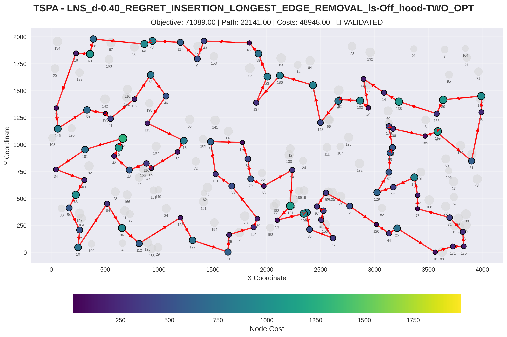

**Node Order (Route):**
62, 9, 148, 15, 186, 137, 23, 89, 183, 143, 0, 117, 93, 140, 108, 69, 18, 22, 146, 159, 193, 41, 139, 68, 46, 115, 118, 59, 65, 116, 43, 42, 5, 96, 181, 34, 160, 48, 54, 177, 10, 184, 84, 112, 123, 127, 70, 135, 154, 180, 133, 151, 51, 176, 80, 79, 63, 94, 121, 53, 100, 26, 86, 75, 101, 1, 97, 152, 2, 120, 44, 25, 16, 171, 175, 113, 31, 78, 145, 179, 92, 129, 57, 55, 52, 178, 106, 185, 119, 40, 81, 90, 27, 39, 165, 138, 14, 144, 49, 102

#### LNS_d-0.30_REGRET_INSERTION_RANDOM_REMOVAL_ls-On_hood-TWO_OPT

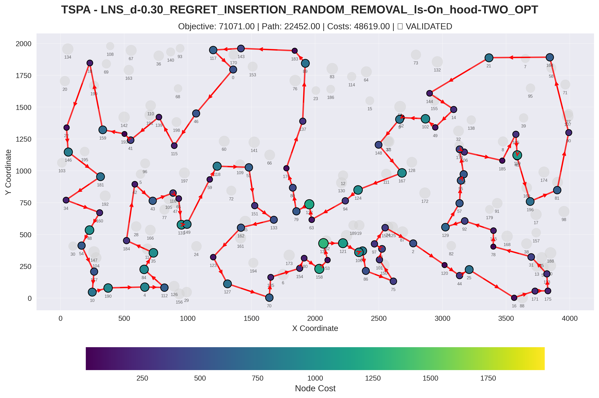

**Node Order (Route):**
151, 133, 162, 123, 127, 70, 135, 154, 180, 158, 53, 136, 121, 100, 26, 86, 75, 101, 1, 97, 152, 2, 120, 44, 25, 16, 171, 175, 113, 31, 78, 145, 92, 129, 57, 55, 52, 178, 106, 185, 165, 119, 40, 196, 81, 90, 164, 21, 144, 14, 49, 102, 62, 9, 148, 167, 124, 94, 63, 122, 79, 80, 176, 137, 89, 183, 143, 117, 0, 46, 115, 139, 41, 193, 159, 18, 22, 146, 181, 34, 160, 48, 54, 177, 10, 190, 4, 112, 84, 35, 184, 42, 43, 116, 65, 131, 149, 59, 118, 51

#### LNS_d-0.30_REGRET_INSERTION_RANDOM_REMOVAL_ls-Off_hood-TWO_OPT

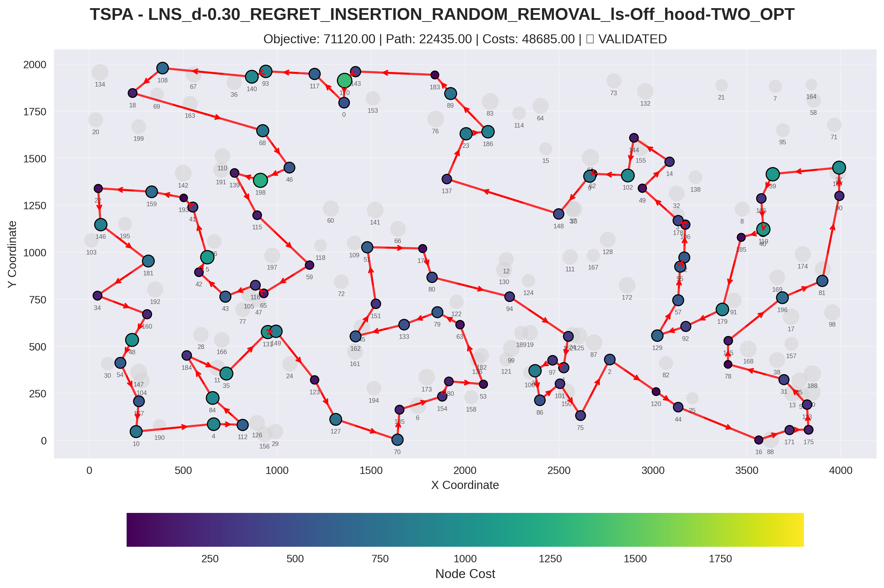

**Node Order (Route):**
41, 193, 159, 22, 146, 181, 34, 160, 48, 54, 177, 10, 4, 112, 84, 184, 35, 131, 149, 123, 127, 70, 135, 154, 180, 53, 63, 79, 133, 162, 151, 51, 176, 80, 94, 152, 1, 97, 26, 86, 101, 75, 2, 120, 44, 16, 171, 175, 113, 31, 78, 145, 196, 81, 90, 27, 39, 165, 119, 40, 185, 179, 92, 129, 57, 55, 52, 106, 178, 49, 14, 144, 102, 62, 9, 148, 137, 23, 186, 89, 183, 143, 170, 0, 117, 93, 140, 108, 18, 68, 46, 198, 139, 115, 59, 65, 116, 43, 42, 5

#### LNS_d-0.20_REGRET_INSERTION_RANDOM_REMOVAL_ls-On_hood-TWO_OPT

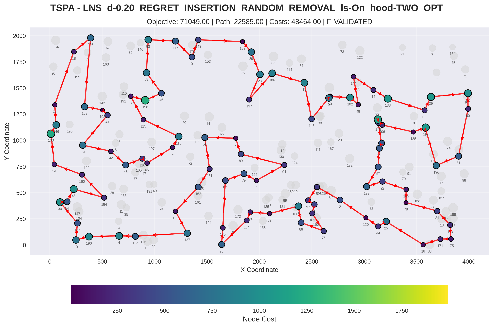

**Node Order (Route):**
81, 196, 40, 119, 185, 106, 3, 178, 52, 55, 57, 129, 92, 145, 78, 31, 113, 175, 171, 16, 25, 44, 120, 2, 152, 97, 1, 101, 75, 86, 26, 53, 180, 154, 70, 135, 133, 79, 63, 94, 80, 176, 51, 151, 162, 123, 127, 112, 4, 190, 10, 177, 30, 54, 48, 184, 160, 34, 103, 146, 22, 18, 108, 159, 193, 41, 181, 42, 43, 116, 65, 59, 118, 115, 139, 198, 46, 68, 93, 117, 0, 143, 183, 89, 23, 137, 186, 15, 148, 9, 62, 102, 49, 144, 14, 138, 165, 39, 27, 90

#### LNS_d-0.40_REGRET_INSERTION_LONGEST_EDGE_REMOVAL_ls-On_hood-TWO_OPT

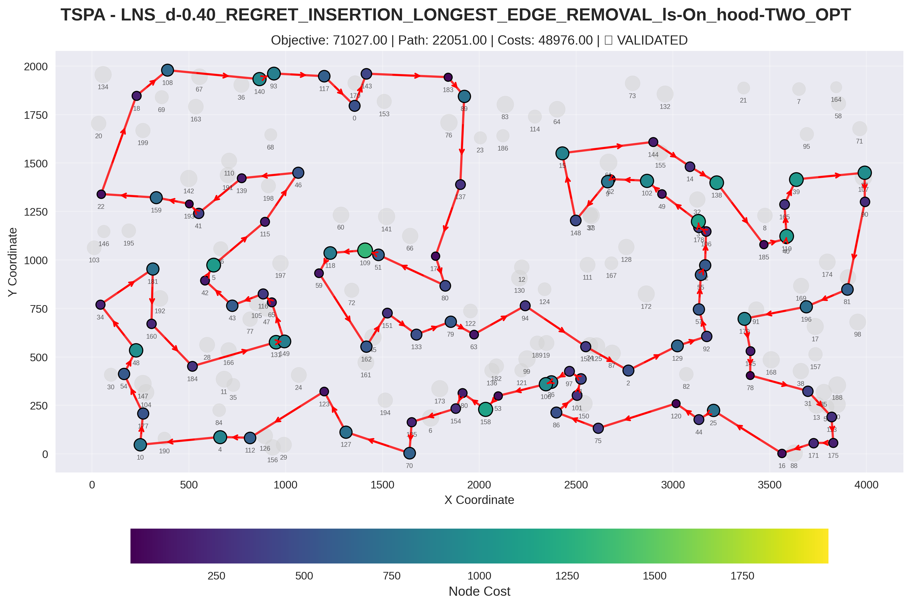

**Node Order (Route):**
59, 162, 151, 133, 79, 63, 94, 152, 2, 129, 92, 57, 55, 52, 106, 178, 3, 49, 102, 62, 9, 148, 15, 144, 14, 138, 185, 40, 119, 165, 39, 27, 90, 81, 196, 179, 145, 78, 31, 113, 175, 171, 16, 25, 44, 120, 75, 86, 101, 1, 97, 26, 100, 53, 158, 180, 154, 135, 70, 127, 123, 112, 4, 10, 177, 54, 48, 34, 181, 160, 184, 131, 149, 65, 116, 43, 42, 5, 115, 46, 139, 41, 193, 159, 22, 18, 108, 140, 93, 117, 0, 143, 183, 89, 137, 176, 80, 51, 109, 118

#### LNS_d-0.40_REGRET_INSERTION_RANDOM_REMOVAL_ls-On_hood-TWO_OPT

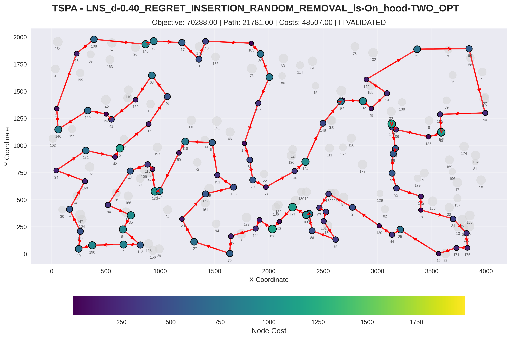

**Node Order (Route):**
35, 84, 112, 4, 190, 10, 177, 54, 160, 34, 181, 42, 5, 115, 46, 68, 139, 41, 193, 159, 146, 22, 18, 108, 140, 93, 117, 0, 143, 183, 89, 23, 137, 176, 80, 79, 63, 94, 124, 148, 9, 62, 102, 49, 14, 144, 21, 164, 90, 165, 119, 40, 185, 106, 3, 178, 52, 55, 57, 92, 145, 78, 31, 113, 175, 171, 16, 25, 44, 120, 2, 152, 97, 1, 101, 75, 86, 26, 100, 121, 53, 158, 180, 154, 135, 70, 127, 123, 162, 133, 151, 51, 118, 59, 149, 131, 65, 116, 43, 184

#### LNS_d-0.20_REGRET_INSERTION_RANDOM_REMOVAL_ls-Off_hood-TWO_OPT

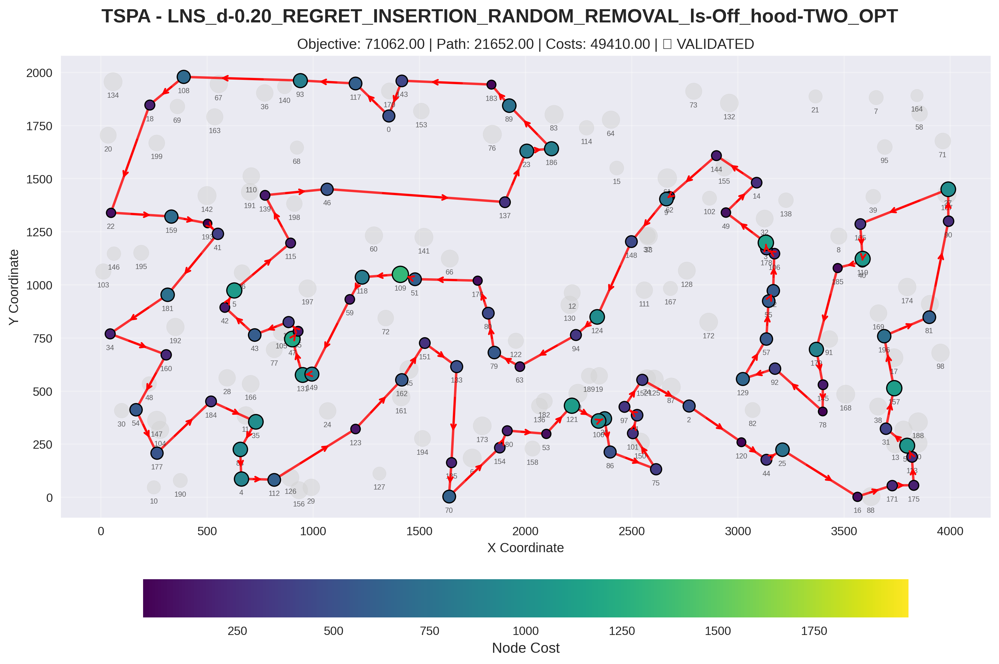

**Node Order (Route):**
44, 25, 16, 171, 175, 113, 56, 31, 157, 196, 81, 90, 27, 165, 119, 40, 185, 179, 145, 78, 92, 129, 57, 55, 52, 106, 178, 3, 49, 14, 144, 62, 9, 148, 124, 94, 63, 79, 80, 176, 51, 109, 118, 59, 149, 131, 47, 65, 116, 43, 42, 5, 115, 139, 46, 137, 23, 186, 89, 183, 143, 0, 117, 93, 108, 18, 22, 159, 193, 41, 181, 34, 160, 54, 177, 184, 35, 84, 4, 112, 123, 162, 151, 133, 135, 70, 154, 180, 53, 121, 100, 26, 86, 75, 101, 1, 97, 152, 2, 120

#### LNS_d-0.20_REGRET_INSERTION_LONGEST_EDGE_REMOVAL_ls-Off_hood-TWO_OPT

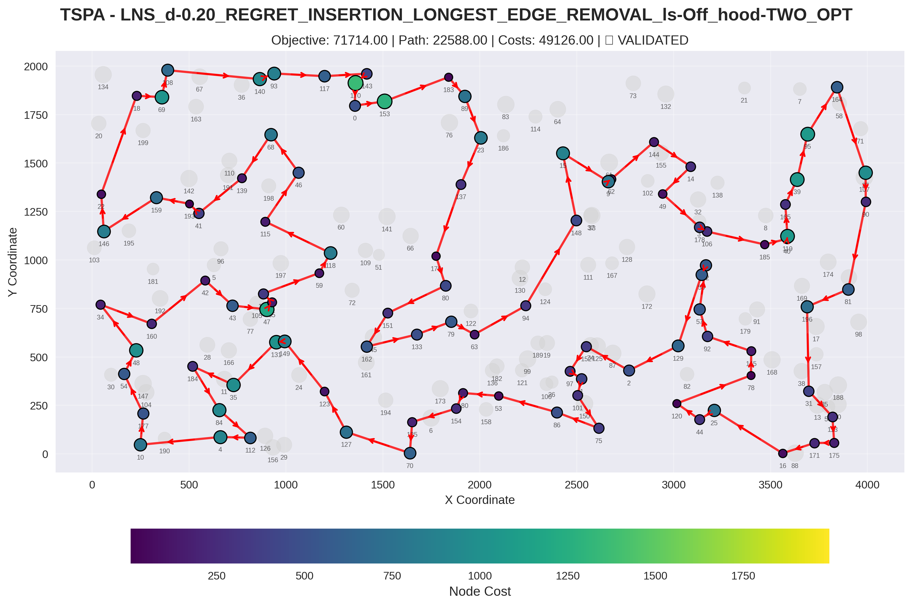

**Node Order (Route):**
159, 146, 22, 18, 69, 108, 140, 93, 117, 143, 170, 0, 153, 183, 89, 23, 137, 176, 80, 151, 162, 133, 79, 63, 94, 148, 15, 9, 62, 144, 14, 49, 178, 106, 185, 40, 119, 165, 39, 95, 164, 27, 90, 81, 196, 31, 113, 175, 171, 16, 25, 44, 120, 78, 145, 92, 57, 52, 55, 129, 2, 152, 97, 1, 101, 75, 86, 53, 180, 154, 135, 70, 127, 123, 149, 131, 35, 184, 84, 112, 4, 10, 177, 54, 48, 34, 160, 42, 43, 47, 65, 116, 59, 118, 115, 46, 68, 139, 41, 193

#### LNS_d-0.30_REGRET_INSERTION_LONGEST_EDGE_REMOVAL_ls-On_hood-TWO_OPT

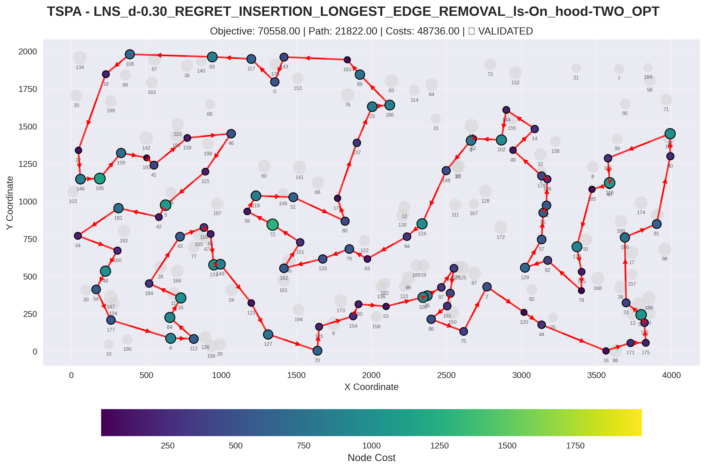

**Node Order (Route):**
31, 196, 81, 90, 27, 165, 119, 40, 185, 179, 145, 78, 92, 129, 57, 55, 52, 106, 178, 49, 14, 144, 102, 62, 9, 148, 124, 94, 63, 79, 133, 162, 151, 72, 59, 118, 51, 80, 176, 137, 23, 186, 89, 183, 143, 0, 117, 93, 108, 18, 22, 146, 195, 159, 193, 41, 139, 46, 115, 5, 42, 181, 34, 160, 48, 54, 177, 4, 112, 84, 35, 184, 43, 116, 65, 131, 149, 123, 127, 70, 135, 154, 180, 53, 100, 26, 97, 152, 1, 101, 86, 75, 2, 120, 44, 16, 171, 175, 113, 56

### Instance: TSPB

#### LNS_d-0.20_REGRET_INSERTION_LONGEST_EDGE_REMOVAL_ls-On_hood-TWO_OPT

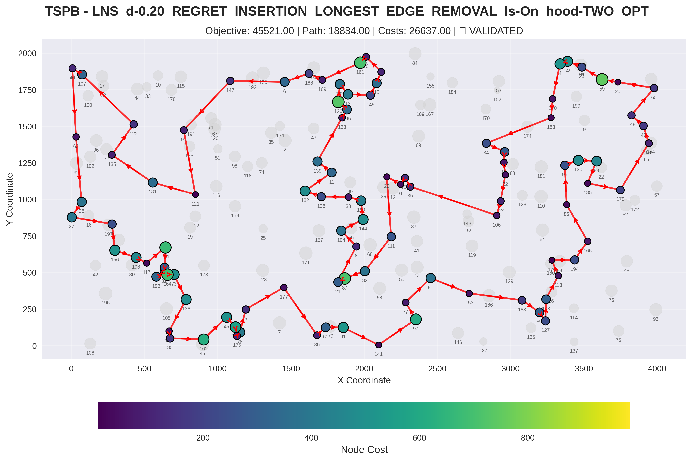

**Node Order (Route):**
20, 59, 28, 149, 4, 140, 183, 34, 55, 18, 62, 124, 106, 35, 109, 0, 29, 111, 82, 87, 21, 8, 104, 144, 160, 33, 138, 182, 11, 139, 168, 195, 126, 132, 13, 145, 15, 3, 70, 161, 169, 188, 6, 147, 90, 121, 131, 135, 122, 107, 40, 63, 38, 27, 1, 156, 198, 117, 151, 54, 31, 193, 164, 73, 136, 190, 80, 162, 45, 142, 175, 78, 5, 177, 36, 61, 91, 141, 97, 77, 81, 153, 163, 89, 127, 103, 113, 176, 194, 166, 86, 95, 130, 99, 185, 179, 94, 47, 148, 60

#### LNS_d-0.30_REGRET_INSERTION_LONGEST_EDGE_REMOVAL_ls-Off_hood-TWO_OPT

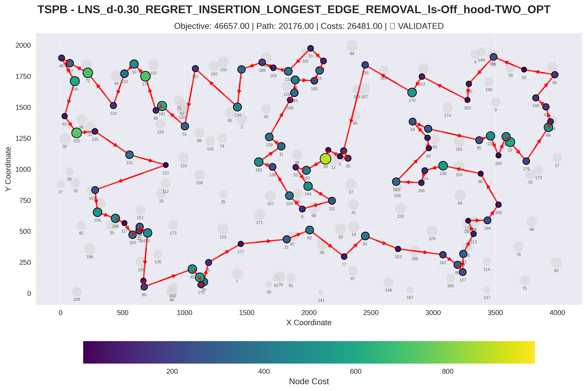

**Node Order (Route):**
160, 33, 144, 111, 8, 104, 138, 182, 11, 139, 168, 195, 13, 145, 15, 3, 70, 132, 169, 188, 6, 134, 147, 51, 191, 90, 178, 10, 133, 122, 72, 107, 40, 100, 63, 102, 135, 131, 121, 1, 156, 198, 117, 193, 31, 54, 73, 190, 80, 45, 142, 175, 78, 5, 177, 21, 82, 77, 81, 153, 163, 89, 127, 103, 113, 176, 194, 166, 86, 128, 124, 106, 143, 62, 18, 34, 55, 95, 130, 185, 99, 22, 179, 66, 94, 47, 148, 60, 20, 28, 140, 183, 152, 170, 155, 109, 35, 0, 29, 39

#### LNS_d-0.40_REGRET_INSERTION_RANDOM_REMOVAL_ls-Off_hood-TWO_OPT

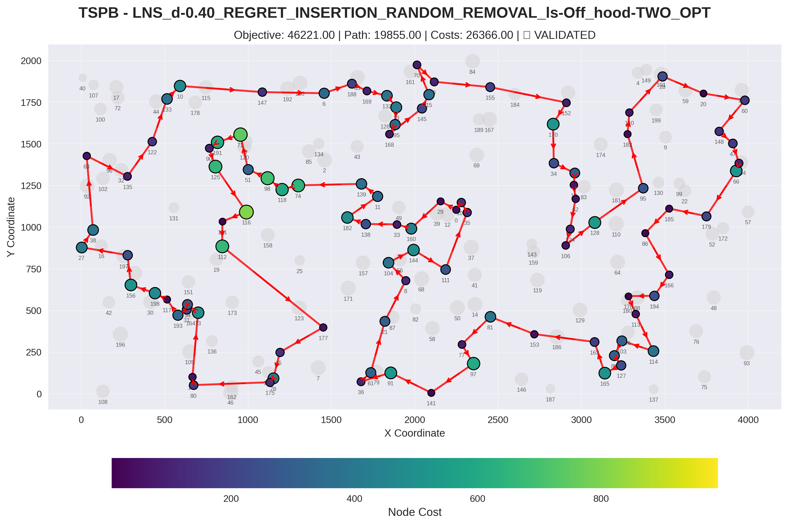

**Node Order (Route):**
145, 15, 70, 3, 155, 152, 170, 34, 55, 18, 62, 124, 106, 128, 95, 183, 140, 28, 20, 60, 148, 47, 94, 66, 179, 185, 86, 166, 194, 176, 113, 114, 103, 89, 127, 165, 163, 153, 81, 77, 97, 141, 91, 36, 61, 21, 8, 104, 144, 111, 35, 109, 0, 29, 160, 33, 138, 182, 11, 139, 74, 118, 98, 51, 71, 191, 90, 125, 116, 121, 112, 177, 5, 78, 175, 80, 190, 73, 54, 31, 193, 117, 198, 156, 1, 27, 38, 63, 135, 122, 133, 10, 147, 6, 188, 169, 132, 13, 195, 168

#### LNS_d-0.40_REGRET_INSERTION_LONGEST_EDGE_REMOVAL_ls-Off_hood-TWO_OPT

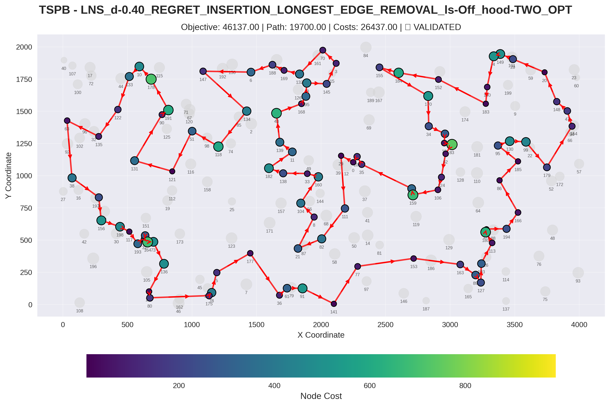

**Node Order (Route):**
156, 198, 117, 193, 54, 31, 164, 73, 136, 190, 80, 175, 78, 5, 177, 36, 61, 91, 141, 77, 153, 163, 89, 127, 103, 113, 180, 176, 194, 166, 86, 185, 95, 130, 99, 179, 94, 47, 148, 20, 28, 149, 4, 140, 183, 152, 184, 155, 170, 34, 55, 18, 83, 62, 124, 106, 159, 143, 35, 109, 0, 29, 111, 82, 21, 8, 104, 160, 33, 138, 182, 11, 139, 43, 168, 195, 13, 145, 3, 70, 132, 169, 188, 6, 147, 134, 118, 51, 121, 131, 90, 191, 178, 10, 133, 122, 135, 63, 38, 1

#### LNS_d-0.30_REGRET_INSERTION_RANDOM_REMOVAL_ls-On_hood-TWO_OPT

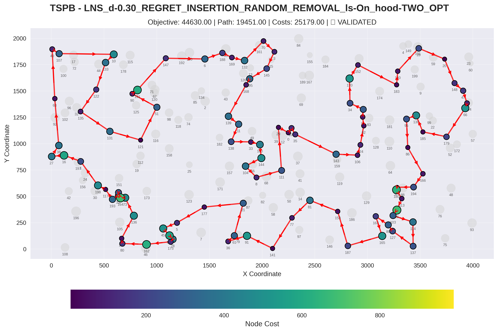

**Node Order (Route):**
121, 51, 90, 191, 147, 6, 188, 169, 132, 70, 3, 145, 195, 168, 139, 11, 138, 33, 160, 144, 104, 8, 111, 29, 0, 109, 35, 143, 106, 124, 62, 18, 55, 34, 170, 152, 183, 140, 28, 20, 148, 47, 94, 66, 179, 185, 130, 95, 86, 166, 194, 176, 180, 113, 26, 103, 114, 137, 127, 89, 163, 165, 187, 153, 81, 77, 141, 91, 36, 61, 21, 177, 5, 45, 142, 78, 175, 162, 80, 190, 136, 73, 164, 54, 31, 193, 117, 198, 1, 16, 27, 38, 63, 40, 107, 10, 133, 122, 135, 131

#### LNS_d-0.30_REGRET_INSERTION_RANDOM_REMOVAL_ls-Off_hood-TWO_OPT

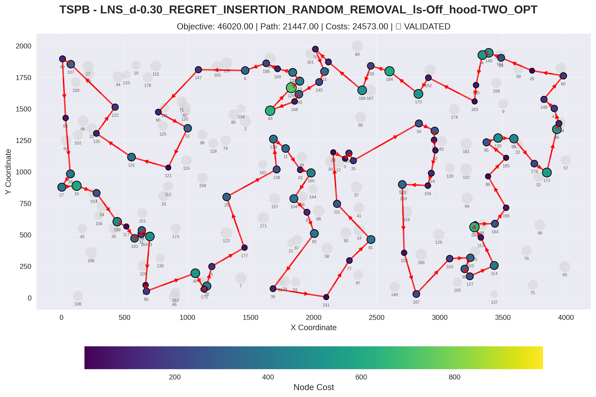

**Node Order (Route):**
135, 122, 107, 40, 63, 38, 27, 16, 1, 198, 117, 193, 31, 54, 73, 190, 80, 45, 175, 78, 5, 177, 25, 138, 139, 11, 33, 160, 104, 8, 82, 36, 141, 77, 81, 111, 29, 0, 109, 35, 34, 55, 18, 62, 124, 106, 143, 153, 187, 163, 103, 89, 127, 114, 113, 180, 176, 194, 166, 86, 185, 95, 130, 99, 179, 172, 66, 94, 47, 148, 60, 20, 28, 149, 4, 140, 183, 152, 170, 184, 155, 189, 3, 70, 15, 145, 195, 168, 43, 126, 13, 132, 169, 188, 6, 147, 90, 51, 121, 131

#### LNS_d-0.20_REGRET_INSERTION_RANDOM_REMOVAL_ls-On_hood-TWO_OPT

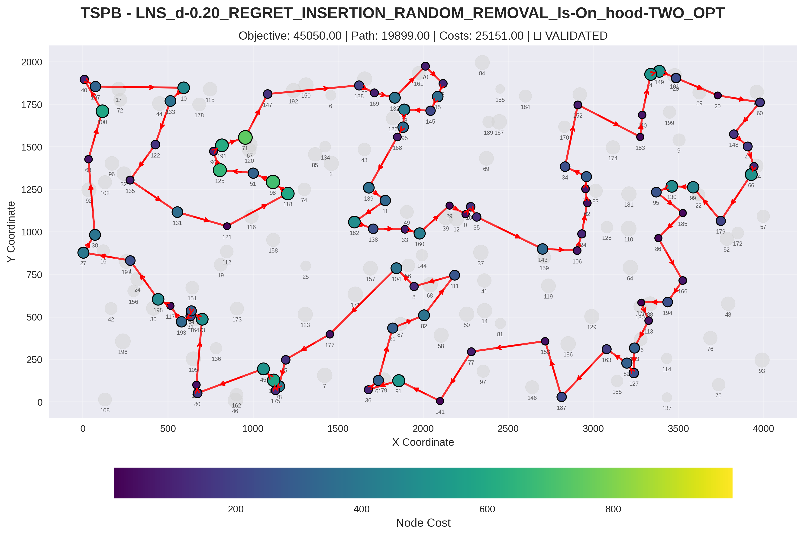

**Node Order (Route):**
54, 31, 193, 117, 198, 1, 27, 38, 63, 100, 40, 107, 10, 133, 122, 135, 131, 121, 118, 98, 51, 125, 90, 191, 71, 147, 188, 169, 132, 70, 3, 15, 145, 13, 195, 168, 139, 11, 182, 138, 33, 160, 29, 0, 109, 35, 143, 106, 124, 62, 18, 55, 34, 152, 183, 140, 4, 149, 28, 20, 60, 148, 47, 94, 66, 179, 99, 130, 95, 185, 86, 166, 194, 176, 113, 103, 127, 89, 163, 187, 153, 77, 141, 91, 36, 61, 21, 82, 111, 8, 104, 177, 5, 78, 175, 142, 45, 80, 190, 73

#### LNS_d-0.40_REGRET_INSERTION_LONGEST_EDGE_REMOVAL_ls-On_hood-TWO_OPT

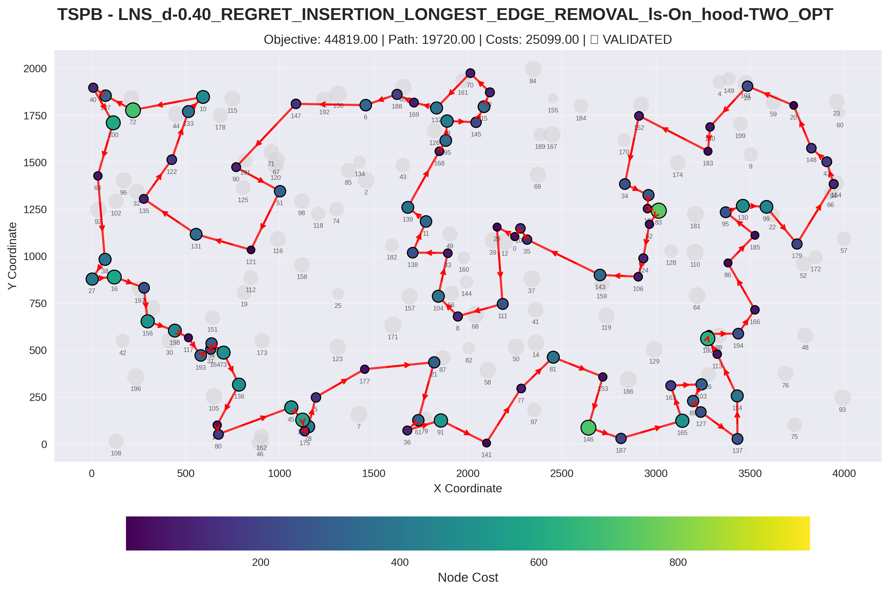

**Node Order (Route):**
113, 180, 176, 194, 166, 86, 185, 95, 130, 99, 179, 94, 47, 148, 20, 28, 140, 183, 152, 34, 55, 18, 83, 62, 124, 106, 143, 35, 109, 0, 29, 111, 8, 104, 33, 138, 11, 139, 168, 195, 13, 145, 15, 3, 70, 132, 169, 188, 6, 147, 90, 51, 121, 131, 135, 122, 133, 10, 72, 107, 40, 100, 63, 38, 27, 16, 1, 156, 198, 117, 193, 31, 54, 73, 136, 190, 80, 45, 142, 175, 78, 5, 177, 21, 61, 36, 91, 141, 77, 81, 153, 146, 187, 165, 163, 103, 89, 127, 137, 114

#### LNS_d-0.40_REGRET_INSERTION_RANDOM_REMOVAL_ls-On_hood-TWO_OPT

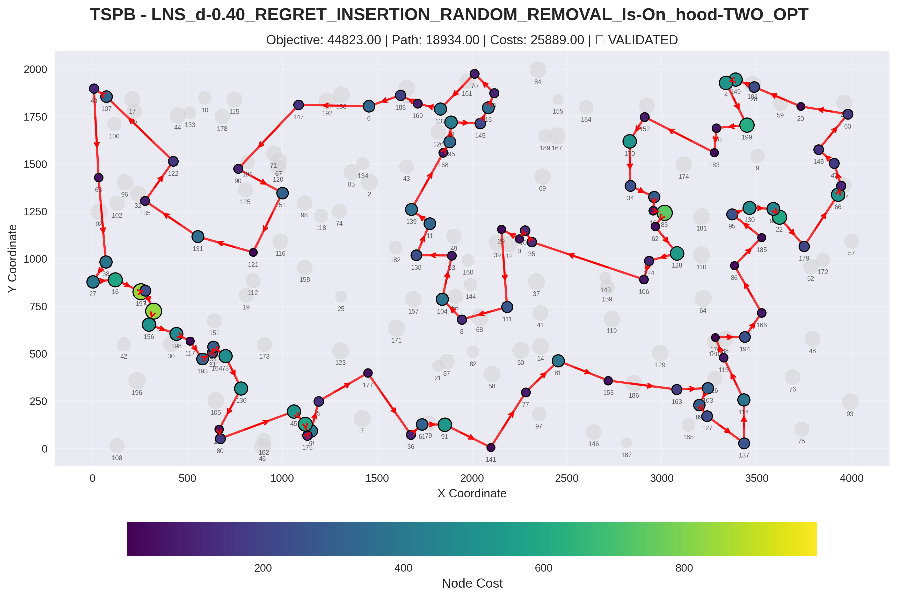

**Node Order (Route):**
63, 38, 27, 16, 197, 1, 24, 156, 198, 117, 193, 31, 54, 73, 136, 190, 80, 45, 142, 175, 78, 5, 177, 36, 61, 91, 141, 77, 81, 153, 163, 103, 89, 127, 137, 114, 113, 176, 194, 166, 86, 185, 95, 130, 99, 22, 179, 66, 94, 47, 148, 60, 20, 28, 149, 4, 199, 140, 183, 152, 170, 34, 55, 18, 83, 62, 128, 124, 106, 35, 109, 0, 29, 111, 8, 104, 33, 138, 11, 139, 168, 195, 13, 145, 15, 3, 70, 132, 169, 188, 6, 147, 90, 51, 121, 131, 135, 122, 107, 40

#### LNS_d-0.20_REGRET_INSERTION_RANDOM_REMOVAL_ls-Off_hood-TWO_OPT

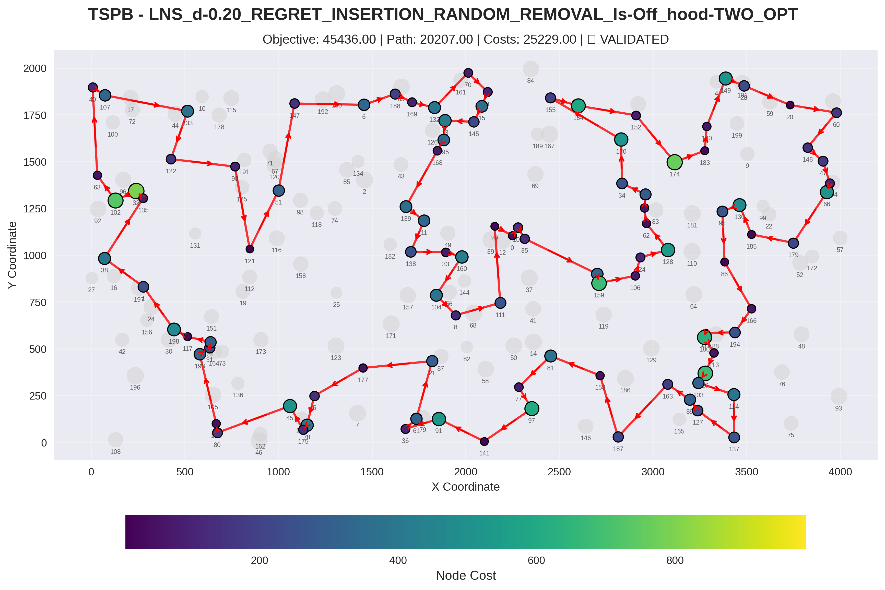

**Node Order (Route):**
6, 188, 169, 132, 70, 3, 15, 145, 13, 195, 168, 139, 11, 138, 33, 160, 104, 8, 111, 29, 0, 109, 35, 143, 159, 106, 124, 128, 62, 18, 55, 34, 170, 155, 184, 152, 174, 183, 140, 149, 28, 20, 60, 148, 47, 94, 66, 179, 185, 130, 95, 86, 166, 194, 176, 180, 113, 26, 103, 114, 137, 127, 89, 163, 187, 153, 81, 77, 97, 141, 91, 36, 61, 21, 177, 5, 78, 175, 45, 80, 190, 193, 31, 54, 117, 198, 1, 38, 135, 32, 102, 63, 40, 107, 133, 122, 90, 121, 51, 147

#### LNS_d-0.20_REGRET_INSERTION_LONGEST_EDGE_REMOVAL_ls-Off_hood-TWO_OPT

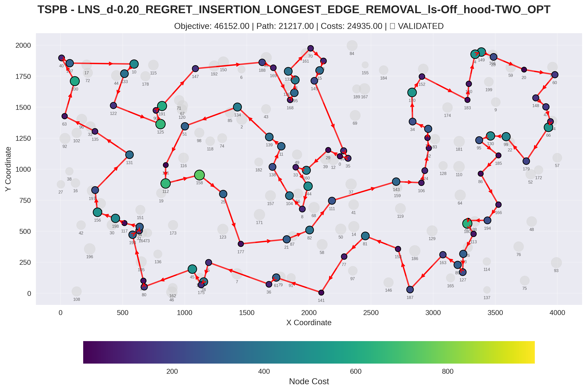

**Node Order (Route):**
11, 139, 134, 51, 121, 112, 158, 25, 177, 21, 82, 111, 143, 106, 124, 62, 18, 55, 34, 170, 152, 183, 140, 4, 149, 28, 20, 60, 148, 47, 94, 66, 179, 99, 130, 95, 185, 86, 166, 194, 176, 180, 113, 103, 127, 89, 163, 187, 153, 81, 77, 141, 61, 36, 5, 78, 175, 45, 80, 190, 193, 31, 54, 117, 198, 156, 1, 131, 135, 63, 100, 40, 107, 10, 133, 122, 125, 90, 191, 147, 188, 169, 168, 195, 13, 132, 70, 3, 15, 145, 109, 35, 0, 29, 160, 33, 144, 8, 104, 138

#### LNS_d-0.30_REGRET_INSERTION_LONGEST_EDGE_REMOVAL_ls-On_hood-TWO_OPT

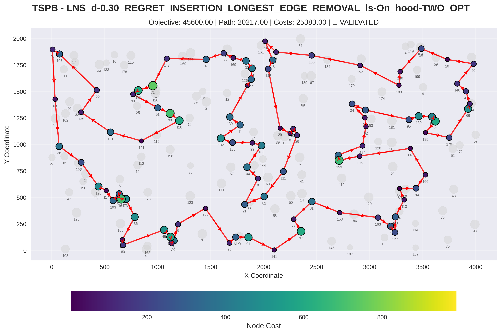

**Node Order (Route):**
78, 5, 177, 36, 61, 91, 141, 97, 77, 81, 153, 163, 89, 127, 103, 113, 176, 194, 166, 86, 106, 159, 143, 124, 62, 18, 34, 55, 95, 130, 99, 22, 185, 179, 66, 94, 47, 148, 60, 20, 28, 140, 183, 152, 155, 3, 70, 15, 145, 29, 0, 109, 35, 111, 82, 21, 8, 104, 160, 33, 138, 182, 11, 139, 168, 195, 13, 132, 169, 188, 6, 147, 71, 191, 90, 51, 98, 118, 121, 131, 135, 122, 107, 40, 63, 38, 1, 198, 117, 193, 54, 31, 164, 73, 136, 190, 80, 45, 142, 175

---

## Conclusions

### Key Findings

<!-- TODO: Add analysis of results -->


### Performance Comparison

<!-- TODO: Compare algorithms -->


### Observations

<!-- TODO: Add observations -->
