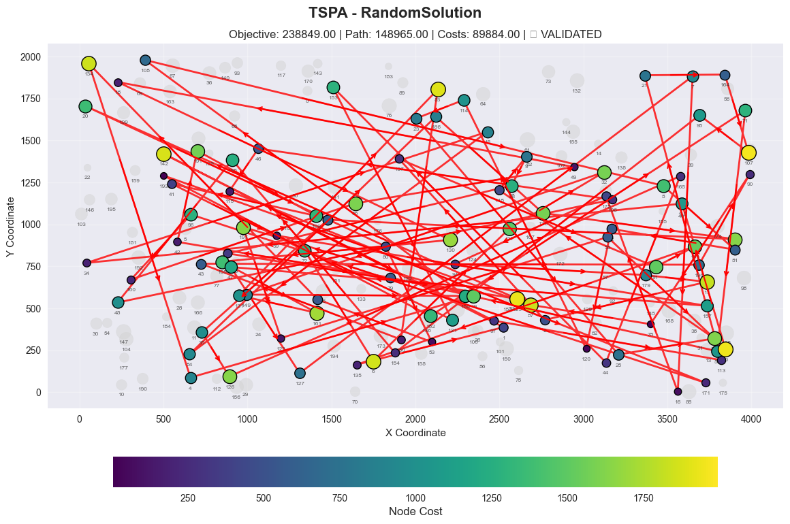
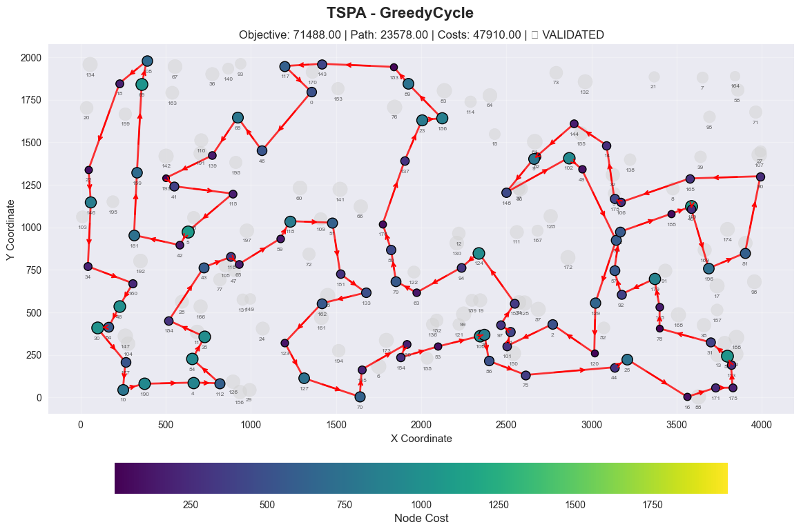
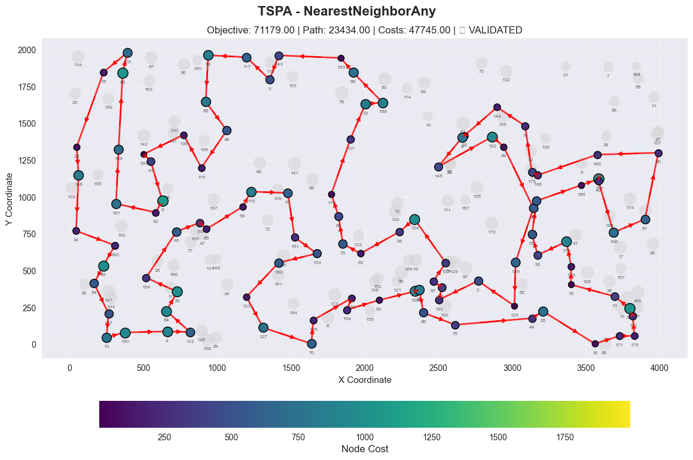
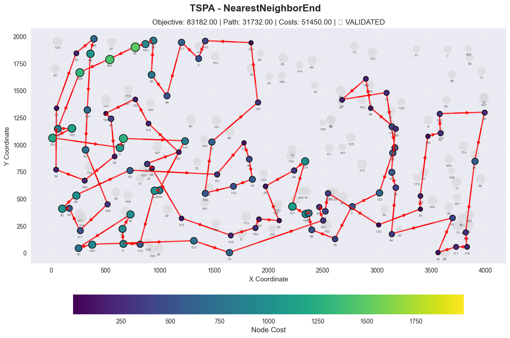
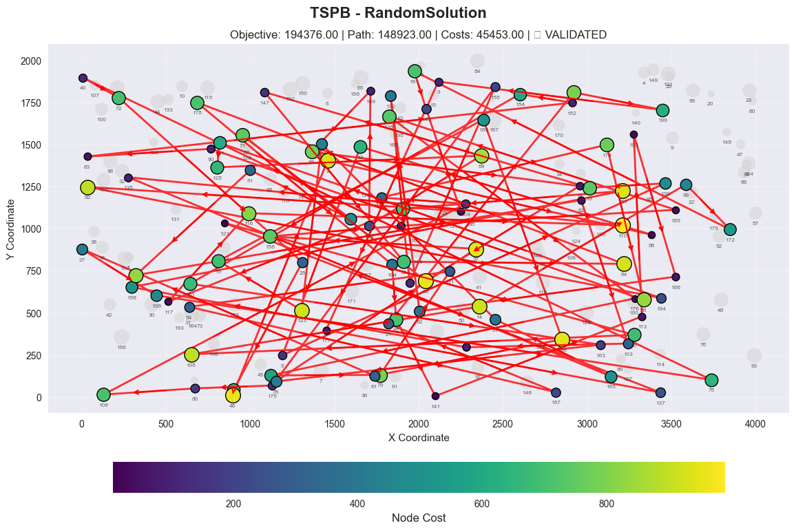
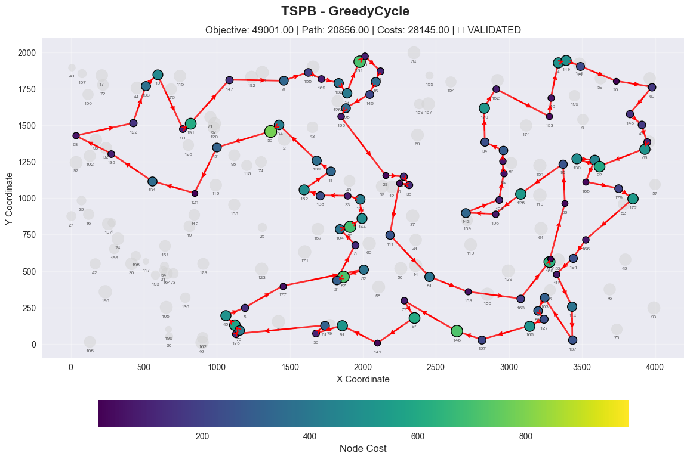
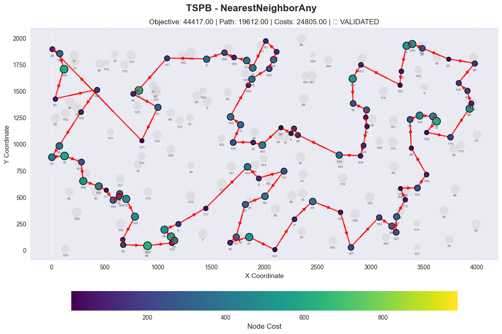
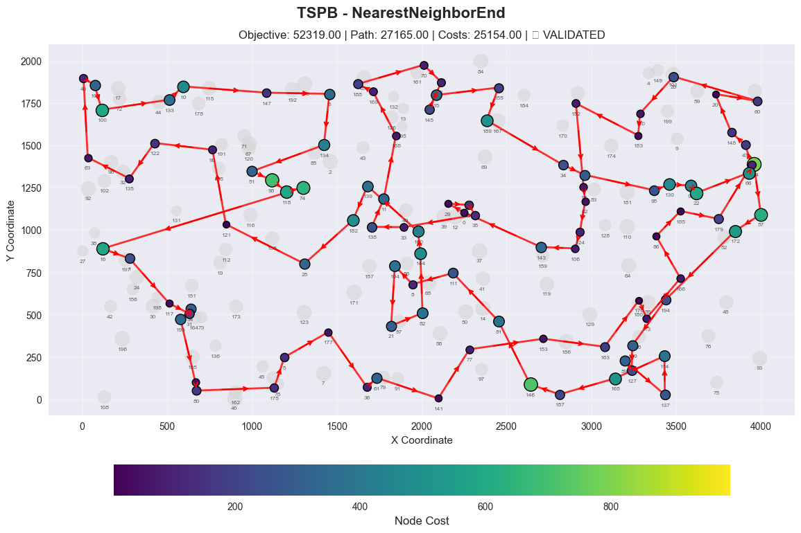
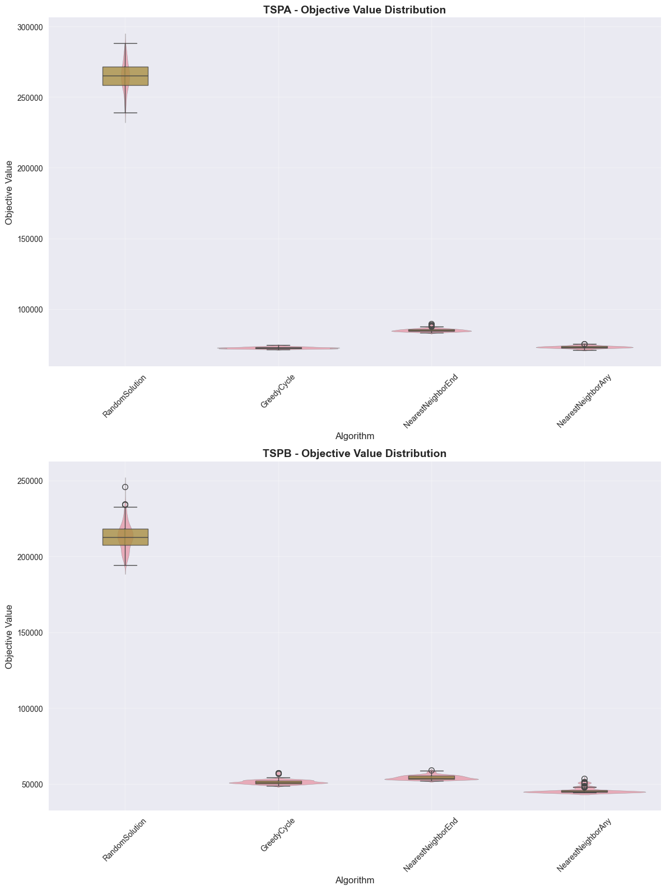
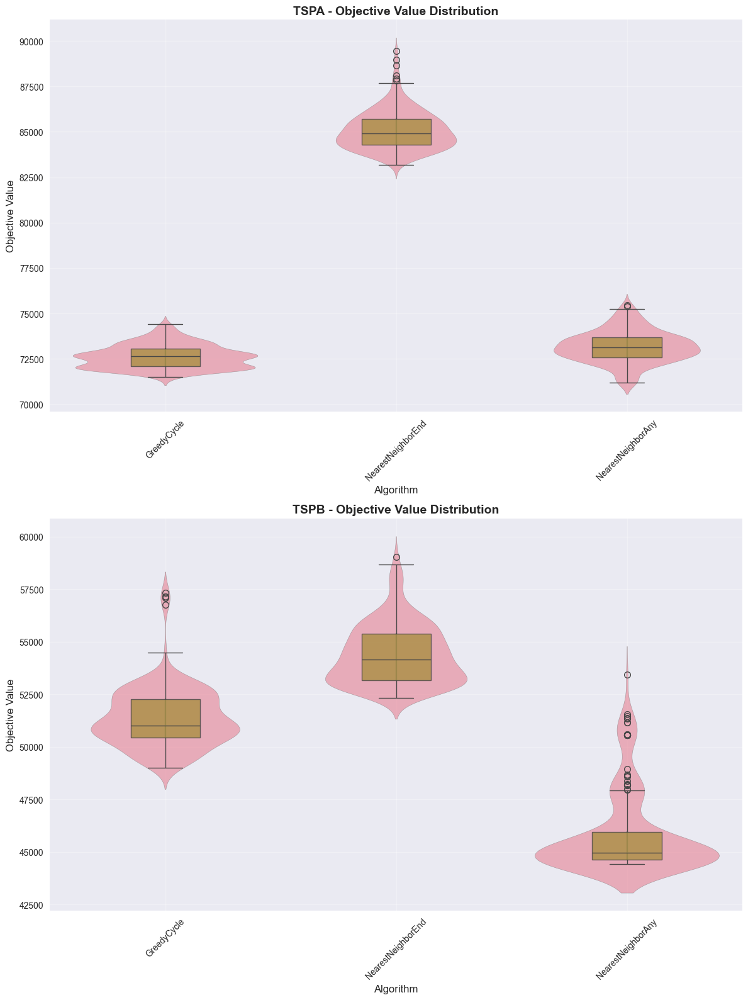

# Greedy Heuristics for TSP with Node Selection

## Authors
- Adam Tomys 156057
- Marcin Kapiszewski 156048

## Problem Description

Given a set of nodes with (x, y) coordinates and costs, the goal is to:
1. **Select exactly 50% of nodes** (rounded up if odd number of nodes)
2. **Form a Hamiltonian cycle** through the selected nodes
3. **Minimize the objective function**: total path length + sum of selected node costs
4. **Distance calculation**: Euclidean distances rounded to nearest integer

## Implemented Algorithms

### 1. Random Solution
**Pseudocode:**
```
1. Randomly select required number of nodes from all available nodes
2. Create random permutation of selected nodes as route
3. Return solution with selected nodes and route
```

### 2. Nearest Neighbor Construction Heuristic
**Pseudocode:**
```
1. Select (e.g. randomly) the starting vertex
2. Repeat:
   - Add to the solution the vertex (and the leading edge) closest to 
     the last one added
   Until required number of vertices have been added
3. Add the edge from the last to the first vertex
```

### 3. Nearest Neighbor (Any Position)
**Pseudocode:**
```
1. Start with startNode in the route
2. While route size < required nodes:
   a. For each unselected node:
      - For each possible position in route:
        * Calculate objective change if inserted at this position
      - Keep best position for this node
   b. Select node and position with best objective change
   c. Insert selected node at best position
3. Return solution
```

### 4. Greedy Cycle Construction Heuristic
**Pseudocode:**
```
1. Select (e.g. randomly) the starting vertex
2. Choose the nearest vertex and create an incomplete cycle from these 
   two vertices
3. Repeat:
   - Insert into the current cycle in the best possible place the vertex 
     causing the smallest increase in cycle length
   Until required number of vertices have been added
```

**Note:** "Nearest" and "closest" consider the best change in objective function (distance + cost), not just geometric distance.

## Computational Experiment Results

## Experimental Results

### Instance: TSPA

| Algorithm            | Runs | Min        | Max        | Average    | Validated |
|----------------------|------|------------|------------|------------|-----------|
| Random Solution      | 200  | 238,849.00 | 288,140.00 | 265,165.54 | YES       |
| Greedy Cycle         | 200  | 71,488.00  | 74,410.00  | 72,635.98  | YES       |
| Nearest Neighbor Any | 200  | 71,179.00  | 75,450.00  | 73,178.55  | YES       |
| Nearest Neighbor End | 200  | 83,182.00  | 89,433.00  | 85,108.51  | YES       |

---

### Instance: TSPB

| Algorithm            | Runs | Min        | Max        | Average    | Validated |
|----------------------|------|------------|------------|------------|-----------|
| Random Solution      | 200  | 194,376.00 | 245,960.00 | 212,968.97 | YES       |
| Greedy Cycle         | 200  | 49,001.00  | 57,324.00  | 51,400.60  | YES       |
| Nearest Neighbor Any | 200  | 44,417.00  | 53,438.00  | 45,870.25  | YES       |
| Nearest Neighbor End | 200  | 52,319.00  | 59,030.00  | 54,390.43  | YES       |

## 2D Visualization of Best Solution

### Instance: TSPA

#### Random Solution


- Status: ✓ VALIDATED
- Objective Value: 238849.00
- Path Length: 148965.00
- Node Costs: 89884.00
- Selected Nodes: 100

Node Order (Route):
55, 50, 119, 34, 15, 84, 186, 128, 187, 51, 35, 126, 165, 44, 153, 121, 59, 157, 47, 127, 7, 16, 178, 94, 179, 17, 2, 137, 91, 169, 135, 1, 142, 97, 113, 21, 164, 107, 95, 154, 198, 48, 106, 46, 115, 171, 96, 160, 66, 49, 18, 130, 105, 161, 131, 83, 180, 43, 196, 90, 78, 87, 193, 182, 71, 56, 79, 42, 191, 109, 41, 72, 6, 111, 32, 149, 189, 108, 8, 81, 52, 120, 114, 23, 25, 85, 148, 9, 37, 116, 125, 20, 80, 53, 162, 134, 4, 19, 197, 123

#### Greedy Cycle



- Status: ✓ VALIDATED
- Objective Value: 71488.00
- Path Length: 23578.00
- Node Costs: 47910.00
- Selected Nodes: 100

Node Order (Route):
0, 46, 68, 139, 193, 41, 115, 5, 42, 181, 159, 69, 108, 18, 22, 146, 34, 160, 48, 54, 30, 177, 10, 190, 4, 112, 84, 35, 184, 43, 116, 65, 59, 118, 51, 151, 133, 162, 123, 127, 70, 135, 180, 154, 53, 100, 26, 86, 75, 44, 25, 16, 171, 175, 113, 56, 31, 78, 145, 179, 92, 57, 52, 185, 119, 40, 196, 81, 90, 165, 106, 178, 14, 144, 62, 9, 148, 102, 49, 55, 129, 120, 2, 101, 1, 97, 152, 124, 94, 63, 79, 80, 176, 137, 23, 186, 89, 183, 143, 117

#### Nearest Neighbor Any


- Status: ✓ VALIDATED
- Objective Value: 71179.00
- Path Length: 23434.00
- Node Costs: 47745.00
- Selected Nodes: 100

Node Order (Route):
68, 46, 115, 139, 193, 41, 5, 42, 181, 159, 69, 108, 18, 22, 146, 34, 160, 48, 54, 177, 10, 190, 4, 112, 84, 35, 184, 43, 116, 65, 59, 118, 51, 151, 133, 162, 123, 127, 70, 135, 180, 154, 53, 100, 26, 86, 75, 44, 25, 16, 171, 175, 113, 56, 31, 78, 145, 179, 92, 57, 52, 185, 119, 40, 196, 81, 90, 165, 106, 178, 14, 144, 62, 9, 148, 102, 49, 55, 129, 120, 2, 101, 1, 97, 152, 124, 94, 63, 79, 80, 176, 137, 23, 186, 89, 183, 143, 0, 117, 93

#### Nearest Neighbor End



- Status: ✓ VALIDATED
- Objective Value: 83182.00
- Path Length: 31732.00
- Node Costs: 51450.00
- Selected Nodes: 100

Node Order (Route):
124, 94, 63, 53, 180, 154, 135, 123, 65, 116, 59, 115, 139, 193, 41, 42, 160, 34, 22, 18, 108, 69, 159, 181, 184, 177, 54, 30, 48, 43, 151, 176, 80, 79, 133, 162, 51, 137, 183, 143, 0, 117, 46, 68, 93, 140, 36, 163, 199, 146, 195, 103, 5, 96, 118, 149, 131, 112, 4, 84, 35, 10, 190, 127, 70, 101, 97, 1, 152, 120, 78, 145, 185, 40, 165, 90, 81, 113, 175, 171, 16, 31, 44, 92, 57, 106, 49, 144, 62, 14, 178, 52, 55, 129, 2, 75, 86, 26, 100, 121

### TSPB
#### Random Solution



- Status: ✓ VALIDATED
- Objective Value: 194376.00
- Path Length: 148923.00
- Node Costs: 45453.00
- Selected Nodes: 100

Node Order (Route):
151, 163, 78, 37, 158, 33, 185, 126, 176, 142, 79, 111, 54, 187, 21, 53, 199, 3, 177, 137, 121, 26, 105, 14, 99, 172, 161, 145, 0, 92, 194, 191, 125, 69, 138, 169, 85, 18, 68, 71, 182, 51, 24, 62, 103, 77, 156, 181, 49, 117, 116, 110, 135, 165, 81, 134, 123, 19, 189, 186, 61, 27, 198, 75, 40, 72, 25, 162, 46, 2, 86, 43, 5, 130, 83, 147, 56, 64, 178, 104, 87, 141, 113, 183, 166, 82, 132, 8, 155, 175, 80, 108, 109, 11, 174, 88, 90, 63, 152, 184

#### Greedy Cycle


- Status: ✓ VALIDATED
- Objective Value: 49001.00
- Path Length: 20856.00
- Node Costs: 28145.00
- Selected Nodes: 100

Node Order (Route):
85, 51, 121, 131, 135, 63, 122, 133, 10, 90, 191, 147, 6, 188, 169, 132, 13, 161, 70, 3, 15, 145, 195, 168, 29, 109, 35, 0, 111, 81, 153, 163, 180, 176, 86, 95, 128, 106, 143, 124, 62, 18, 55, 34, 170, 152, 183, 140, 4, 149, 28, 20, 60, 148, 47, 94, 66, 22, 130, 99, 185, 179, 172, 166, 194, 113, 114, 137, 103, 89, 127, 165, 187, 146, 77, 97, 141, 91, 36, 61, 175, 78, 142, 45, 5, 177, 82, 87, 21, 8, 104, 56, 144, 160, 33, 138, 182, 11, 139, 134

#### Nearest Neighbor Any


- Status: ✓ VALIDATED
- Objective Value: 44417.00
- Path Length: 19612.00
- Node Costs: 24805.00
- Selected Nodes: 100

Node Order (Route):
40, 107, 100, 63, 122, 135, 38, 27, 16, 1, 156, 198, 117, 193, 31, 54, 73, 136, 190, 80, 162, 175, 78, 142, 45, 5, 177, 104, 8, 111, 82, 21, 61, 36, 91, 141, 77, 81, 153, 187, 163, 89, 127, 103, 113, 176, 194, 166, 86, 95, 130, 99, 22, 185, 179, 66, 94, 47, 148, 60, 20, 28, 149, 4, 140, 183, 152, 170, 34, 55, 18, 62, 124, 106, 143, 35, 109, 0, 29, 160, 33, 138, 11, 139, 168, 195, 145, 15, 3, 70, 13, 132, 169, 188, 6, 147, 191, 90, 51, 121

#### Nearest Neighbor End



- Status: ✓ VALIDATED
- Objective Value: 52319.00
- Path Length: 27165.00
- Node Costs: 25154.00
- Selected Nodes: 100

Node Order (Route):
16, 1, 117, 31, 54, 193, 190, 80, 175, 5, 177, 36, 61, 141, 77, 153, 163, 176, 113, 166, 86, 185, 179, 94, 47, 148, 20, 60, 28, 140, 183, 152, 18, 62, 124, 106, 143, 0, 29, 109, 35, 33, 138, 11, 168, 169, 188, 70, 3, 145, 15, 155, 189, 34, 55, 95, 130, 99, 22, 66, 154, 57, 172, 194, 103, 127, 89, 137, 114, 165, 187, 146, 81, 111, 8, 104, 21, 82, 144, 160, 139, 182, 25, 121, 90, 122, 135, 63, 40, 107, 100, 133, 10, 147, 6, 134, 51, 98, 118, 74

# Best solution validation
In additional to the validator created by us, all of the 4 best solutions were checked manually by copying the nodes numbers to the solution checker excel.

## Algorithm Performance Comparison
### With Random Solutions

### Without Random Solutions


### Source Code

The complete implementation is available in the project repository:
- Github Link: https://github.com/Marcin59/evolutionary-computation
- Java source code: `src/main/java/tsp/algorithms/greedyAlgorithms/`
- This analysis notebook: `TSP_Greedy_Analysis.ipynb`

## Conclusions
- The random solution is obviously the worst, however it has 1 benefit. It is the fastest
- Second worst is the nearest neighbor, which can only insert on the end. Again it is not surprising, however it has O(N) time complexity, which is much better than O(N^2) of the next two methods
- While nearest neighboar allowing all positions is similar to the greedy cycle, it performs slightly better, especially on the second test case. They both have the same time complexity. However, it is hard to say whether different examples would have different outcome.