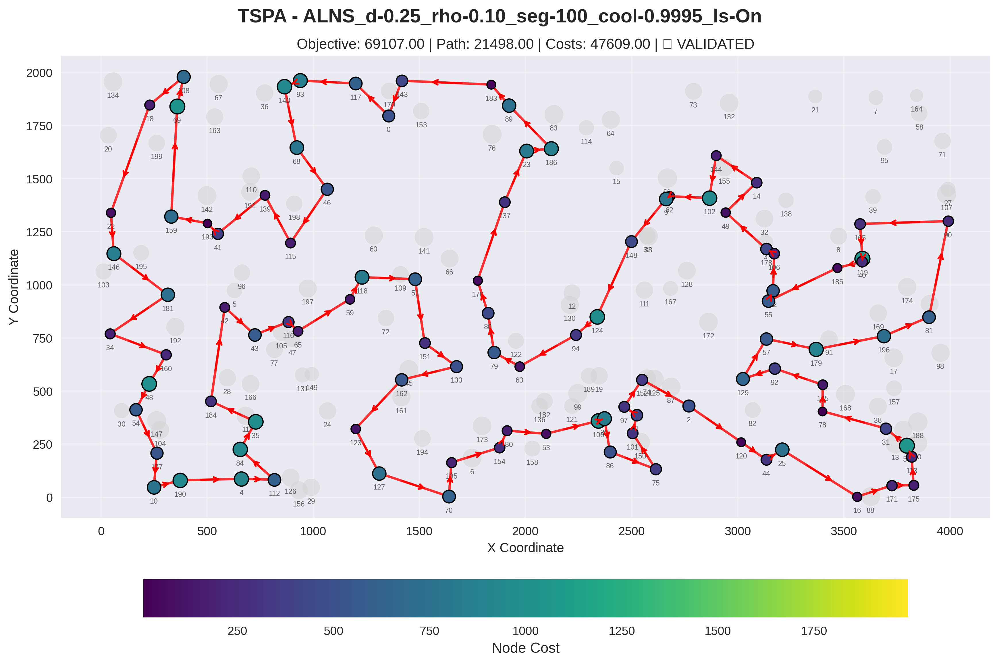
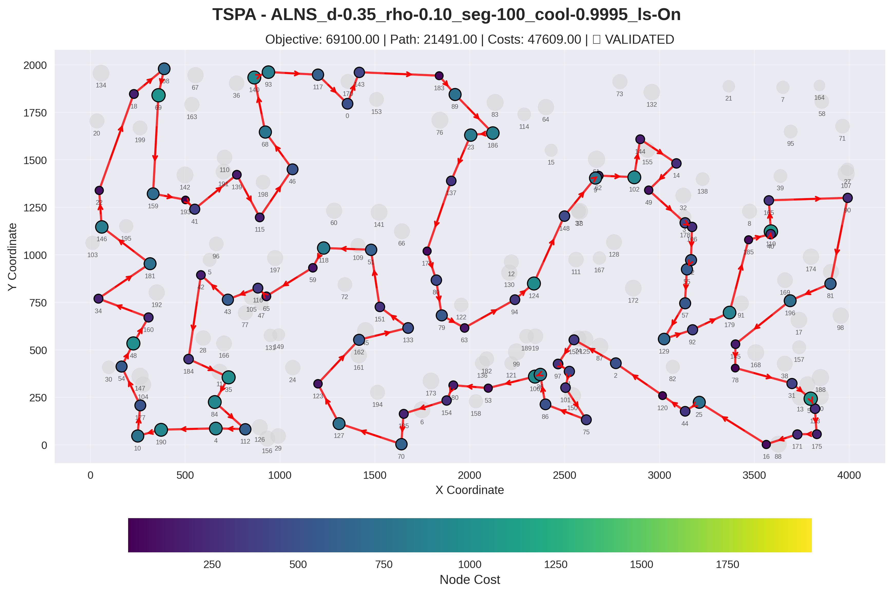
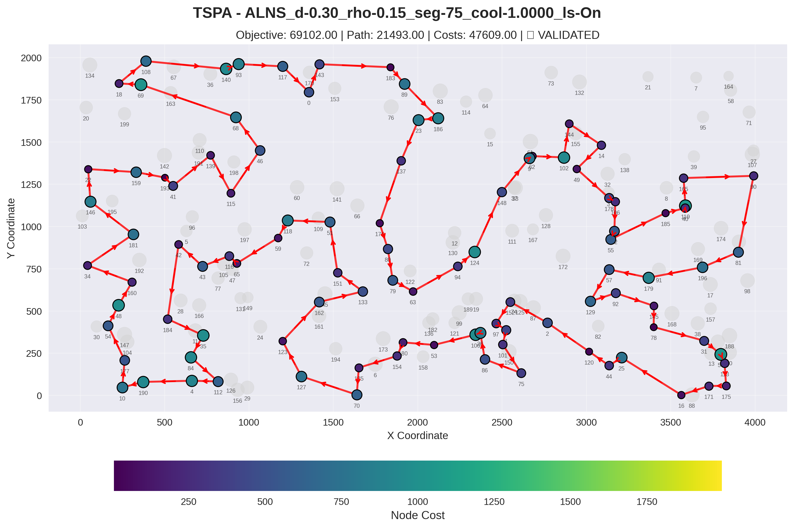
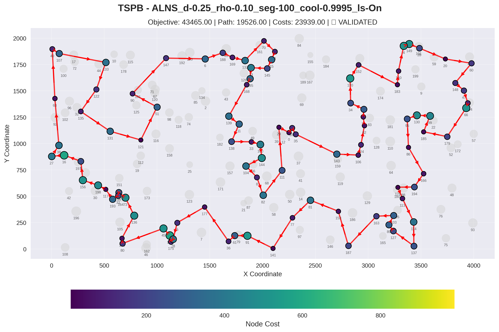
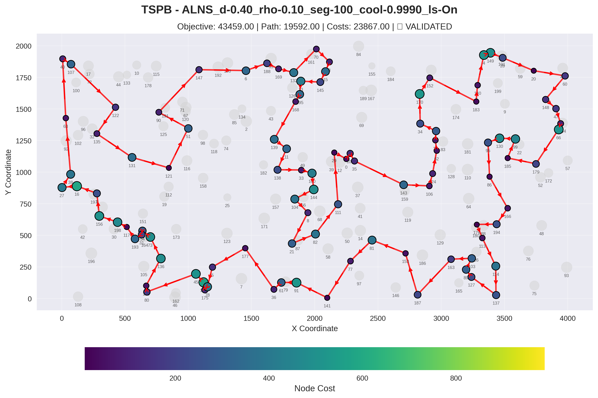
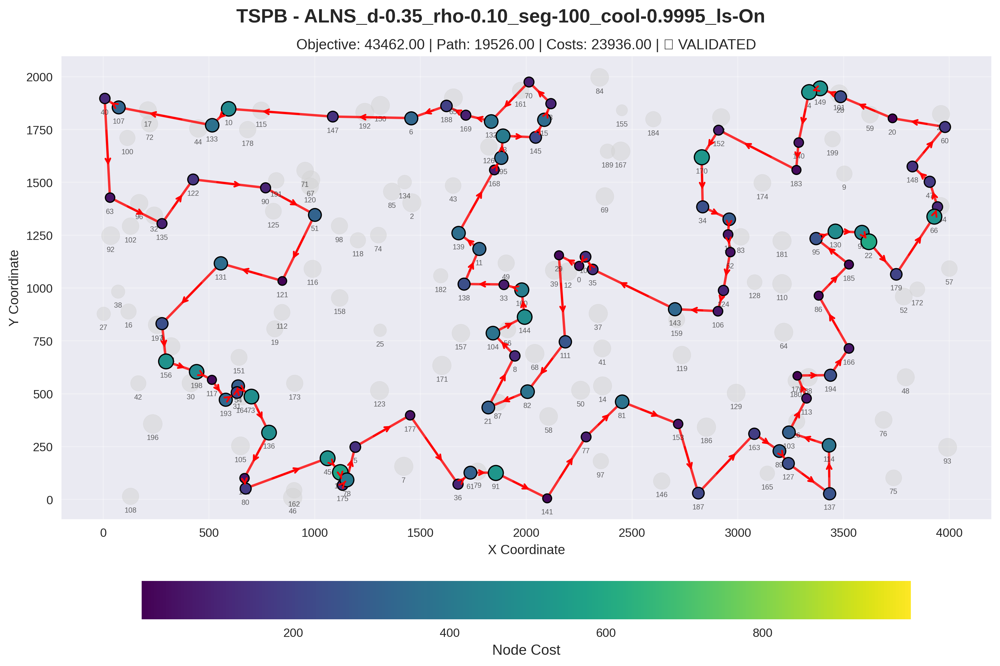
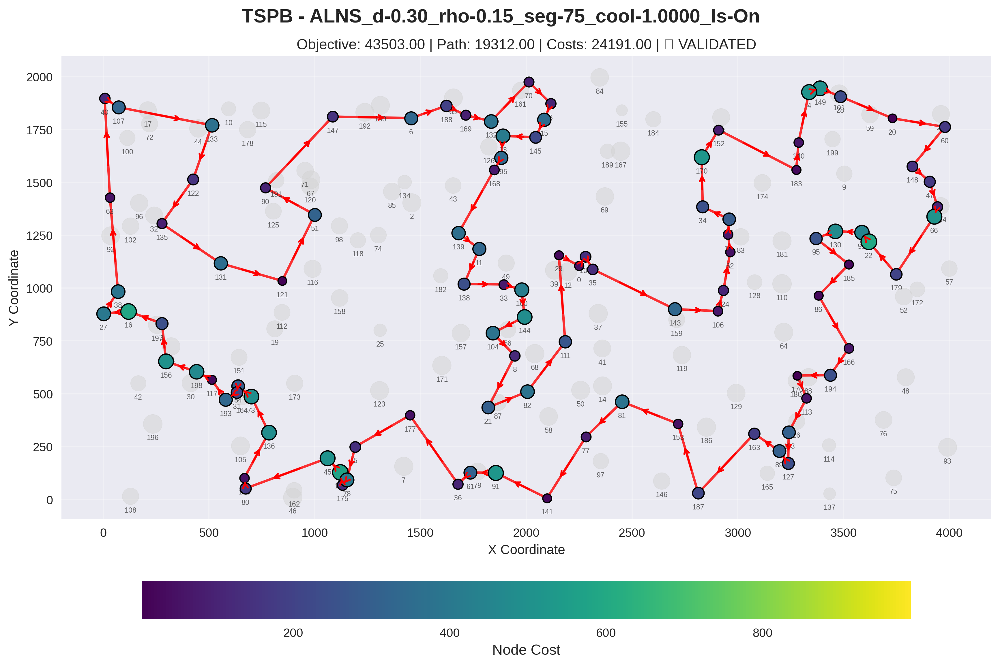
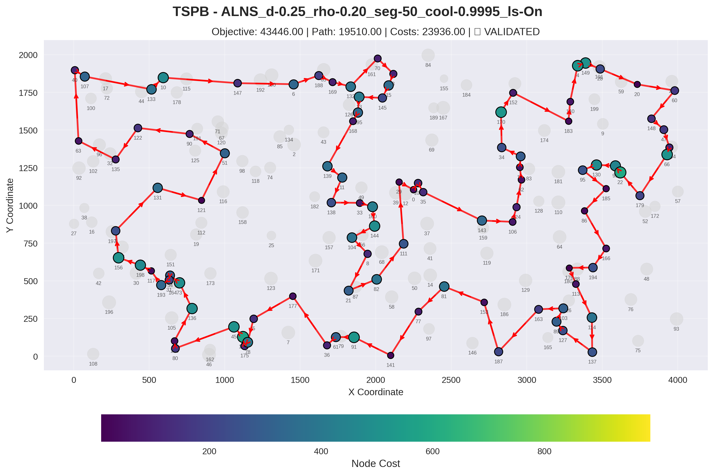

# Alns algorithm for TSP Problem

## Authors
- Adam Tomys 156057
- Marcin Kapiszewski 156048

## Implemented Algorithms

## Algorithm Overview

```
Algorithm: ALNS for TSP with Node Selection
Input: Instance, destructionRate, timeLimit, useLocalSearch
Output: Best solution found

1. INITIALIZATION
   x_current = GenerateRandomSolution()
   x_current = LocalSearch(x_current)
   x_best = x_current

   // Initialize operator weights (equal)
   destroyWeights = [1.0, 1.0, 1.0]  // RANDOM, SUBPATH, COST_WEIGHTED_ROULETTE
   repairWeights = [1.0, 1.0]        // TWO_REGRET, GREEDY_CYCLE

   // Initialize SA temperature (~50% acceptance for 5% worse)
   temperature = 0.05 * x_current.cost / ln(2)

   // Operator statistics (reset each segment)
   destroyScores = [0, 0, 0]
   repairScores = [0, 0]
   destroyUsage = [0, 0, 0]
   repairUsage = [0, 0]

2. MAIN LOOP (while time < timeLimit)

   2.1 SELECT OPERATORS (Roulette Wheel)
       destroyOp = RouletteSelect(destroyWeights)
       repairOp = RouletteSelect(repairWeights)

   2.2 DESTROY
       partialTour = Destroy(x_current, destroyOp, destructionRate)

   2.3 REPAIR
       x_new = Repair(partialTour, repairOp)

   2.4 LOCAL SEARCH (optional)
       if useLocalSearch:
           x_new = SteepestLocalSearch(x_new)

   2.5 SCORE CALCULATION
       delta = x_new.cost - x_current.cost
       score = 0

       if x_new.cost < x_best.cost:
           x_best = x_new
           score = sigma1 (= 3.0)  // New global best
       else if delta < 0:
           score = sigma2 (= 2.0)  // Improved current

   2.6 ACCEPTANCE (Simulated Annealing)
       if delta < 0:
           accept = true
       else:
           p = exp(-delta / temperature)
           if random() < p:
               accept = true
               score = sigma3 (= 1.0)  // Accepted worse
           else:
               accept = false

       if accept:
           x_current = x_new

   2.7 UPDATE STATISTICS
       destroyUsage[destroyOp]++
       destroyScores[destroyOp] += score
       repairUsage[repairOp]++
       repairScores[repairOp] += score
       iteration++

   2.8 UPDATE WEIGHTS (every segmentLength iterations)
       if iteration % segmentLength == 0:
           UpdateWeights()

   2.9 COOL TEMPERATURE
       temperature = max(temperature * coolingRate, 0.001)

3. RETURN x_best
```

## Destroy Operators

### 1. RANDOM_REMOVAL
```
function DestroyRandom(tour, count):
    shuffled = shuffle(tour)
    removed = shuffled[0:count]
    return tour - removed
```

### 2. SUBPATH_REMOVAL
```
function DestroySubpath(tour, count):
    start = random(0, tour.length)
    removed = []
    for i = 0 to count:
        idx = (start + i) % tour.length
        removed.add(tour[idx])
    return tour - removed
```

### 3. COST_WEIGHTED_ROULETTE (new - replaces LONGEST_EDGE)
```
function DestroyCostWeightedRoulette(tour, count):
    removed = {}

    while |removed| < count AND |tour| - |removed| > 2:
        candidates = []
        costs = []
        totalCost = 0

        for each node in tour:
            if node not in removed:
                prev = tour[(index(node) - 1) % tour.length]
                next = tour[(index(node) + 1) % tour.length]

                // Cost = node cost + incoming edge + outgoing edge
                cost = node.cost + distance(prev, node) + distance(node, next)

                candidates.add(node)
                costs.add(cost)
                totalCost += cost

        // Roulette wheel selection (higher cost = higher probability)
        spin = random() * totalCost
        cumulative = 0
        for i = 0 to candidates.length:
            cumulative += costs[i]
            if cumulative >= spin:
                removed.add(candidates[i])
                break

    return tour - removed
```

## Repair Operators

### 1. TWO_REGRET
```
function RepairWith2Regret(partialTour):
    // Uses NearestNeighborAnyPositionTwoRegretAlgorithm
    // with weightInsertion=1, weightRegret=1

    while |route| < requiredNodes:
        bestNode = null
        bestScore = -infinity

        for each unselected node:
            // Find best and second-best insertion positions
            costs = []
            for each position in route:
                insertionCost = nodeCost + addedEdges - removedEdge
                costs.add(insertionCost)

            sort(costs)
            regret = costs[1] - costs[0]  // 2-regret
            score = weightRegret * regret - weightInsertion * costs[0]

            if score > bestScore:
                bestScore = score
                bestNode = node

        insert bestNode at best position

    return route
```

### 2. GREEDY_CYCLE (new)
```
function RepairWithGreedyCycle(partialTour):
    route = partialTour
    selected = set(partialTour)
    unselected = allNodes - selected

    while |selected| < requiredNodes:
        bestNode = null
        bestPosition = null
        bestCost = infinity

        for each candidate in unselected:
            nodeCost = candidate.cost

            for each position in route:
                nodeA = route[position]
                nodeB = route[(position + 1) % route.length]

                removedDist = distance(nodeA, nodeB)
                addedDist = distance(nodeA, candidate) + distance(candidate, nodeB)
                insertionCost = nodeCost + addedDist - removedDist

                if insertionCost < bestCost:
                    bestCost = insertionCost
                    bestNode = candidate
                    bestPosition = position + 1

        route.insert(bestPosition, bestNode)
        selected.add(bestNode)
        unselected.remove(bestNode)

    return route
```

## Weight Update Mechanism

```
function UpdateWeights():
    rho = reactionFactor  // How quickly weights adapt (default: 0.1)
    minWeight = 0.1       // Prevent operator starvation

    // Update destroy operator weights
    for i = 0 to destroyWeights.length:
        if destroyUsage[i] > 0:
            avgScore = destroyScores[i] / destroyUsage[i]
            destroyWeights[i] = destroyWeights[i] * (1 - rho) + rho * avgScore
            destroyWeights[i] = max(destroyWeights[i], minWeight)

        // Reset for next segment
        destroyUsage[i] = 0
        destroyScores[i] = 0

    // Update repair operator weights
    for i = 0 to repairWeights.length:
        if repairUsage[i] > 0:
            avgScore = repairScores[i] / repairUsage[i]
            repairWeights[i] = repairWeights[i] * (1 - rho) + rho * avgScore
            repairWeights[i] = max(repairWeights[i], minWeight)

        // Reset for next segment
        repairUsage[i] = 0
        repairScores[i] = 0
```

## Roulette Wheel Selection

```
function RouletteSelect(weights):
    totalWeight = sum(weights)
    r = random() * totalWeight
    cumulative = 0

    for i = 0 to weights.length:
        cumulative += weights[i]
        if r <= cumulative:
            return i

    return weights.length - 1  // Fallback
```

## Parameters

| Parameter | Default | Description |
|-----------|---------|-------------|
| destructionRate | 0.25 | Fraction of nodes to remove (25%) |
| reactionFactor (rho) | 0.1 | Weight adaptation speed |
| segmentLength | 100 | Iterations between weight updates |
| coolingRate | 0.9995 | SA temperature decay per iteration |
| sigma1 | 3.0 | Reward for new global best |
| sigma2 | 2.0 | Reward for improving current |
| sigma3 | 1.0 | Reward for accepting worse |
| minWeight | 0.1 | Minimum operator weight |

## Experiment Results

### Objective function

| Algorithm | TSPA | TSPB |
|---|---|---|
| MSLS_STEEPEST_TWO_OPT | 71357.85 (70897.00 - 71801.00) | 45641.30 (44699.00 - 46076.00) |
| ILS_STEEPEST_TWO_OPT_pert15_ext1 | 69990.80 (69287.00 - 70452.00) | 44551.25 (44334.00 - 44912.00) |
| ILS_STEEPEST_TWO_OPT_pert15_ext3 | 70212.05 (69905.00 - 70466.00) | 44514.45 (44012.00 - 44820.00) |
| LNS_d-0.30_RANDOM_REMOVAL_ls-On_hood-TWO_OPT | 69612.30 (69214.00 - 70184.00) | 44292.90 (43484.00 - 45362.00) |
| LNS_d-0.40_RANDOM_REMOVAL_ls-On_hood-TWO_OPT | 69605.65 (69185.00 - 70200.00) | 44026.40** (43509.00 - 44623.00) |
| **HEA_OPERATOR_1_LS_pop20_TWO_OPT** | **69260.30** (**69107.00** - 69568.00) | **43558.45** (**43456.00** - 43971.00) |
| ALNS_d-0.25_rho-0.10_seg-100_cool-0.9995_ls-On | 69107.00 (69107.00 - 69107.00) | 43566.10 (43465.00 - 43677.00) |
| **ALNS_d-0.25_rho-0.20_seg-50_cool-0.9995_ls-On** | 69105.80 (69100.00 - 69107.00) | **43549.10** (**43446.00** - 43665.00) |
| ALNS_d-0.30_rho-0.15_seg-75_cool-1.0000_ls-On | 69106.60 (69102.00 - 69107.00) | 43572.35 (43503.00 - 43728.00) |
| ALNS_d-0.35_rho-0.10_seg-100_cool-0.9995_ls-On | 69105.80 (69100.00 - 69107.00) | 43601.20 (43462.00 - 43716.00) |
| **ALNS_d-0.40_rho-0.10_seg-100_cool-0.9990_ls-On** | **69102.90** (**69100.00** - 69107.00) | 43587.20 (43459.00 - 43694.00) |

## 2D Visualization of Best Solution

### Instance: TSPA

#### ALNS_d-0.25_rho-0.10_seg-100_cool-0.9995_ls-On



**Node Order (Route):**
177, 10, 190, 4, 112, 84, 35, 184, 42, 43, 116, 65, 59, 118, 51, 151, 133, 162, 123, 127, 70, 135, 154, 180, 53, 100, 26, 86, 75, 101, 1, 97, 152, 2, 120, 44, 25, 16, 171, 175, 113, 56, 31, 78, 145, 92, 129, 57, 179, 196, 81, 90, 165, 119, 40, 185, 55, 52, 106, 178, 49, 14, 144, 102, 62, 9, 148, 124, 94, 63, 79, 80, 176, 137, 23, 186, 89, 183, 143, 0, 117, 93, 140, 68, 46, 115, 139, 41, 193, 159, 69, 108, 18, 22, 146, 181, 34, 160, 48, 54

#### ALNS_d-0.40_rho-0.10_seg-100_cool-0.9990_ls-On


**Node Order (Route):**
40, 119, 165, 90, 81, 196, 145, 78, 31, 56, 113, 175, 171, 16, 25, 44, 120, 2, 152, 97, 1, 101, 75, 86, 26, 100, 53, 180, 154, 135, 70, 127, 123, 162, 133, 151, 51, 118, 59, 65, 116, 43, 42, 184, 35, 84, 112, 4, 190, 10, 177, 54, 48, 160, 34, 181, 146, 22, 18, 108, 69, 159, 193, 41, 139, 115, 46, 68, 140, 93, 117, 0, 143, 183, 89, 186, 23, 137, 176, 80, 79, 63, 94, 124, 148, 9, 62, 102, 144, 14, 49, 178, 106, 52, 55, 57, 129, 92, 179, 185

#### ALNS_d-0.35_rho-0.10_seg-100_cool-0.9995_ls-On



**Node Order (Route):**
127, 123, 162, 133, 151, 51, 118, 59, 65, 116, 43, 42, 184, 35, 84, 112, 4, 190, 10, 177, 54, 48, 160, 34, 181, 146, 22, 18, 108, 69, 159, 193, 41, 139, 115, 46, 68, 140, 93, 117, 0, 143, 183, 89, 186, 23, 137, 176, 80, 79, 63, 94, 124, 148, 9, 62, 102, 144, 14, 49, 178, 106, 52, 55, 57, 129, 92, 179, 185, 40, 119, 165, 90, 81, 196, 145, 78, 31, 56, 113, 175, 171, 16, 25, 44, 120, 2, 152, 97, 1, 101, 75, 86, 26, 100, 53, 180, 154, 135, 70

#### ALNS_d-0.30_rho-0.15_seg-75_cool-1.0000_ls-On



**Node Order (Route):**
133, 151, 51, 118, 59, 65, 116, 43, 42, 184, 35, 84, 112, 4, 190, 10, 177, 54, 48, 160, 34, 181, 146, 22, 159, 193, 41, 139, 115, 46, 68, 69, 18, 108, 140, 93, 117, 0, 143, 183, 89, 186, 23, 137, 176, 80, 79, 63, 94, 124, 148, 9, 62, 102, 144, 14, 49, 178, 106, 52, 55, 185, 40, 119, 165, 90, 81, 196, 179, 57, 129, 92, 145, 78, 31, 56, 113, 175, 171, 16, 25, 44, 120, 2, 152, 97, 1, 101, 75, 86, 26, 100, 53, 180, 154, 135, 70, 127, 123, 162

#### ALNS_d-0.25_rho-0.20_seg-50_cool-0.9995_ls-On


**Node Order (Route):**
185, 40, 119, 165, 90, 81, 196, 145, 78, 31, 56, 113, 175, 171, 16, 25, 44, 120, 2, 152, 97, 1, 101, 75, 86, 26, 100, 53, 180, 154, 135, 70, 127, 123, 162, 133, 151, 51, 118, 59, 65, 116, 43, 42, 184, 35, 84, 112, 4, 190, 10, 177, 54, 48, 160, 34, 181, 146, 22, 18, 108, 69, 159, 193, 41, 139, 115, 46, 68, 140, 93, 117, 0, 143, 183, 89, 186, 23, 137, 176, 80, 79, 63, 94, 124, 148, 9, 62, 102, 144, 14, 49, 178, 106, 52, 55, 57, 129, 92, 179

### Instance: TSPB

#### ALNS_d-0.25_rho-0.10_seg-100_cool-0.9995_ls-On



**Node Order (Route):**
109, 35, 143, 106, 124, 62, 18, 55, 34, 170, 152, 183, 140, 4, 149, 28, 20, 60, 148, 47, 94, 66, 179, 185, 99, 130, 95, 86, 166, 194, 176, 113, 114, 137, 127, 89, 103, 163, 187, 153, 81, 77, 141, 91, 61, 36, 177, 5, 78, 175, 142, 45, 80, 190, 136, 73, 54, 31, 193, 117, 198, 156, 1, 16, 27, 38, 63, 40, 107, 133, 122, 135, 131, 121, 51, 90, 147, 6, 188, 169, 132, 70, 3, 15, 145, 13, 195, 168, 139, 11, 138, 33, 160, 144, 104, 8, 82, 111, 29, 0

#### ALNS_d-0.40_rho-0.10_seg-100_cool-0.9990_ls-On



**Node Order (Route):**
153, 81, 77, 141, 91, 61, 36, 177, 5, 78, 175, 142, 45, 80, 190, 136, 73, 54, 31, 193, 117, 198, 156, 1, 16, 27, 38, 63, 40, 107, 122, 135, 131, 121, 51, 90, 147, 6, 188, 169, 132, 70, 3, 15, 145, 13, 195, 168, 139, 11, 138, 33, 160, 144, 104, 8, 21, 82, 111, 29, 0, 109, 35, 143, 106, 124, 62, 18, 55, 34, 170, 152, 183, 140, 4, 149, 28, 20, 60, 148, 47, 94, 66, 179, 185, 99, 130, 95, 86, 166, 194, 176, 113, 114, 137, 127, 89, 103, 163, 187

#### ALNS_d-0.35_rho-0.10_seg-100_cool-0.9995_ls-On



**Node Order (Route):**
113, 176, 194, 166, 86, 185, 95, 130, 99, 22, 179, 66, 94, 47, 148, 60, 20, 28, 149, 4, 140, 183, 152, 170, 34, 55, 18, 62, 124, 106, 143, 35, 109, 0, 29, 111, 82, 21, 8, 104, 144, 160, 33, 138, 11, 139, 168, 195, 13, 145, 15, 3, 70, 132, 169, 188, 6, 147, 10, 133, 107, 40, 63, 135, 122, 90, 51, 121, 131, 1, 156, 198, 117, 193, 31, 54, 73, 136, 190, 80, 45, 142, 175, 78, 5, 177, 36, 61, 91, 141, 77, 81, 153, 187, 163, 89, 127, 137, 114, 103

#### ALNS_d-0.30_rho-0.15_seg-75_cool-1.0000_ls-On



**Node Order (Route):**
29, 0, 109, 35, 143, 106, 124, 62, 18, 55, 34, 170, 152, 183, 140, 4, 149, 28, 20, 60, 148, 47, 94, 66, 179, 22, 99, 130, 95, 185, 86, 166, 194, 176, 113, 103, 127, 89, 163, 187, 153, 81, 77, 141, 91, 61, 36, 177, 5, 78, 175, 142, 45, 80, 190, 136, 73, 54, 31, 193, 117, 198, 156, 1, 16, 27, 38, 63, 40, 107, 133, 122, 135, 131, 121, 51, 90, 147, 6, 188, 169, 132, 70, 3, 15, 145, 13, 195, 168, 139, 11, 138, 33, 160, 144, 104, 8, 21, 82, 111

#### ALNS_d-0.25_rho-0.20_seg-50_cool-0.9995_ls-On



**Node Order (Route):**
89, 103, 163, 187, 153, 81, 77, 141, 91, 61, 36, 177, 5, 78, 175, 142, 45, 80, 190, 136, 73, 54, 31, 193, 117, 198, 156, 1, 131, 121, 51, 90, 122, 135, 63, 40, 107, 133, 10, 147, 6, 188, 169, 132, 70, 3, 15, 145, 13, 195, 168, 139, 11, 138, 33, 160, 144, 104, 8, 21, 82, 111, 29, 0, 109, 35, 143, 106, 124, 62, 18, 55, 34, 170, 152, 183, 140, 4, 149, 28, 20, 60, 148, 47, 94, 66, 179, 22, 99, 130, 95, 185, 86, 166, 194, 176, 113, 114, 137, 127

---

## Conclusions

1. This New algorithms outperforms all other methods

2. This produces the most consistent results, especially on TSPA (69100 - 69107 range)

4. Different set of parameters work better or worse on different instances.

5. This makes it easier to adapt, since it learns the weights as it goes.