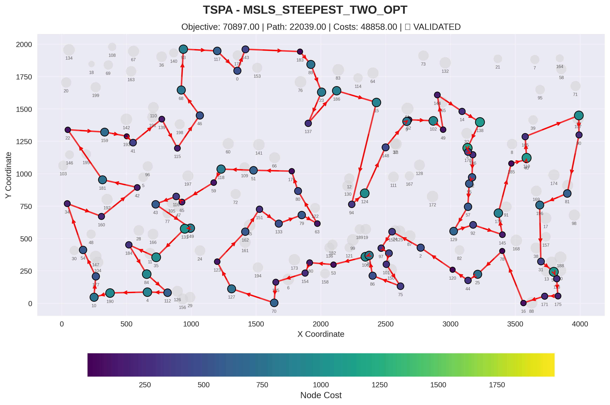
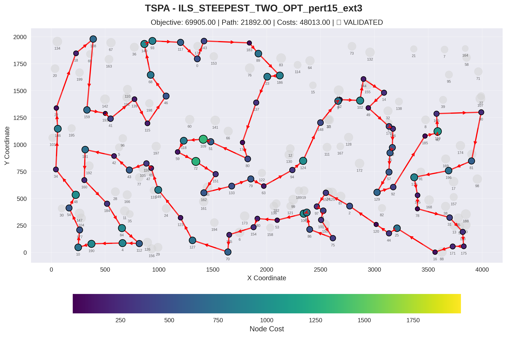
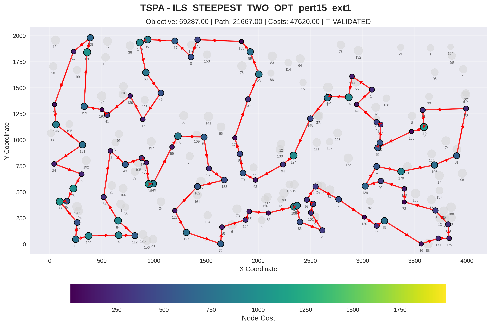
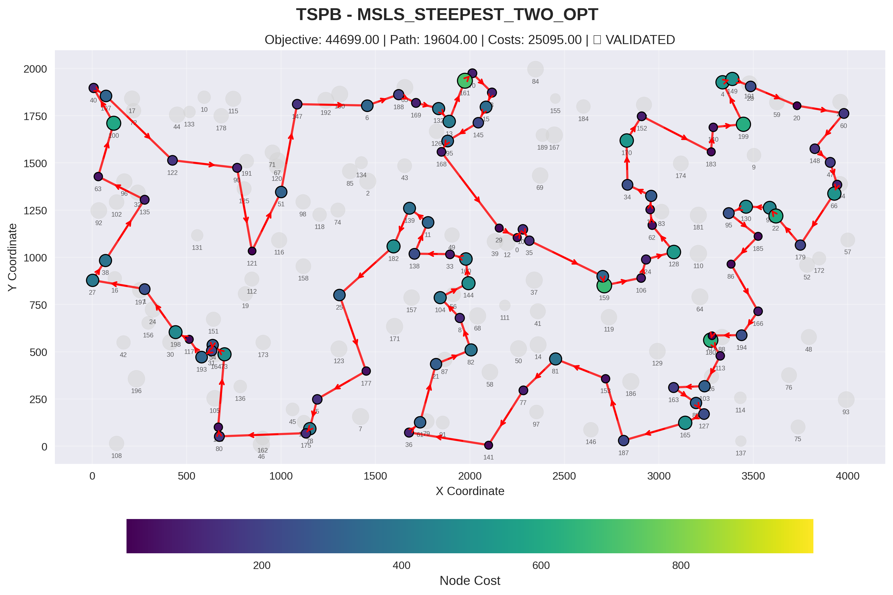
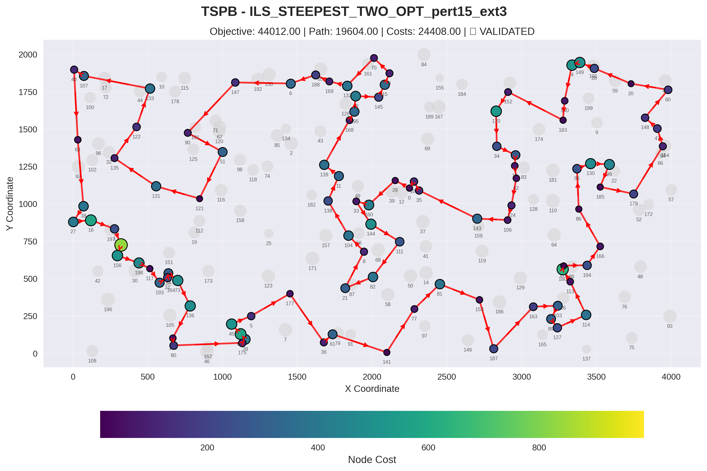
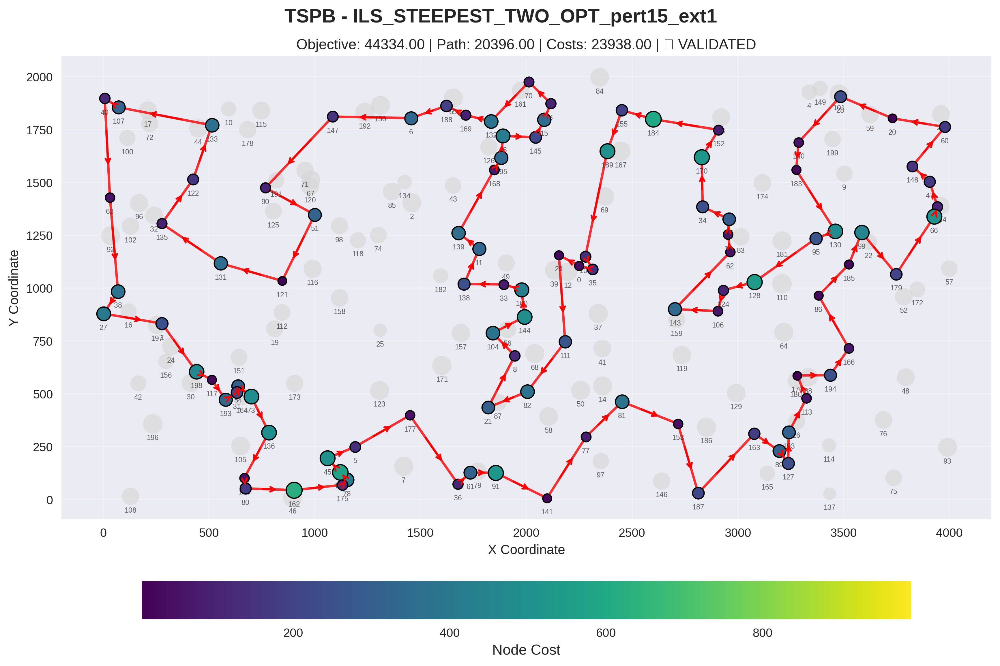

# Msls Ils algorithm for TSP Problem

## Implemented Algorithms

### 1. Multiple Start Local Search (MSLS)

**Similified Pseudocode:**
```
Algorithm MSLS(instance, numIterations):
    bestSolution ← null
    
    for i from 1 to numIterations do:
        randomSolution ← GenerateRandomSolution(instance)
        
        localOptimum ← SteepestLocalSearch(randomSolution)
        
        if bestSolution == null or localOptimum.objective < bestSolution.objective then:
            bestSolution ← localOptimum
    
    return bestSolution
```

---

### 2. Iterated Local Search (ILS)

**Pseudocode:**
```
Algorithm ILS(instance, perturbationStrength, 
              externalPerturbationStrength, timeLimitMs):
    // Generate initial random solution and apply local search
    initialSolution ← GenerateRandomSolution(instance)
    currentSolution ← SteepestLocalSearch(initialSolution)
    bestSolution ← currentSolution
    localSearchCallCount ← 1
    startTime ← CurrentTime()
    
    // Main ILS loop - continue until time limit
    while (CurrentTime() - startTime) < timeLimitMs do:
        // Perturb current solution to escape local optimum
        perturbedSolution ← PerturbSolution(currentSolution, perturbationStrength, 
                                            externalPerturbationStrength)
        
        // Apply local search to perturbed solution
        newSolution ← SteepestLocalSearch(perturbedSolution)
        localSearchCallCount ← localSearchCallCount + 1
        
        // Accept if improvement found
        if newSolution.objective < bestSolution.objective then:
            bestSolution ← newSolution
        
        // Use current solution as base for next perturbation
        currentSolution ← newSolution
    
    return bestSolution

PerturbSolution(solution, intraPert, externalPert):
    currentSol ← solution
    
    // Apply intra-route perturbations (based on neighborhood type)
    for i from 1 to intraPert do:
        move ← GenerateRandomTwoOptMove(currentSol)
        
        if move != null then:
            currentSol ← ApplyMove(move, currentSol)
    
    // Apply inter-route perturbations (replace nodes with external ones)
    for i from 1 to externalPert do:
        move ← GenerateRandomReplaceNodeMove(currentSol)
        if move != null then:
            currentSol ← ApplyMove(move, currentSol)
    
    return currentSol

GenerateRandomTwoOptMove(solution):
    route ← solution.getRoute()
    n ← route.size()
    
    if n < 3 then:
        return null
    
    // Pick two random edge positions
    i1 ← Random(0, n-2)
    i2 ← Random(i1+1, n-1)
    
    // Avoid reversing the entire route
    if i1 == 0 and i2 == n-1 then:
        return null
    
    return TwoOptMove(i1, i2)

GenerateRandomReplaceNodeMove(solution):
    route ← solution.getRoute()
    selectedNodes ← solution.getSelectedNodes()
    totalNodes ← instance.getTotalNodes()
    
    // Find all unselected nodes
    unselectedNodes ← []
    for node from 0 to totalNodes-1 do:
        if node not in selectedNodes then:
            unselectedNodes.append(node)
    
    if unselectedNodes is empty or route is empty then:
        return null
    
    // Pick random position in route and random unselected node
    pos ← Random(0, route.size()-1)
    outsideNode ← unselectedNodes[Random(0, unselectedNodes.size()-1)]
    
    return ReplaceNodeMove(pos, outsideNode)
```

---

## Experiment Results

### Objective function

| Algorithm | TSPA | TSPB |
|---|---|---|
| NearestNeighborAny2Regret_w1_1 | 72401.24 (70010.00 - 75452.00) | 47664.46 (44891.00 - 55247.00)|
| STEEPESTLS_EDGES_RANDOM | 73842.79 (71576.00 - 78846.00)    | 48374.04 (46064.00 - 52759.00) |
| MSLS_STEEPEST_TWO_OPT | 71357.85 (70897.00 - 71801.00) | 45641.30 (44699.00 - 46076.00) |
| ILS_STEEPEST_TWO_OPT_pert15_ext1 | 69990.80 (69287.00 - 70452.00) | 44551.25 (44334.00 - 44912.00) |
| ILS_STEEPEST_TWO_OPT_pert15_ext3 | 70212.05 (69905.00 - 70466.00) | 44514.45 (44012.00 - 44820.00) |

---

### Computation Times (ms) / Local Search iterations

| Algorithm | TSPA | TSPB |
|---|---|---|
| STEEPESTLS_EDGES_RANDOM                         | 59.24 (51 - 80) | 56.47 (42 - 65) |
| MSLS_STEEPEST_TWO_OPT | 5850.60 (5756 - 6041) | 5838.85 (5769 - 5930) |
| ILS_STEEPEST_TWO_OPT_pert15_ext1 | 1049.15 (1023 - 1079) | 1041.85 (1023 - 1064) |
| ILS_STEEPEST_TWO_OPT_pert15_ext3 | 916.65 (907 - 932) | 905.15 (889 - 920) |

## 2D Visualization of Best Solution

### Instance: TSPA

#### MSLS_STEEPEST_TWO_OPT



**Node Order (Route):**
16, 78, 25, 44, 120, 2, 152, 97, 1, 101, 75, 86, 26, 100, 53, 180, 154, 135, 70, 127, 123, 162, 151, 133, 79, 63, 80, 176, 51, 118, 59, 65, 116, 43, 149, 131, 35, 184, 84, 112, 4, 190, 10, 177, 54, 34, 160, 42, 181, 22, 159, 193, 41, 139, 115, 46, 68, 93, 117, 0, 143, 183, 89, 23, 137, 186, 15, 94, 124, 148, 9, 62, 102, 49, 144, 14, 138, 3, 178, 106, 52, 55, 57, 129, 92, 145, 179, 185, 40, 119, 165, 27, 90, 81, 196, 31, 56, 113, 175, 171

#### ILS_STEEPEST_TWO_OPT_pert15_ext3



**Node Order (Route):**
48, 34, 146, 22, 18, 108, 159, 193, 41, 139, 115, 46, 68, 140, 93, 117, 0, 143, 183, 89, 186, 23, 137, 176, 80, 51, 109, 118, 59, 72, 151, 162, 133, 79, 63, 94, 124, 148, 9, 62, 102, 144, 14, 49, 178, 106, 52, 55, 57, 129, 92, 185, 40, 119, 165, 90, 81, 196, 179, 145, 78, 31, 113, 175, 171, 16, 25, 44, 120, 2, 152, 97, 1, 101, 75, 86, 26, 100, 53, 180, 154, 135, 70, 127, 123, 149, 65, 116, 43, 42, 181, 160, 184, 84, 112, 4, 190, 10, 177, 54

#### ILS_STEEPEST_TWO_OPT_pert15_ext1



**Node Order (Route):**
14, 144, 102, 62, 9, 148, 124, 94, 63, 79, 80, 176, 137, 23, 89, 183, 143, 0, 117, 93, 140, 68, 46, 115, 139, 41, 193, 159, 69, 108, 18, 22, 146, 181, 34, 160, 48, 54, 30, 177, 10, 190, 4, 112, 84, 184, 42, 43, 116, 65, 131, 149, 59, 118, 51, 151, 133, 162, 123, 127, 70, 135, 154, 180, 53, 100, 26, 86, 75, 101, 1, 97, 152, 2, 120, 44, 25, 16, 171, 175, 113, 31, 78, 145, 92, 129, 57, 179, 196, 81, 90, 165, 119, 40, 185, 55, 52, 106, 178, 49

### Instance: TSPB

#### MSLS_STEEPEST_TWO_OPT



**Node Order (Route):**
73, 54, 31, 193, 117, 198, 1, 27, 38, 135, 63, 100, 40, 107, 122, 90, 121, 51, 147, 6, 188, 169, 132, 13, 161, 70, 3, 15, 145, 195, 168, 29, 0, 109, 35, 143, 159, 106, 124, 128, 62, 18, 55, 34, 170, 152, 183, 140, 199, 4, 149, 28, 20, 60, 148, 47, 94, 66, 179, 22, 99, 130, 95, 185, 86, 166, 194, 176, 180, 113, 103, 163, 89, 127, 165, 187, 153, 81, 77, 141, 36, 61, 21, 82, 8, 104, 144, 160, 33, 138, 11, 139, 182, 25, 177, 5, 78, 175, 80, 190

#### ILS_STEEPEST_TWO_OPT_pert15_ext3



**Node Order (Route):**
81, 153, 187, 163, 103, 89, 127, 114, 113, 180, 176, 194, 166, 86, 95, 130, 99, 185, 179, 94, 47, 148, 60, 20, 28, 149, 4, 140, 183, 152, 170, 34, 55, 18, 62, 124, 106, 143, 35, 109, 0, 29, 160, 33, 144, 111, 82, 21, 8, 104, 138, 11, 139, 168, 195, 13, 145, 15, 3, 70, 132, 169, 188, 6, 147, 90, 51, 121, 131, 135, 122, 133, 107, 40, 63, 38, 27, 16, 1, 24, 156, 198, 117, 193, 31, 54, 73, 136, 190, 80, 175, 78, 142, 45, 5, 177, 36, 61, 141, 77

#### ILS_STEEPEST_TWO_OPT_pert15_ext1



**Node Order (Route):**
90, 51, 121, 131, 135, 122, 133, 107, 40, 63, 38, 27, 1, 198, 117, 193, 31, 54, 73, 136, 190, 80, 162, 175, 78, 142, 45, 5, 177, 36, 61, 91, 141, 77, 81, 153, 187, 163, 89, 127, 103, 113, 176, 194, 166, 86, 185, 99, 179, 66, 94, 47, 148, 60, 20, 28, 140, 183, 130, 95, 128, 124, 106, 143, 62, 18, 55, 34, 170, 152, 184, 155, 189, 109, 35, 0, 29, 111, 82, 21, 8, 104, 144, 160, 33, 138, 11, 139, 168, 195, 13, 145, 15, 3, 70, 132, 169, 188, 6, 147

---

## Conclusions

### Key Findings
- increased number of swapping nodes in route works better in TSPB than TSPA
- In general swapping edges is more beneficial than swapping nodes with unused ones
- Both of the new methods beat all previous ones, however they sacrifice speed
- ILS is better than MSLS