# Convexity Analysis for TSP Solutions

## Authors
- Adam Tomys 156057
- Marcin Kapiszewski 156048

## Introduction

This report analyzes the convexity and similarity patterns of TSP solutions generated using **Greedy Local Search** applied to **random starting solutions**. 

The method works as follows:
- Generate multiple random starting solutions
- Apply greedy local search (first improvement) to each random solution  
- Analyze the resulting local optima using edge-based and node-based similarity metrics

The analysis examines three types of solution comparisons:
1. **Average solutions** - All solutions from multiple runs
2. **Best 1000 solutions** - The best out of 1000 solutions from each run
3. **External comparison** - Cross-comparison between solution generated by the best method so far

This approach allows us to understand the convexity of the solution space and identify how the landscape structure affects convergence patterns.

---

## Instance: TSPA

### Edge Similarity Analysis

#### Average Solutions - Edge Similarity
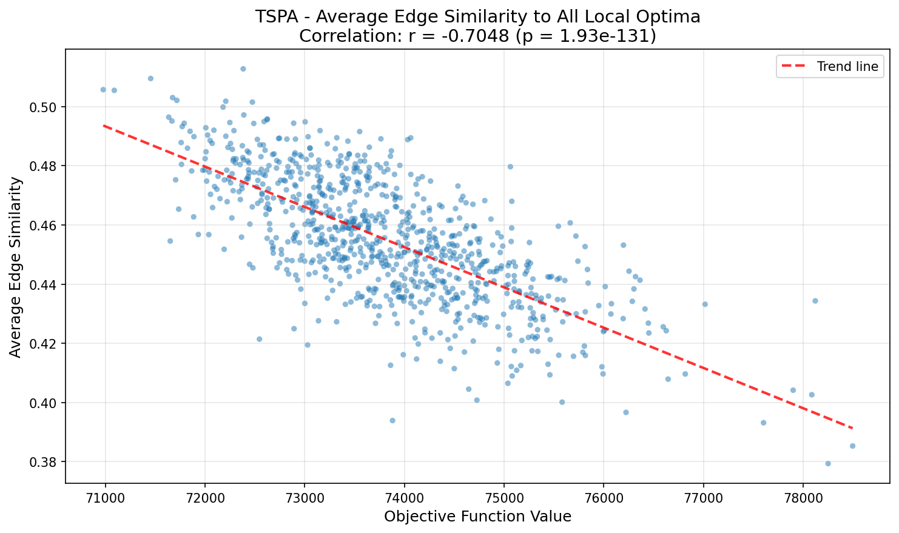

#### Best 1000 Solutions - Edge Similarity
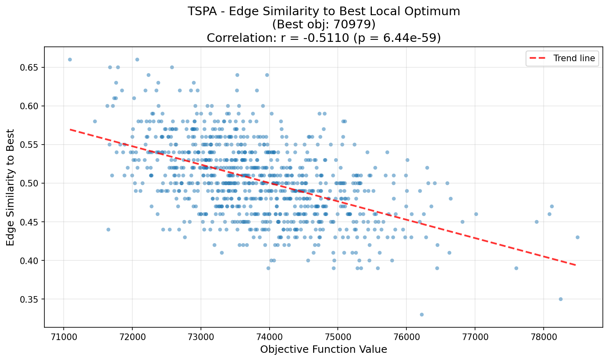

#### External Edge Similarity
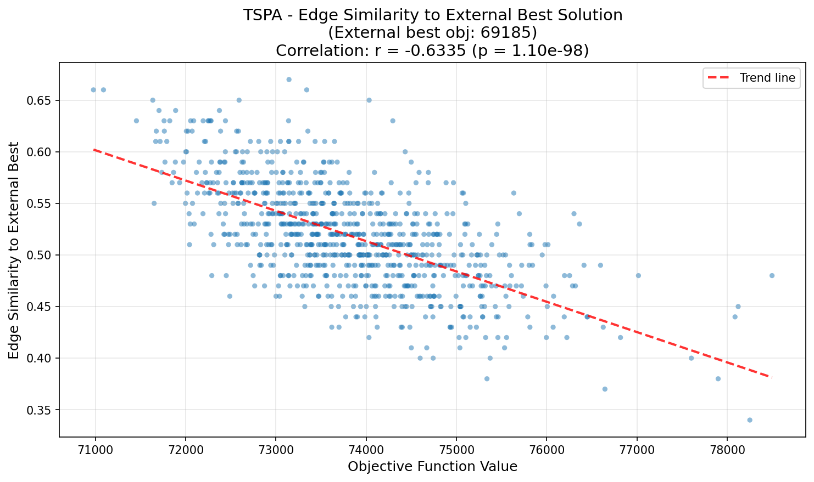

### Node Similarity Analysis

#### Average Solutions - Node Similarity
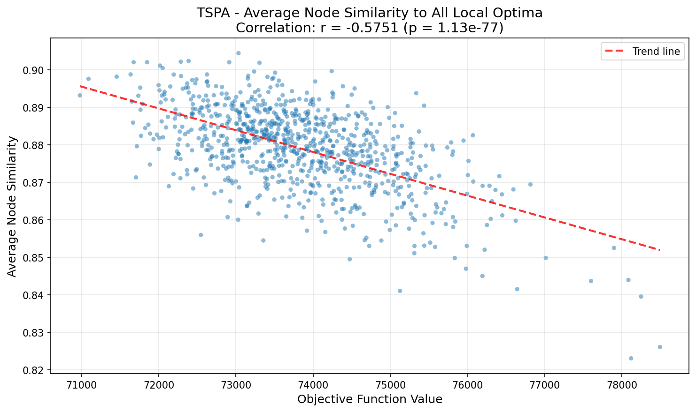

#### Best 1000 Solutions - Node Similarity
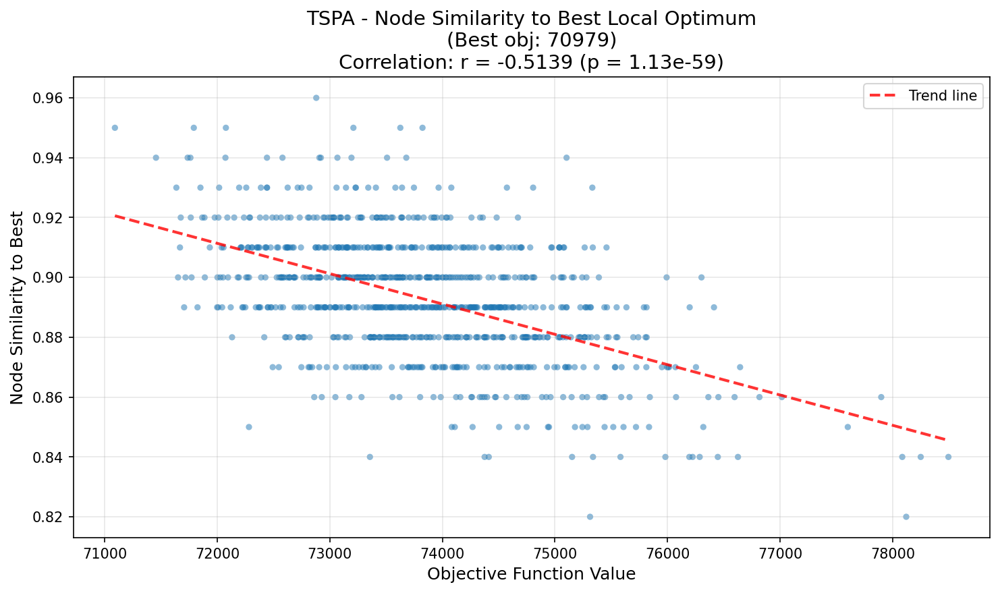

#### External Node Similarity
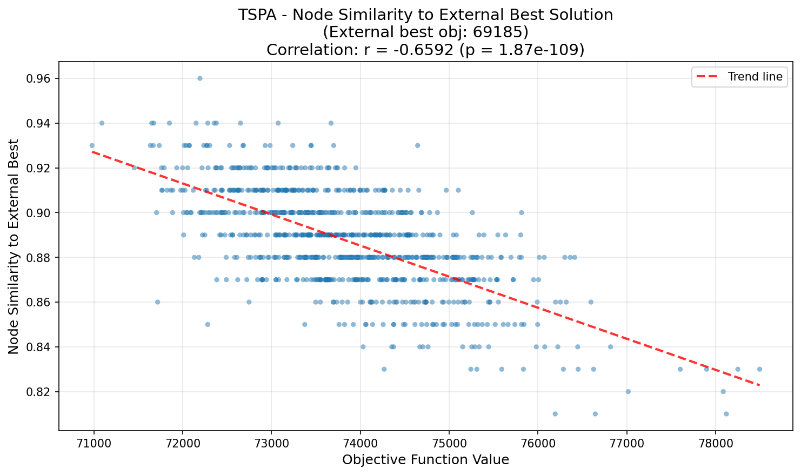

---

## Instance: TSPB

### Edge Similarity Analysis

#### Average Solutions - Edge Similarity
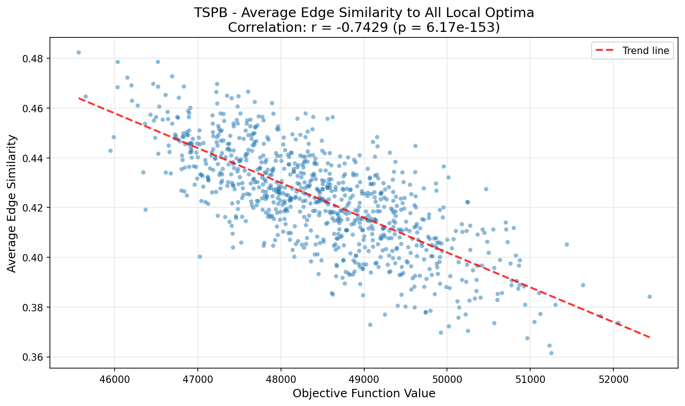

#### Best 1000 Solutions - Edge Similarity
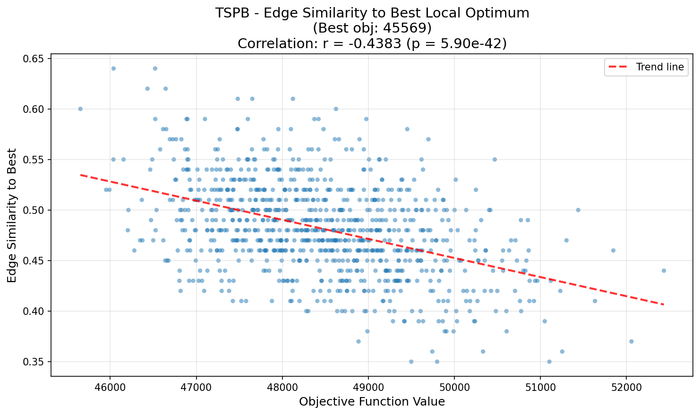

#### External Edge Similarity
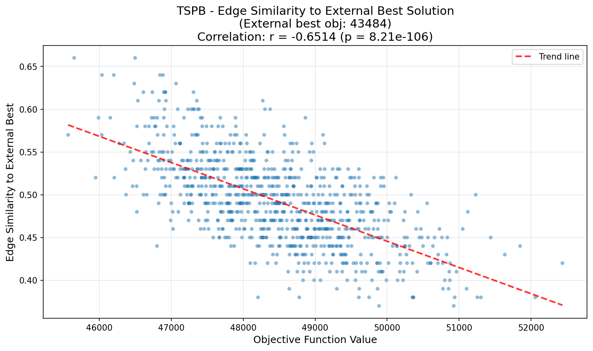

### Node Similarity Analysis

#### Average Solutions - Node Similarity
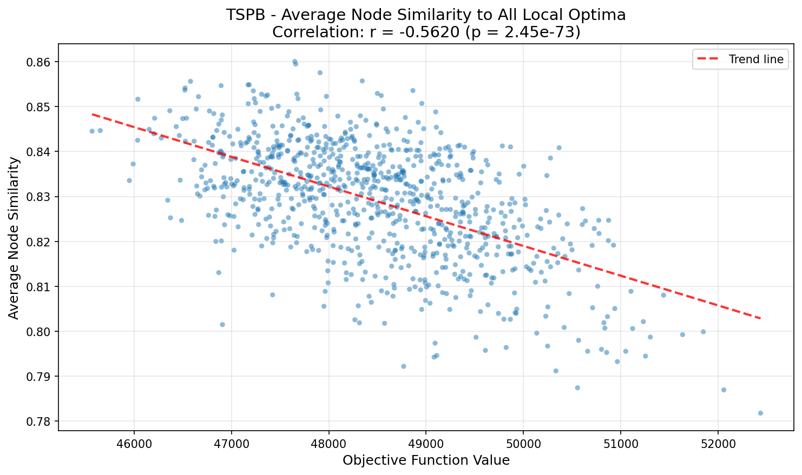

#### Best 1000 Solutions - Node Similarity
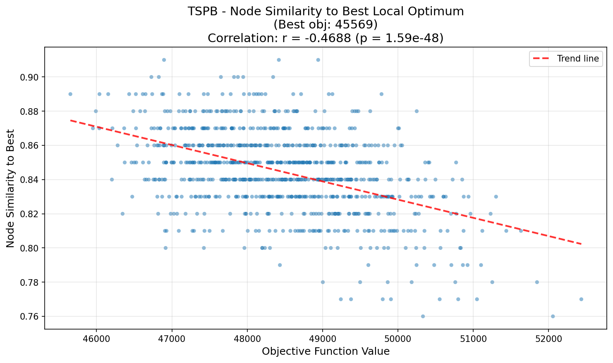

#### External Node Similarity
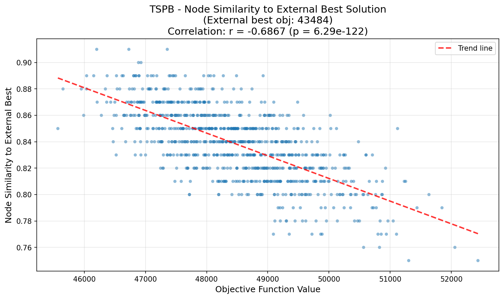

---

## Summary
The analysis of TSPA and TSPB confirms a "Big Valley" landscape structure, where high-quality local optima are not random but cluster significantly around the global optimum.

### Key Findings:
1. Strong Negative Correlation: Across all scenarios, lower objective values (better solutions) correlate strongly with higher similarity.
2. External Validation: Both instances show strong convergence toward the known optimum. Notably, TSPB exhibits high correlations for both edge ($r = -0.65$) and node ($r = -0.69$) similarity to the external best, confirming the search is gravitating toward the true global basin.
3. Edge vs. Node: While edge similarity is usually the main predictor, node similarity was unexpectedly stronger for the TSPB global optimum comparison ($r = -0.69$ vs. $-0.65$). This suggests spatial positioning is sometimes as critical as specific connections.
4. Global vs. Local Gradient: The landscape exhibits a steep global slope for the general population (e.g., $r = -0.74$) but becomes less structured near the optimum (e.g., $r = -0.44$ for the elite solutions). This implies a clear path exists to the region of good solutions, but identifying the absolute best one is harder due to local ruggedness.

### Conclusions
The solution space is convex, meaning good solutions share structural features.