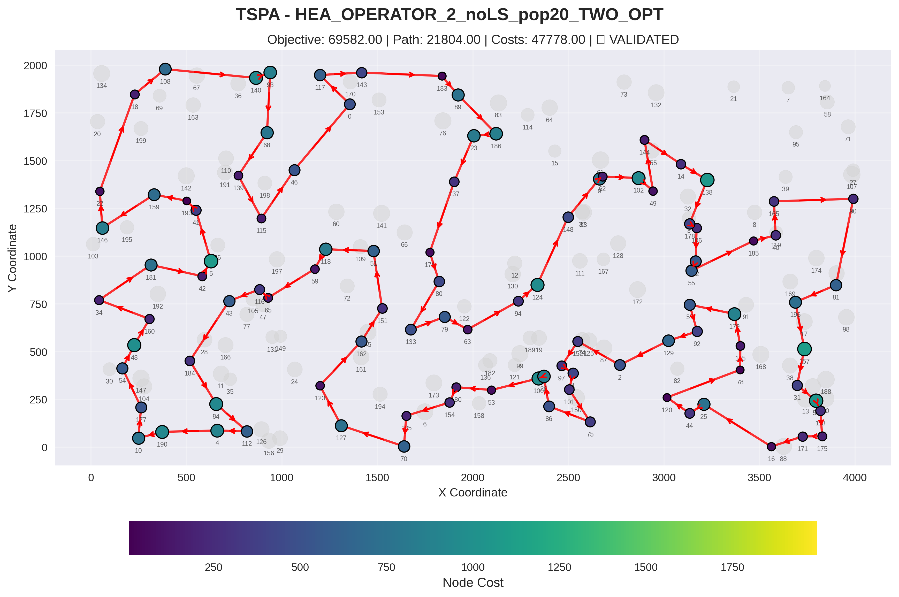
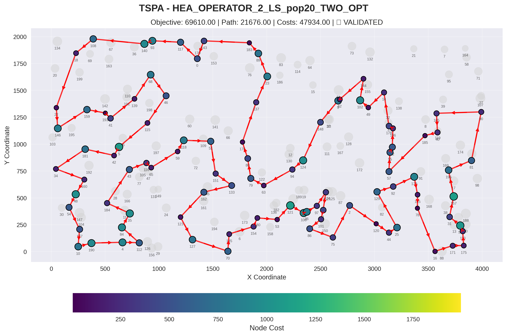
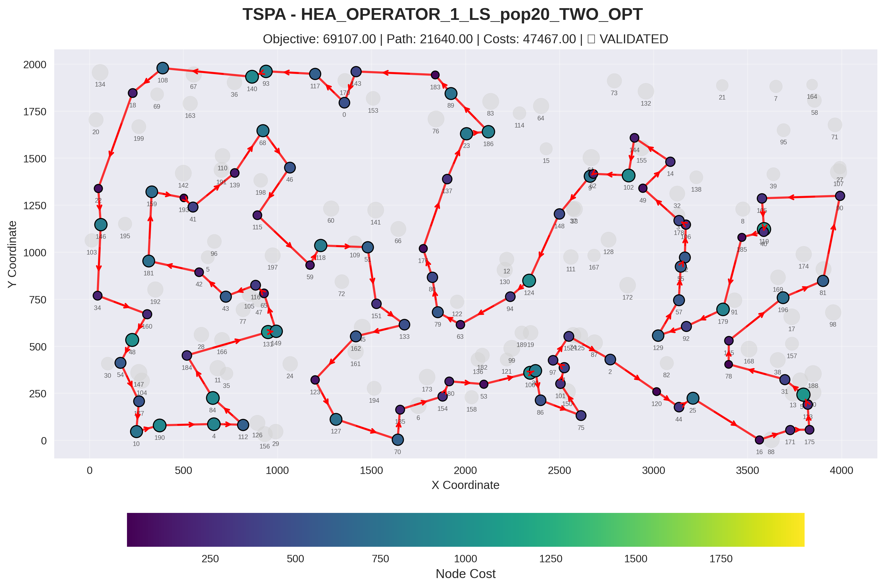
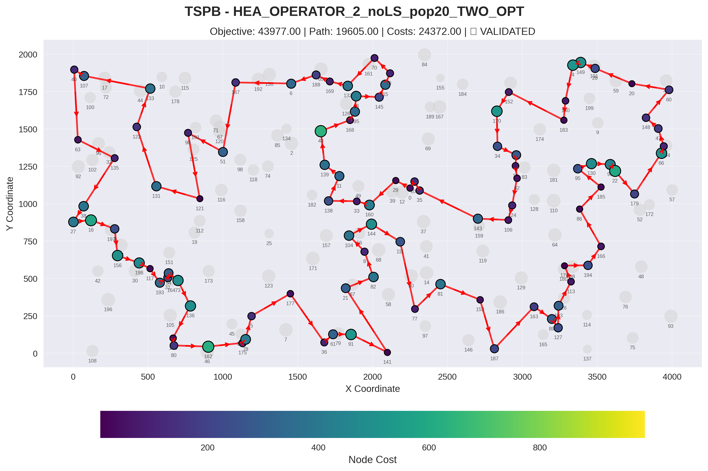
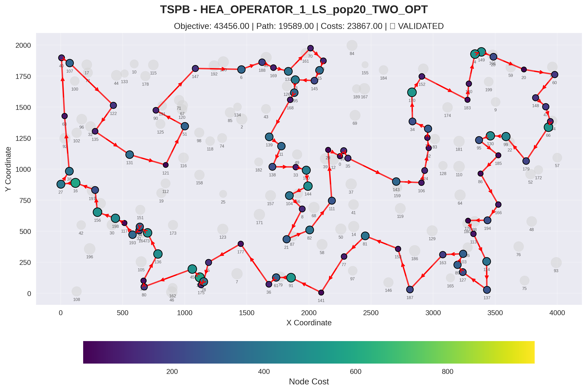

# Hea algorithm for TSP Problem

## Authors
- Adam Tomys 156057
- Marcin Kapiszewski 156048

## Implemented Algorithms

### Pseudocode

```
Algorithm HybridEvolutionaryAlgorithm(instance, populationSize, timeLimitMs, 
                                       recombinationOperator, useLocalSearch):
    
    // Initialize population with local search optimization
    population ← empty priority queue
    objectiveValues ← empty set
    
    while |population| < populationSize do:
        solution ← GenerateRandomSolution(instance)
        solution ← SteepestLocalSearch(solution)
        if solution.objectiveValue not in objectiveValues then:
            Add solution to population
            Add solution.objectiveValue to objectiveValues
    
    bestSolution ← population.first()  // Best solution (min objective)
    startTime ← CurrentTime()
    
    // Main evolutionary loop
    while (CurrentTime() - startTime) < timeLimitMs do:
        parent1, parent2 ← SelectRandomParents(population)
        
        if recombinationOperator == OPERATOR_1 then:
            offspring ← RecombineOperator1(parent1, parent2)
        else:
            offspring ← RecombineOperator2(parent1, parent2)
        
        if useLocalSearch then:
            offspring ← SteepestLocalSearch(offspring)
        
        if offspring.objectiveValue in objectiveValues then:
            continue
        
        // Steady-state selection: replace worst if offspring is better
        worst ← population.last()
        if offspring.objectiveValue < worst.objectiveValue then:
            Remove worst from population
            Remove worst.objectiveValue from objectiveValues
            Add offspring to population
            Add offspring.objectiveValue to objectiveValues
            
            if offspring.objectiveValue < bestSolution.objectiveValue then:
                bestSolution ← offspring
    
    return bestSolution

---


RecombineOperator1(parent1, parent2):
    // Find common nodes and edges between parents
    commonNodes ← parent1.nodes ∩ parent2.nodes
    commonEdges ← parent1.edges ∩ parent2.edges
    
    // Build subpaths from common edges
    subpaths ← BuildSubpathsFromEdges(commonEdges)
    
    // Add single-node subpaths for common nodes not in any subpath
    for node in commonNodes do:
        if node not in any subpath then:
            Add [node] to subpaths
    
    // Add random nodes to reach required count (50% of total)
    nodesToAdd ← requiredNodes - |nodesInSubpaths|
    availableNodes ← allNodes - nodesInSubpaths
    Shuffle availableNodes randomly
    for i = 1 to nodesToAdd do:
        Add [availableNodes[i]] to subpaths
    
    // Connect subpaths in random order with random orientation
    subpaths.shuffle()
    route ← empty list
    for subpath in subpaths do:
        if random() < 0.5 then:
            Reverse subpath
        Append subpath to route
    
    return CreateSolution(route)

---

BuildSubpathsFromEdges(edges):
    // Build adjacency list from edges
    adjacency ← empty map
    for edge(a, b) in edges do:
        adjacency[a].add(b)
        adjacency[b].add(a)
    // final result example {a: [b, c], b: [a], c:[a], d: [e], e: [d]}
    
    subpaths ← empty list
    visited ← empty set
    
    for startNode in adjacency.keys() do:
        if startNode in visited then:
            continue
        
        // Find endpoint (node with degree 1) by walking along chain
        endpoint ← FindEndpoint(startNode, adjacency)
        
        // Build path segment from endpoint
        segment ← empty list
        current ← endpoint
        prev ← null
        
        while current not null do:
            visited.add(current)
            segment.add(current)
            
            // Move to next unvisited neighbor
            next ← null
            for neighbor in adjacency[current] do:
                if neighbor ≠ prev and neighbor not in visited then:
                    next ← neighbor
                    break
            prev ← current
            current ← next
        
        if segment not empty then:
            subpaths.add(segment)
    
    return subpaths

---

RecombineOperator2(parent1, parent2):
    // Randomly choose base parent
    if random() < 0.5 then:
        baseParent ← parent1
        otherParent ← parent2
    else:
        baseParent ← parent2
        otherParent ← parent1
    
    // Keep only common nodes (preserving order from base parent)
    partialRoute ← empty list
    for node in baseParent.route do:
        if node in otherParent.nodes then:
            Add node to partialRoute
    
    // Repair using 2-regret heuristic
    return RepairWith2Regret(partialRoute, requiredNodes)
```

---

## Experiment Results

### Objective function

| Algorithm | TSPA | TSPB |
|---|---|---|
| MSLS_STEEPEST_TWO_OPT | 71357.85 (70897.00 - 71801.00) | 45641.30 (44699.00 - 46076.00) |
| ILS_STEEPEST_TWO_OPT_pert15_ext1 | 69990.80 (69287.00 - 70452.00) | 44551.25 (44334.00 - 44912.00) |
| ILS_STEEPEST_TWO_OPT_pert15_ext3 | 70212.05 (69905.00 - 70466.00) | 44514.45 (44012.00 - 44820.00) |
| LNS_d-0.30_RANDOM_REMOVAL_ls-On_hood-TWO_OPT | 69612.30 (69214.00 - 70184.00) | 44292.90 (**43484.00** - 45362.00) |
| LNS_d-0.40_RANDOM_REMOVAL_ls-Off_hood-TWO_OPT | 69737.15 (69255.00 - 70554.00) | 44199.95 (43602.00 - 44832.00) |
| LNS_d-0.40_RANDOM_REMOVAL_ls-On_hood-TWO_OPT | **69605.65** (**69185.00** - 70200.00) | **44026.40** (43509.00 - 44623.00) |
| **HEA_OPERATOR_1_LS_pop20_TWO_OPT** | **69260.30** (**69107.00** - 69568.00) | **43558.45** (**43456.00** - 43971.00) |
| HEA_OPERATOR_2_LS_pop20_TWO_OPT | 70069.75 (69610.00 - 70962.00) | 44214.75 (43780.00 - 44821.00) |
| HEA_OPERATOR_2_noLS_pop20_TWO_OPT | 70350.50 (69582.00 - 71197.00) | 44565.15 (43977.00 - 45126.00) |

---

### Computation Times (ms)

| Algorithm | TSPA | TSPB |
|---|---|---|
| STEEPESTLS_EDGES_RANDOM                         | 59.24 (51 - 80) | 56.47 (42 - 65) |
| MSLS_STEEPEST_TWO_OPT | 5850.60 (5756 - 6041) | 5838.85 (5769 - 5930) |

### Iterations

| Algorithm | TSPA | TSPB |
|---|---|---|
| ILS_STEEPEST_TWO_OPT_pert15_ext1 | 1049.15 (1023 - 1079) | 1041.85 (1023 - 1064) |
| ILS_STEEPEST_TWO_OPT_pert15_ext3 | 916.65 (907 - 932) | 905.15 (889 - 920) |
| LNS_d-0.20_RANDOM_REMOVAL_ls-Off_hood-TWO_OPT | 11177.45 (10979 - 11347) | 11378.25 (11169 - 11565) |
| LNS_d-0.20_RANDOM_REMOVAL_ls-On_hood-TWO_OPT | 6740.95 (5891 - 7517) | 6586.00 (5215 - 7734) |
| LNS_d-0.30_RANDOM_REMOVAL_ls-Off_hood-TWO_OPT | 7552.75 (7462 - 7631) | 7708.45 (7591 - 7838) |
| LNS_d-0.30_RANDOM_REMOVAL_ls-On_hood-TWO_OPT | 5108.50 (4188 - 5591) | 4550.55 (3687 - 4960) |
| LNS_d-0.40_RANDOM_REMOVAL_ls-Off_hood-TWO_OPT | 5782.30 (5704 - 5876) | 5920.50 (5823 - 6006) |
| LNS_d-0.40_RANDOM_REMOVAL_ls-On_hood-TWO_OPT | 3993.10 (3522 - 4428) | 3530.70 (2935 - 3879) |
| HEA_OPERATOR_1_LS_pop20_TWO_OPT | 2003.50 (1103 - 2911) | 1642.95 (625 - 2269) |
| HEA_OPERATOR_2_LS_pop20_TWO_OPT | 13244.80 (9691 - 18125) | 12409.85 (9828 - 18218) |
| HEA_OPERATOR_2_noLS_pop20_TWO_OPT | 47212.85 (30186 - 75469) | 44160.65 (27498 - 110516) |

## 2D Visualization of Best Solution

### Instance: TSPA

#### HEA_OPERATOR_2_noLS_pop20_TWO_OPT



**Node Order (Route):**
41, 193, 159, 146, 22, 18, 108, 140, 93, 68, 139, 115, 46, 0, 117, 143, 183, 89, 186, 23, 137, 176, 80, 133, 79, 63, 94, 124, 148, 9, 62, 102, 49, 144, 14, 138, 178, 106, 52, 55, 185, 40, 165, 90, 81, 196, 157, 31, 56, 113, 175, 171, 16, 25, 44, 120, 78, 145, 179, 57, 92, 129, 2, 152, 97, 1, 101, 75, 86, 26, 100, 53, 180, 154, 135, 70, 127, 123, 162, 151, 51, 118, 59, 65, 116, 43, 184, 84, 112, 4, 190, 10, 177, 54, 48, 160, 34, 181, 42, 5

#### HEA_OPERATOR_2_LS_pop20_TWO_OPT



**Node Order (Route):**
79, 80, 176, 137, 23, 89, 183, 143, 0, 117, 93, 140, 108, 18, 22, 146, 159, 193, 41, 139, 68, 46, 115, 5, 42, 181, 34, 160, 48, 54, 177, 10, 190, 4, 112, 84, 35, 184, 43, 116, 65, 59, 118, 51, 151, 133, 162, 123, 127, 70, 135, 154, 180, 53, 121, 100, 26, 97, 152, 1, 101, 86, 75, 2, 120, 44, 25, 129, 92, 179, 145, 78, 16, 171, 175, 113, 56, 31, 157, 196, 81, 90, 165, 40, 185, 57, 55, 52, 106, 178, 14, 49, 102, 144, 62, 9, 148, 124, 94, 63

#### HEA_OPERATOR_1_LS_pop20_TWO_OPT



**Node Order (Route):**
92, 129, 57, 55, 52, 106, 178, 49, 14, 144, 102, 62, 9, 148, 124, 94, 63, 79, 80, 176, 137, 23, 186, 89, 183, 143, 0, 117, 93, 140, 108, 18, 22, 146, 34, 160, 48, 54, 177, 10, 190, 4, 112, 84, 184, 131, 149, 65, 116, 43, 42, 181, 159, 193, 41, 139, 68, 46, 115, 59, 118, 51, 151, 133, 162, 123, 127, 70, 135, 154, 180, 53, 100, 26, 86, 75, 101, 1, 97, 152, 2, 120, 44, 25, 16, 171, 175, 113, 56, 31, 78, 145, 196, 81, 90, 165, 119, 40, 185, 179

### Instance: TSPB

#### HEA_OPERATOR_2_noLS_pop20_TWO_OPT



**Node Order (Route):**
124, 106, 143, 35, 109, 0, 29, 160, 33, 138, 11, 139, 43, 168, 195, 13, 145, 15, 3, 70, 132, 169, 188, 6, 147, 51, 90, 121, 131, 122, 133, 107, 40, 63, 135, 38, 27, 16, 1, 156, 198, 117, 193, 31, 54, 73, 136, 190, 80, 162, 175, 78, 5, 177, 36, 61, 91, 141, 21, 82, 8, 104, 144, 111, 77, 81, 153, 187, 163, 89, 127, 103, 113, 176, 194, 166, 86, 185, 95, 130, 99, 22, 179, 66, 94, 47, 148, 60, 20, 28, 149, 4, 140, 183, 152, 170, 34, 55, 18, 62

#### HEA_OPERATOR_2_LS_pop20_TWO_OPT


**Node Order (Route):**
95, 130, 99, 179, 66, 94, 47, 148, 60, 20, 28, 149, 4, 140, 183, 152, 170, 34, 55, 18, 62, 124, 106, 143, 35, 109, 0, 29, 111, 82, 8, 104, 144, 160, 33, 138, 11, 139, 43, 168, 195, 13, 145, 15, 3, 70, 132, 169, 188, 6, 147, 90, 51, 121, 131, 135, 122, 133, 107, 40, 63, 38, 27, 16, 1, 156, 198, 117, 193, 31, 54, 73, 136, 190, 80, 162, 45, 175, 78, 5, 177, 21, 61, 36, 91, 141, 77, 81, 153, 187, 163, 89, 127, 103, 113, 176, 194, 166, 86, 185

#### HEA_OPERATOR_1_LS_pop20_TWO_OPT



**Node Order (Route):**
4, 149, 28, 20, 60, 148, 47, 94, 66, 179, 99, 130, 95, 185, 86, 166, 194, 176, 113, 114, 137, 127, 89, 103, 163, 187, 153, 81, 77, 141, 91, 61, 36, 177, 5, 78, 175, 142, 45, 80, 190, 136, 73, 54, 31, 193, 117, 198, 156, 1, 16, 27, 38, 63, 40, 107, 122, 135, 131, 121, 51, 90, 147, 6, 188, 169, 132, 70, 3, 15, 145, 13, 195, 168, 139, 11, 138, 33, 160, 144, 104, 8, 21, 82, 111, 29, 0, 109, 35, 143, 106, 124, 62, 18, 55, 34, 170, 152, 183, 140

---

## Conclusions

1. HEA with Operator 1 and Local Search achieves the best solution quality
2. Operator 1 significantly outperforms Operator 2
3. Local Search improves the effectiveness of the algotihm, however the diffrence is not extreme in the Operator 2.
4. First operator is much more expensive, it does over 6 times less iterations that the second one with LS on and almost 24 times less than the second operator with LS off.